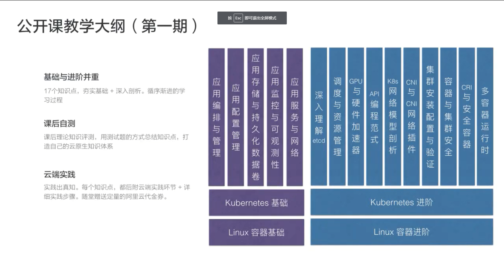

# 云原生技术
## 云原生技术简史
- 2004-2007: google apply cgroups 
- 2008.01: merge to linux master
- 2013.03: docker 
- 2014.06: Kubernetes
- 2015.07: CNCF foundation
## 云原生技术生态现状
- 云原生基金会
- 云原生技术社区
- 云原生产业
## 课程大纲

## 云原生思想理论基础
|理论基础|目前实现|
|-------|--------|
|不可变的基础设施|容器镜像实现|
|云应用编排理论|容器设计模式|

## 云原生关键技术点
- 自包含、可定制的应用镜像
- 应用快速部署与隔离能力
- 应用基础设施创建和
- 销毁的自动化管理
- 可复制的管控系统与支撑组建
