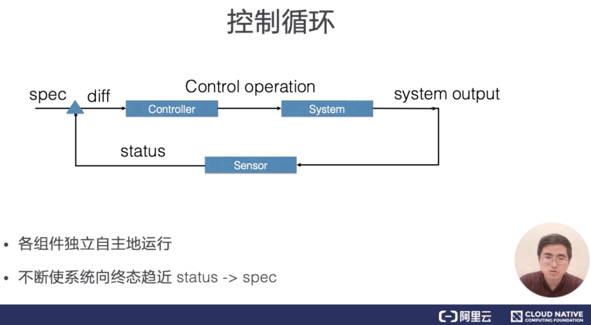
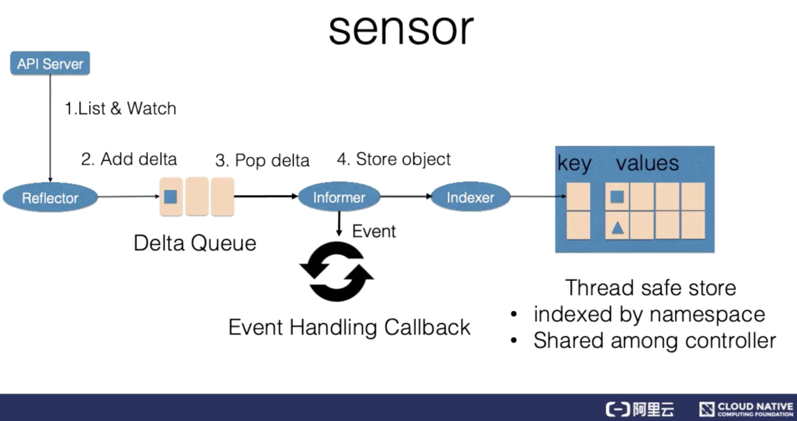

# 应用编排与管理
## kubernets资源对象（配置文件内容）
1. spec:期望的状态
2. status：观测到的状态
3. metadata：
   - labels
   - annotations
   - ownerreference
### labels 标签
可能是最重要的，打标签
- 标识型的Key: Value元数据
- 作用
  - 用于筛选资源(可以用selector来查询)
  - 唯一的组合资源的方式
### annotataions 注解
- 也是Key: Value型
- 作用
  - 存储资源的非标识性信息
  - 拓展资源的spec/status
- 特点
  - 一般比label更大
  - 可以包含特殊字符
  - 可以结构化也可以非结构化
### ownerreference
- 集合类资源(集合类资源的控制器创建了归属资源)
- 作用
  - 方便方向查找创建资源的对象
  - 方便进行级联删除
## 控制器 controller
1. 声明式API：由声明式API驱动，针对资源对象的声明修改来驱动操作
2. 控制循环：控制器异步地控制系统向终态趋近  

上述两点使得系统的自动化和无人值守化成为可能，同时具备高可拓展性。  
另外，针对于有状态应用，可以使用operator来特化操作
### 控制循环逻辑组件

各个组件独立自主运行，status不断地向用户设定的spec靠近
1. 控制器：比较资源的spec：计算diff得出控制操作
2. 被控制系统：被控制操作修改后会产生新的输出
3. 传感器：观测系统：接受被控制系统的输出，并以资源status的形式上报，最终修改资源的spec
#### 传感器 sensor

1. Reflector:通过list(重启或者watch中断情况下系统资源的全量更新)和watch(在list之间进行增量更新) k8s的API server 来获取资源和数据。获取新的资源数据后，会给Delta队列中塞入一个包括资源对象本身以及资源对象事件类型的Delta记录，Delta队列中可以保证同一个对象仅有一条记录，从而避免重复记录。
2. Informer:从Delta队列中弹出delta记录，然后把资源对象交给indexer，当indexer处理完成后，把这个事件交给事件的回调函数。
3. Indexer:把资源记录在一个缓存中，缓存在默认设置下是用资源的命名空间来做索引的，且可以被Controller Manager或多个Controller所共享。
#### 控制器 controller
1. 事件处理函数：事件处理函数之间会相互关注资源的diff(新增、更新、删除的事件)，并根据控制器的逻辑去决定是否需要处理。对需要处理的事件，会把事件关联资源的命名空间以及名字塞入一个工作队列中。(工作队列会对存储的对象进行去重，从而避免多个worker处理同一个资源)
2. worker池：处理工作队列中的资源。一般需要用资源的名字来重新获得最新的资源数据，用来创建或更新资源对象，或者调用调用其他的外部服务。如果处理失败，会自动将资源名字重新加入到工作队列中，方便之后进行调试。
### 声明式API
#### 与命令式API的对比
错误处理中
|场景|命令式API|声明式API|
|-|-|-|
|命令没有响应，需要反复重试|需要反复重试来排查，步骤复杂容易出错|天然地记录了状态，会自动靠近最终状态，可在任意时刻反复操作|
|巡检|额外的工作，容易造成错误|正常的运行过程中便会有巡检的过程|
|多并发|排查错误需要给多并发加锁，限制了排查错误期间的系统性能|可合并多个变更操作，可以不加锁就进行多方访问|