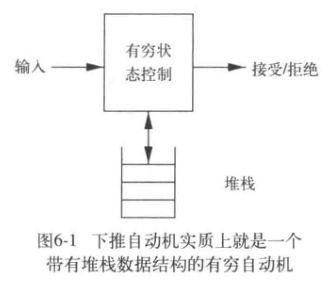

# parsing
通常语法分析基于给定的一套上下文无关语法的语法规则
上下文无关语法与正则不同的是上下文无关语法包含了递归规则，小小的改变带来的变化是巨大的
首先，数据结构就需要从正则使用的线性的tokens数组变为parse tree/syntax tree
parsing的算法可分为top-down parsing and bottom-up parsing
与scanner不同的另一点是需要错误处理（报告与恢复）
## 上下文无关语法 context-free grammar (CFG)
G = (V, T, P, S)
基本的语法格式是Backus-Naur form BNF
``` BNF
exp -> exp op exp | (exp) | number
op -> {+|-|*}
```
推导（derivation/production，=>） P:指通过一系列替换操作从一个开始符号推导出一个句子的过程。一次替换操作只能应用一条语法规则。推导与语法分析树等价。
终结符号 T：组成句子（串）的基本符号（与tokens含义相同）是推导的终结。于上面的例子就是 number、（和）
非终结符号 V：表示用于由文法生成的句子的集合，非终结符号可以由终结符号和其它非终结符号组成，最终推导至全为终结符号。于上面的例子就是 exp 和 op。
开始符号（start symbol）S：一个特殊的非终结符号，表示文法生成的最基本的句子的集合，成为句型（即文法的定义的最基本语言）。于上面的例子就是 exp。
由上下文无关文法语言的定义如下
**L(G) = {s | exp =>* s}**
L(G) 指由语法G定义的语言，上下文无关语法由多个产生式（production）组成。开始符号通常是
s 指由token 组成的句子（sentence）
exp 是开始符号
=>* 指推导的过程（星号意味着可能是多个推导的步骤）
产生式式的上下顺序决定了推导时选用产生式的优先级
最左推导（leftmost derivation）指每次推导优先替换最左边的非终结符号。对应了前序遍历（preorder traversal）的语法树。
最右推导（rightmost derivation）指每次推导优先替换最右边的非终结符号。对应了后序遍历（postorder traversal）的语法树。

对上下文无关语法更形式化的定义是
**G = (V, T, P, S)**
1. A set T of **terminals**
2. A set N of **non-terminals**
3. A set P of **productions(grammar rules)**, of the form A -> a, where A ∈ N and a ∈ (T ∪ N)*
4. A **start symbol** S from the set N.


## 解析树和抽象语法树
一个解析树（parse tree）对应一整个推导过程，其叶子节点是终结符号，非叶子节点是非终结符号，非叶子节点的数量也就对应着推导的次数。
parse tree存在一种更为简明的表示方式，抽象语法树（abstract syntax tree, AST），parser会遍历parse tree显示的所有推导过程，并生成最终的AST。分析树的含义取决于其**后序遍历**。
- parse tree：表示concrete syntax
- syntax tree：表示abstract syntax，所以信息更少
## 二义性语法（ambiguity）
如果一个上下文无关语言CFL的所有CFG都是歧义的，则语言CFL具有固有二义性，使得推导过程存在多种方式，最终生成的不同的parse tree和AST，可能导致句子具有不同的含义，也会在后续介绍的解析算法中失败。而语言L只要存在有一个CFG文法是无歧义的，那么L就是无二义性的。可能具有二义性的文法可以通过某些修改进一步消除二义性，但同时保证其生成同样的CFL。目前没有一个算法来判断一个CFG是否存在二义性（也即没有一个快速算法可以将一个二义性算法转换为非二义性文法），CFG是否是二义性的是不可判定问题。另一方面对于无二义性文法其最左推导和最右推导都是唯一的。
一般来说二义性的原因主要有：
1. 没有考虑运算符的优先级
2. 没有考虑运算符的结合性（左结合，右结合，不结合），一系列同样的运算符既可以从左到右结合，也可以从右到左结合。对于有结合律的运算符也必须选择一种结合性来保证语法树的唯一性。
已经存在一系列的方法来消除二义性，这里介绍两个基本方法。
1. 方法一：给定一套规则，当存在二义性的情况时，说明哪个是正确的推导，好处是不用改变现有语法规则，坏处是语法结构的说明变复杂了，不再单独由语法规则给出。
2. 方法二：改变原有语法规则，改变了语法规则实际就改变了语言本身的含义，所以通常不采用这种方法
### 运算优先级（precedence）和结合性（associativity）
可以通过产生式的顺序来修正由运算优先级（precedence）导致的二义性
对于运算优先级可以使用优先级级联（precedence cascade），优先级级联是将不同优先级的操作打包并将优先级低的运算符产生式放置于高优先级之前，使其更接近于parse tree的root，更晚被执行的一种标准操作
以`+*`为例子更具体的操作是（这里使用了左递归产生式，使得`+*`皆具有了左结合性）：
1. 引入一个新的非终结符*factor*，其不能被任何操作符分隔，其只有可能是由括号括起来的非终结符或者一个标识符 `factor -> (exp) | identifier`
2. 引入一个新的非终结符*term*，其不能被低优先级的操作符风格，对于例子就是不能被`+`分隔，可以被`*`分隔 `term -> term * factor | factor`
3. 其余非终结符可以被低优先级的表达式分隔 `exp -> exp + term | term`
``` BNF
exp -> exp + term | term
term -> term * factor | factor
factor -> (exp) | identifier
```
factor的产生式很简单，不存在二义性，term的产生式可以确保其只能从`f1*f2*···*fn-1*fn`推导为`f1*f2*···*fn-1`、`*`和`fn-1`三个子节点，exp也类似，所以最终推导出的parse tree是唯一的。
在同一个优先级的操作符中需要考虑结合性（associativity）问题
左结合性是指当算子左右两边都有运算符时，算子优先属于左侧的运算符。
左递归产生式是产生式拼接串的最左边的符号和产生式头部的非终结符相同。
一个左递归产生式使得运算符具有左结合性
一个右递归产生式使得运算符具有右结合性
### 悬挂else问题 the dangling else problem 
使用最近嵌套规则，需要在语法上描述一个中间状态（like：unmatched-stmt）产生式并放置在多个产生式中合理的位置来解决此类二义性。有些语言也会使用一个结束词（脚本里使用fi）

## EBNF 扩展巴科斯范式
相较于BNF，EBNF添加了重复的语法元素
``` EBNF
BNF  左递归重复: exp -> exp addop term | term
EBNF 左递归重复: exp -> term { addop term }
BNF  选择: exp -> exp addop term | term
EBNF 选择: exp -> [exp addop] term
```
EBNF还可以使用语法图表示
## 乔姆斯基范式 
如果一个CFG的每个规则具有如下形式
```
A->BC
A->a
a是任意终结符
ABC是任意非终结符，且BC不是起始符号
此外允许规则S->ε，其中S为起始符号
```
则称该CFG表示形式为乔姆斯基范式（且可以将非乔姆斯基范式的CFG转换为乔姆斯基范式）。在设计使用上下文无关语法的算法时有用。
## 下推自动机（Pushdown Automaton）

可以定义上下文无关语言，是带有ε转换的非确定型有穷自动机+堆栈的自动机。
注意确定型下推自动机与非确定性下推自动机在语言识别上能力不同，非确定型下推自动机等价于上下文无关语法。
非确定型下推自动机在堆栈中保存CFG中的非终结符组成的串，直到在条带扫描后遇到非终结符后将栈顶的非终结符弹出
其形式化定义如下
```
下推自动机是一个6元组(S, Σ, T, f, S0, F)
S：一个有穷集合，称为状态集
Σ：一个有穷集合，称为输入字母表
T：一个有穷集合，称为栈字母表
f：f:SxΣxT->P(SxT)是转移函数，转移函数参数为当前状态、栈顶符号和输入符号
S0：S的一个子集，称为起始状态（部分定义中指定起始状态唯一）
F：S的一个子集，称为终止状态（接受状态）
```
### CFG->PDA
对于表示CFG G的PDA P
1. P有个初始状态S，把栈底标记符$和开始符号推进栈中
2. 重复下列步骤
    a. 如果栈顶是非终结符A，弹出并选择一个关于A的推导式，把A替换为推导式右边的串
    b. 如果栈顶是终结符a，弹出并读取下一个输入符号，并且与a比较，匹配则继续，不匹配则拒绝这个非确定性分支，回溯到上一个可替换的非终结符推导式，并替换
    c. 如果栈顶是栈底标记符$，且输入已结束，进入接受状态。
### 自顶向下分析
从构造PDA的方式很自然的可以整理出一种算法：
从CFG的开始符号出发，尝试推导出某个串t。比较目标串s，判断串s和推导出的串t是否相同，相同则接受，否则回溯。
```C
token_t[] tokens;
int token_index = 0; // 当前读到的token的索引位置，初始化为0，即从第一个token开始读取。
stack_t stack;
stack.push(START_SYMBOL);
while (stack.empty() != true)
{
    if (is_terminal(stack.top()) == true)
    {
        if (termainal_cmp(stack.top(), tokens[token_index]) == true)
        {
            stack.pop();
        }
        else backtrack(); // 回溯替换推导式
    }
    else
    {
        non_termainal_symbol nontermainal = stack.pop();
        stack.push(next_production_right(nontermainal));
    }
}
```
算法中使用了回溯，分析效率很低。
为了避免回溯，引入了前看符号
### 递归下降分析算法
也称为预测分析算法，思想非常简单
1. 对每一个非终结符构造一个分析函数
2. 用前看符号指导推导式规则的选择
```C
typedef void (*non_terminal_parser) (string lookahead_token);

void non_terminal_parser_for_exp(string lookahead_token)
{
    switch(lookahead_token)
    {
        case NON_TERMINAL_TERM: non_terminal_parser_for_term();
        case TERMINAL_TOKEN[0]: 
        default: error("...");
    }
}

void non_terminal_parser_for_term(string lookahead_token);
void non_terminal_parser_for_factor(string lookahead_token);

```
#### 例子
```C
void parse_factor(char lookahead)
{
    if (is_number(lookahead))
    {
        parse_num(get_next_token());
    }
    else if (lookahead == '(')
    {
        parse_exp(get_next_token());
        if (get_next_token() != ')')
            {
                error();
            }
    }
    return;
}

void parse_exp(char lookahead)
{
    parse_term(get_next_token());
    lookahead = get_next_token();
    while(is_op(lookahead))
    {
        parse_term(get_next_token());
        lookahead = get_next_token();
    }
    return;
}
```
### LL(1)分析算法
从**左（Left）向右**读入程序，使用**最左（Left**）推导，采用**一个（1）**前看符号的分析算法称为LL(1)分析算法。
思想是表驱动的分析算法，语法经过语法分析器（自动生成器）生成分析表
缺点是文法类型受限，往往需要文法改写
分析过程可能需要不断增长的栈空间

LL(1)分析算法
```C
token_t[] tokens;
int token_index = 0; // 当前读到的token的索引位置，初始化为0，即从第一个token开始读取。
stack_t stack;
stack.push(START_SYMBOL);
while (stack.empty() != true)
{
    if (is_terminal(stack.top()) == true)
    {
        if (terminal_cmp(stack.top(), tokens[token_index]) == true)
        {
            stack.pop();
        }
        else error();
    }
    else
    {
        non_termainal_symbol nontermainal = stack.pop();
        stack.push(currect_production_right(nontermainal, token[token_index+1]));
    }
}
```
语法分析器（自动生成器）算法
对于非终结符N，计算N的First集
FIRST(N) = {a|a是所有可能的从非终结符N开始推导得出的句子的开头终结符}
         = {a|a是所有可能的从非终结符N直接推导得出的句子的开头终结符} U {a| a = FIRST(M), M为非终结符N直接推导出的句子的最左非终结符}
对于CFG中存在可以推导出ε的非终结符（称可以推导出ε的非终结符集合为NULLABLE），需要考虑FOLLOW集

通过FIRST(N)反向可以推出分析表

但是
存在一些情况某些非终结符可以推导出空字符串（ε），我们将这类非终极符归类为NULLABLE集合，他们会导致计算FIRST集的算法从一般的情况变得相对复杂。
在这种复杂情况下为了得出FIRST集，需要进一步考虑非终结符的FOLLOW集
NULLABLE = {N| N可以直接推导出ε} U {M| M->O1...On,O1...On是n个非终结符，且都属于NULLABLE集合}
```C
// 计算FIRST集
gen_first_set()
{
    foreach_nonterminal(nonterminal N)
    {
        // 初始化FIRST(N)为空集
        FIRST(N) = {};
    }

    while(at least one FIRST set is changed)
    {
        foreach (production p: N->x1 ... xn) // 遍历CFG的所有产生式
        {
            foreach(xi from x1 to xn)
            {
                if (xi == a...) // 如果xi是终结符a
                {
                    FIRST(N) &= {a};
                    break; // 不在继续遍历这个产生式右侧的其他符号
                }
                if (xi == M...) // 如果xi是非终结符M
                {
                    FIRST(N) &= FIRST(M)
                    if (M not in NULLABLE)
                    {
                        break; // 不在继续遍历这个产生式右侧的其他符号
                    }
                }
            }
        }
    }
    return set<FIRST>;
}

// 计算FOLLOW集
gen_follow_set()
{
    foreach_nonterminal(nonterminal N)
    {
        // 初始化FOLLOW(N)为空集
        FOLLOW(N) = {};
    }

    while(at least one FOLLOW set is changed)
    {
        foreach (production p: N->x1 ... xn) // 遍历CFG的所有产生式
        {
            FOLLOW temp = FOLLOW(N); 
            foreach(xi from xn to x1) //注意是逆序!
            {
                if (xi == a...) // 如果xi是终结符a
                {
                    temp = {a};
                }
                if (xi == M...) // 如果xi是非终结符M
                {
                    FOLLOW(M) &= temp;  // 之前逆序遍历的结果，都是非终结符M的FOLLOW集
                    if (M is not in NULLABLE)
                        temp = FIRST(M);
                    else temp &= FIRST(M);
                }
            }
        }
    }
    return set<FOLLOW>;
}

// 计算每个产生式的FIRST集
gen_production_first_set()
{
    foreach_production(production p)
    {
        // 初始化FIRST_S(p)为空集
        FIRST_S(p) = {};
    }
    foreach (production p: N->x1 ... xn)
    {
        foreach(xi from x1 to xn)
        {
            if (xi == a...) // 如果xi是终结符a
            {
                FIRST_S(p) &= {a};
                break;
            }
            if (xi == M...) // 如果xi是非终结符M
            {
                FIRST_S(p) &= FIRST(M);
                if (M is not NULLABLE)
                {
                    break;
                }
                FIRST_S(p) &= FOLLOW(N);
            }
        }
    }
}
```
### LL(1)文法与冲突
CFG对应得出的分析表中每个表项只有一个元素，则称该文法为LL(1)文法。若有任一表项元素大于1，则称为分析表冲突。遇到分析表冲突的话 算法实现会回溯。可以通过一些手段去除分析表冲突。
#### 消除左递归
任何左递归的文法都不是LL(1)文法，因为左递归会导致前看符号无法指导推导式规则的选择。
#### 提取左公因子

## 自底向上分析算法
### LR(0)分析算法
也称为移进(shift)-归约(recursive)算法