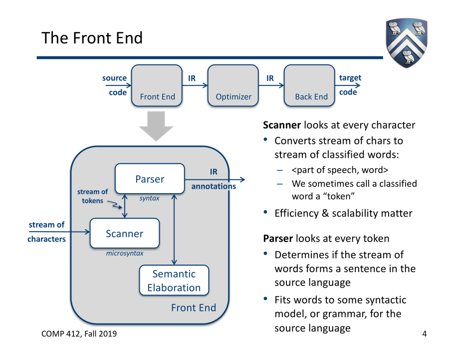

# 编译器前端

## 架构

### 识别器 scanner
扫描字符流，将其识别为<语法范畴(也就是句子的组成单位)，单词>的二元组（这个二元组也被称为token）
- 依据微语法(Microsyntax or lexical structure):句子每一部分的拼写规范
#### 背景知识
  
1. RE->NFA: 针对RE中的连接、选择、闭包算法都有相对应的转换为NFA的方式(Thompson构造法)，将其组合就可以
 
2. NFA->DFA: 子集构造法
3. DFA->minimal DFA
### 解析器 parser
前端主要部件。扫描token流，根据语法将推断语义，并最终转换为中间表示(IR, Intermediate Representation)
- 依据语法(Syntax or grammar):句子的每一部分的组合规范
- 语法的数学模型: 上下文无关文法(CFG, context-free grammar)，先称其为G。上下文无关语法可以由巴克斯(BNF)范式表示
- 验证句子是否属于G的算法
## 构建流程 
### 0. 定义语言
在构建前端之前，需要对语言进行定义  
定义的语言必须包含下列两方面的性质
- formal
- operational
### 1. 构建识别器
0. 可以用状态转移图表示，虽然直观但是不简洁，可以用正则替代
1. 用正则表达式表示微语法
2. 由识别器生成器依据正则表达式自动化构建确定性有限自动机(DFA)和识别器
### 2. 构建解析器
1. 用CFG表示语法
2. 依据CFG自动构建自顶向下自动机和解析器
## 常见做法
1. 用lex/yacc等类似生成器创建一个前端解析器
   - 可快速构建原型系统
   - 系统规模庞大后，难以维护
2. 用手写
   - 清晰且速度快
   - 开发周期长，也难以维护
## 术语
Deep theoretical foundations
General techniques 
Pervasive technology 普适技术
DFA: 确定性代表争对每一个字母有且仅有一次状态转移
NFA: 对一个字母可以有多种可能的转移，采用正确的转移依赖于之后的字符
