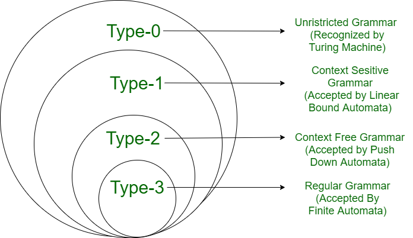

# 文法
描述语言的语法结构的形式规则
$G = (N, \sum, P, S)$
- N: 非终结符号的有限集合(可以再分解和定义(即向终结符推导))
- $\sum$: 有穷终结符号集合：一个有穷字符集$\sum$($\sum$中字符所构成的一个有穷序列称为字，不包含任何字符的序列成为空字，记作$\varepsilon$)
- P: 产生式规则集(通常是[非终结符]->[变量/终止符组成的字])
- S: 起始符号集($S\in N$)
## Chomsky hierarchy
约束越来越高

### Type0
- Language: Recurisively enumerable(递归可枚举集)
- Automaton: 图灵机
- Production rule: $\alpha A\beta \longrightarrow \delta $ 
### Type1
- Language: Context-sensitive 上下文有关语法
- Automaton: Linear-bounded non-deterministic Turing machine 线性有限自动机
- Production rule: $\alpha A\beta \longrightarrow \alpha \gamma \beta$
### Type2
- Language: Context-free 上下文无关语法
- Automaton: Non-deterministic pushdown automaton
- Production rule: $A\longrightarrow \alpha$
### Type3
- Language: Regular 正则文法
- Automaton: Finite state automaton 
- Production rule: $A\longrightarrow a$ and $A \longrightarrow aB$
## 语法树
由非终止符推向终止符
- 最左推导: 每步推导只改写最左边的那个非终结符
- 最右推导: 每步推导只改写最右边的那个非终结符

## 自动机
### DFA
确定的有穷自动机(DFA, Deterministic Finite Automaton)
$ A = (Q, \sum, \delta, q0, F)$
- Q: 有穷状态集
- $\sum$: 有穷输入符号集或字母表
- $\delta$: $Q \times \sum \longrightarrow Q$, 状态转移函数(可以写作$\delta(q,a) = p $)
- q0: $q0 \in Q$, 状态机初始状态
- F: $F\subseteq Q $, 状态机终结状态集或接受状态集
- 也可以用状态转移图或状态转移表表示
### NFA
非确定的有穷自动机(DFA, Deterministic Finite Automaton)
$ A = (Q, \sum, \delta, q0, F)$
- Q: 有穷状态集
- $\sum$: 有穷输入符号集或字母表
- $\delta$: $Q \times \sum \longrightarrow 2^{Q}$, 状态转移函数(可以写作$\delta(q,a) = p $)
- q0: $q0 \in Q$, 状态机初始状态
- F: $F\subseteq Q $, 状态机终结状态集或接受状态集
- 也可以用状态转移图或状态转移表表示
### NFA与DFA的等价性
有穷自动机+栈 -> NFA 不等于 DFA
有穷自动机+读头可写可向两侧移动 -> 图灵机(识别语言的能力是相同的，效率不知道 N=NP问题)