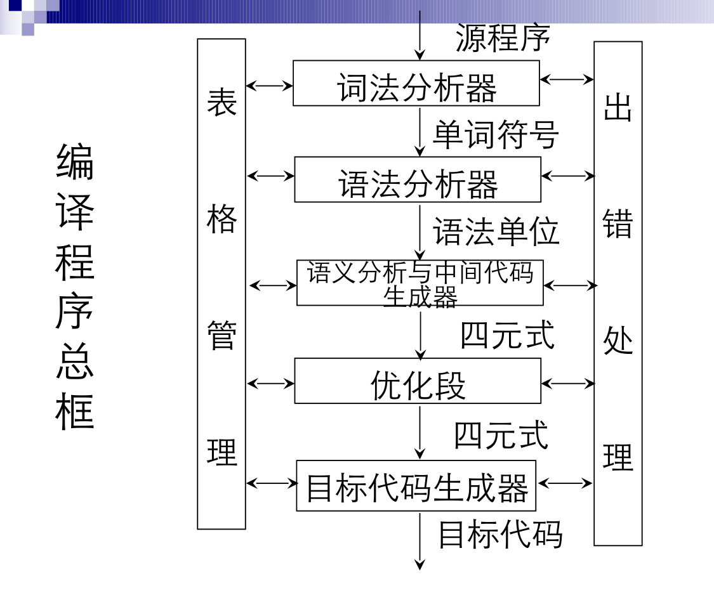

# intro to compiler
编程语言的实现有两种
- 编译器(Compilers):可以看作是offline，重点在于预处理程序(不需要为不同数据集修改程序)
- 解释器(Interpreters):可以看作是online，不会预处理程序
## history
- 1953年，最早由John Backus开发的Speedcoding解释器，开发速度快，但执行效率低，且占内存高达300B(当时的内存的30%)
- 1954-1957，还是John Backus带头开发了FORTRAN(Formulas Translated)，FORTRAN还带为现代编译器带来了标准的五个阶段
  1. Syntactic Analysis 句法分析
    1. Lexical Analysis 词法分析:依据（有限自动机描述的）构词规则，对字符串进行扫描、分解，识别出一个个单词符号
    2. Parsing 解析:生成语法树
  2. Semantic Analysis 语法分析：关注于类型、范畴规则。在词法分析基础上，根据语言的（上下文无关语法）语法规则把单词符号串分解成各类语法单位(语法范畴)
  3. (中间代码生成)：依据语义规则，对各类不同的语法范畴按语言的语义进行初步翻译
  4. Optimization 优化：依据程序的等价变换原则对中间代码进行加工变换，以期产生更高效的目标代码
  5. Code Generation 目标代码生成：转换为另一种语言（基于硬件系统结构核机器指令含义）
## 编译程序的结构
  
- 表格管理: 管理存储编译过程中的信息的数据结构
- 出错处理: 语法词法错误(非法字符、括号不匹配)/语义错误(说明错误、类型错误)
