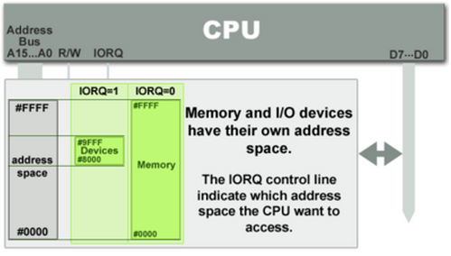
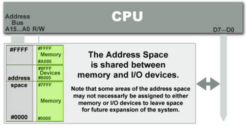

# DPDK
as a user driver，DPDK被认为是一组用户态的网络包输入/输出库
## 流程
### 初始化
#### 设备配置
内核通过CPU指令或BIOS函数对PCI总线上设备进行枚举获取pci信息。一般来说PCI总线和设备的枚举和放在系统上电后的自检阶段，内核对其配置通过BIOS调用的形式实现。在内核代码arch/i386/kernel/pci-pc.c:pcibios_init函数中通过条件编译来选择直接枚举PCI设备还是调用BIOS获取。
获取到设备所需的存储区间和
#### 内存配置
大页内存
numa感知
### 网卡到内存
#### 网卡接收
网卡RX（Receiver，接收器）接受到物理信号，网卡LD（Line Decoder，线路解码器）对其进行解码，并将数据（0/1比特流）以帧为单位传递给IB（Input Buffer，输入缓存）。IB将帧逐个传递给CU（Control Unit，控制单元）进行分析和处理，丢弃或者去除帧头和帧尾上送。
#### 网卡上送
计算机系统将设备数据传输到内存上的方式有两种
1. Programmed I/O (PIO)：通过CPU指令控制数据传输，一条指令对应一次传输，且数据供cpu直接使用（同样可以由cpu转存到内存上供后续使用）。如果访问设备时，设备数据未准备好，cpu可能会踏步等待或者被调度让其他任务执行并等待设备中断。PIO的形式有两种，对于同一个设备两种方式可以同时使用
   
   - port-mapped I/O (PMIO)：指令根据设备的IO端口号（一种特殊的地址空间，与内存区别开来，早期就是为了防止设备挤占内存地址空间，所以用了另外一套）来指定设备获取数据，x86平台下的IN/OUT指令。通常读取键盘输入就是用的PMIO方式。
   
   - memory-mapped I/O (MMIO)：随着计算机硬件进步，CPU的位宽提高后，CPU可以访问的内存空间足够大，不需要额外的地址空间进行PMIO，可以让设备直接映射于内存地址（具体地址会由设备最初定义，主板BIOS会最终根据是否有冲突决定，传输地址的具体含义详见设备说明，可能由PMIO读取），CPU直接使用常规访存指令访问内存上的设备地址即可以访问设备数据。
2. Direct Memory Access (DMA)：使用PIO的方式虽然简单但需要全程CPU参与，在内存以及传输跟不上CPU的速度的情况下，浪费计算资源，DMA使得CPU从数据传输的工作中解放出来去做更有效的任务。DMA 有两种类型：third-party DMA 以及 bus mastering (first-party DMA)
   - third-party DMA：最初的DMA方式，这种方式在ISA总线和IBM PC上使用，由于当时大多是**共享总线**，且外部设备一般只能作为总线的从设备，不能够主动发出请求，所以需要在共享总线上有单独的DMAC(DMA Controller)，DMAC替代了CPU在PIO中的位置。DMAC和CPU都可以作为FSB的master，都可以向内存控制器发送内存读写请求。为执行DMA事务，CPU需要先通过PIO设置DMAC（DMA描述符，至少包括数据传输的源地址（SA）、目的地址（DA）、需要传输的数据量（data size）和每次总线传输的数据位宽（transfer size））。设置完成后，DMAC会发起对共享总线的使用请求，成为共享总线的master。
   - bus mastering (first-party DMA)：现在普遍使用的都是PCI总线，在PCI总线下，每个设备都可以暂时作为总线的master，主动发出DMA读写请求。当设备需要进行内存访问时，只需要获取内存地址对应的总线地址，请求总线控制权，并向目标地址发出读写请求即可。

内核准备好DMA描述符（至少包括数据传输的源地址（SA）、目的地址（DA）、需要传输的数据量（data size）、和每次总线传输的数据位宽（transfer size））通过PIO/DMA告知DMA控制器，由DMA控制器执行数据传输工作（由DMA控制器掌管总线），CPU则执行其他任务，传输完成后DMA控制器通知CPU（交还总线控制权）。

一个DMA事务，需要内核创建一个支持DMA的存储区域，将进程虚拟地址转换成真实物理地址告知DMA，并启动DMA事务。这过程需要上下文切换、地址的查找和转换操作，这不利于高性能输入/输出。

DPDK通过询问内核来计算它的物理地址后使用`eal_unix_memory.c:rte_mem_lock`锁定内存，这样网卡硬件可以在IO事务时使用这些物理地址，网卡硬件可以自己启动DMA事务的方式配置硬件，使DPDK避免了不必要的开销，并且可以完全从用户空间执行输入/输出（？）。
### 内存到处理
## Arch
### Core
1. EAL(Environment Abstraction Layer): set up initiation(像了解你的核数，要多少内存，哪些内存和哪个核绑定，网卡信息这些)
2. MBUF: 
3. MEMPOOL: 自己实现的内存池，被封为一个个小slab(使用大页内存，以减少TLB刷新)
4. RING: for lockless queues of packets send between threads and cores
5. TIMER: q
### kernal driver
1. IGB_UIO: enable the Poll mode driver
2. VFIO: enable the Poll mode driver
3. KNI:
## 参考
1. [Memory-mapped IO vs Port-mapped IO](https://www.bogotobogo.com/Embedded/memory_mapped_io_vs_port_mapped_isolated_io.php)
2. [网卡硬件收发包流程](https://www.cnblogs.com/winter-blogs/p/12003210.html)
3. [DMA介绍](https://jianyue.tech/posts/dma/)
4. [DMA指南](https://www.kernel.org/doc/html/latest/core-api/dma-api-howto.html)
5. https://read.seas.harvard.edu/cs161/2019/lectures/lecture17/
