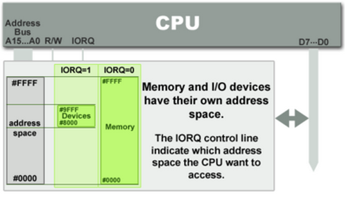
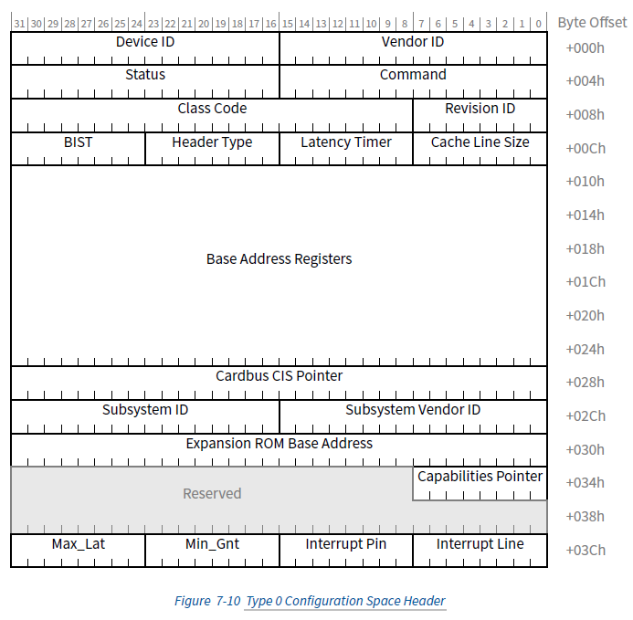

# DPDK
as a user driver，DPDK被认为是一组用户态的网络包输入/输出库
## background
计算机系统与设备数据的数据传输的方式有两种
1. Programmed I/O (PIO)：通过CPU指令控制数据传输，一条指令对应一次传输，且数据供cpu直接使用（同样可以由cpu转存到内存上供后续使用）。如果访问设备时，设备数据未准备好，cpu可能会踏步等待或者被调度让其他任务执行并等待设备中断。PIO的形式有两种，对于同一个设备两种方式可以同时使用
   
   - port-mapped I/O (PMIO)：指令根据设备的IO端口号（一种特殊的地址空间，与内存区别开来，早期就是为了防止设备挤占内存地址空间，所以用了另外一套）来指定设备获取数据，x86平台下的IN/OUT指令。通常读取键盘输入就是用的PMIO方式。
   
   - memory-mapped I/O (MMIO)：随着计算机硬件进步，CPU的位宽提高后，CPU可以访问的内存空间足够大，不需要额外的地址空间进行PMIO，可以让设备直接映射于内存地址（具体地址会由设备最初定义，主板BIOS会最终根据是否有冲突决定，传输地址的具体含义详见设备说明，可能由PMIO读取），CPU直接使用常规访存指令访问内存上的设备地址即可以访问设备数据。
2. Direct Memory Access (DMA)：使用PIO的方式虽然简单但需要全程CPU参与，在内存以及传输跟不上CPU的速度的情况(大数据量传输)下，浪费计算资源，DMA使得CPU从数据传输的工作中解放出来去做更有效的任务。DMA有以下三种类型
   - third-party DMA（standard DMA）：最初的DMA方式，这种方式在ISA总线和IBM PC上使用，由于当时大多是**共享总线**，且外部设备一般只能作为总线的从设备，不能够主动发出请求，所以需要在共享总线上有且仅有一个的DMAC(DMA Controller，在IBM PC上是Intel 8237)，DMAC替代了CPU在PIO中的位置。DMAC和CPU都可以作为FSB的master，都可以向内存控制器发送内存读写请求。为执行DMA事务，CPU需要先通过PIO设置DMAC（DMA描述符，至少包括数据传输的源地址（SA）、目的地址（DA）、需要传输的数据量（data size）和每次总线传输的数据位宽（transfer size））。设置完成后，DMAC会发起对共享总线的使用请求，成为共享总线的master。
   - bus master（first-party DMA）：现在普遍使用的PCI总线是一种点对点模型，且多数设备有自己的DMA控制器。当设备需要进行内存访问时，设备设置自己的DMA寄存器（DMA描述符，至少包括数据传输的源地址（SA）、目的地址（DA）、需要传输的数据量（data size）和每次总线传输的数据位宽（transfer size）），设备的DMA控制器主动向总线发出DMA读写请求，请求总线控制权，获得控制权后暂时作为bus master，向内存目标地址进行读写。
## 地址空间
```
             CPU                  CPU                  Bus
           Virtual              Physical             Address
           Address              Address               Space
            Space                Space

          +-------+             +------+             +------+
          |       |             |MMIO  |   Offset    |      |
          |       |  Virtual    |Space |   applied   |      |
        C +-------+ --------> B +------+ ----------> +------+ A
          |       |  mapping    |      |   by host   |      |
+-----+   |       |             |      |   bridge    |      |   +--------+
|     |   |       |             +------+             |      |   |        |
| CPU |   |       |             | RAM  |             |      |   | Device |
|     |   |       |             |      |             |      |   |        |
+-----+   +-------+             +------+             +------+   +--------+
          |       |  Virtual    |Buffer|   Mapping   |      |
        X +-------+ --------> Y +------+ <---------- +------+ Z
          |       |  mapping    | RAM  |   by IOMMU
          |       |             |      |
          |       |             |      |
          +-------+             +------+
```
CPU物理地址空间的排布可以通过`/proc/iomem`查看，不仅包括了内存条上的内存地址(System ROM)还包括PCIe 配置空间等
CPU执行的指令（内核和用户程序）使用的是CPU Virtual Address Space的地址**C**，通过MMU（段/页内存机制）转换得到了CPU Physical Address Space上的地址**B**，PA的归属最终由硬件电路决定。CPU发出的物理地址会被送到内存控制器（Memory Controller）或芯片组（Host Bridge Chipset），根据预定义的地址路由规则判断，如果是MMIO地址就会进一步对设备进行操作
I/O设备上的芯片（包括DMA）读写内存使用的是Bus Address Space的地址**Z**(总线地址/dma地址)（某些系统中总线地址恰好与CPU Physical Address相同），通过IOMMU转换得到了CPU Physical Address Space上的地址**Y**
PCIe枚举后，内核可以得到设备MMIO使用的PA地址**B**，然后通过ioremap()将physical Address 映射到 CPU Virtual Address Space 地址**C**以供程序（用户程序、驱动程序）访问MMIO使用。在使用完设备之后（比如在模块的 exit 例程中），调用 iounmap（）将地址空间返回给内核。
### 初始化
#### 设备配置
一般来说，系统上电后BIOS通过ACPI（Advanced Configuration and Power Interface）完成PCI总线上设备的枚举，为所有设备分配配置空间并将所有设备的配置空间映射到物理地址空间中，然后BIOS通过ECAM（Enhanced Configuration Access Mechanism）访问机制（PCI时代是CAM机制）转交给操作系统内核。操作系统使用BDF（Bus总线号 + Device设备号 + Function功能号）构成了每个PCIe设备节点的唯一标识，通过ECAM基址+设备BDF偏移获得设备配置空间对应的物理内存地址，获得设备配置空间对应的物理内存地址则可以通过MMIO读写配置空间。


配置空间中的BAR（Base Address Register）用于描述不同的内存空间或者IO空间的地址基址和范围（为了描述不同类型的地址空间，这里的地址不是单纯的指针，有特定结构），设备和系统通过一个握手协议对BAR进行多次读写来协商基址和范围，具体的值可以通过`lspci -vv`查看。

``` sh
[root@localhost /]# cat /proc/iomem | grep 18:00.0
    a9800000-a9ffffff : 0000:18:00.0
    aa400000-aa7fffff : 0000:18:00.0
    aa808000-aa80ffff : 0000:18:00.0
    aa910000-aaa0ffff : 0000:18:00.0
    aae80000-aaefffff : 0000:18:00.0
[root@localhost /]# lspci -vv -s 18:00.0
    18:00.0 Ethernet controller: Intel Corporation Ethernet Controller XL710 for 40GbE QSFP+ (rev 02)
	Subsystem: Intel Corporation Ethernet Converged Network Adapter XL710-Q2
	Control: I/O- Mem+ BusMaster+ SpecCycle- MemWINV- VGASnoop- ParErr- Stepping- SERR- FastB2B- DisINTx+
	Status: Cap+ 66MHz- UDF- FastB2B- ParErr- DEVSEL=fast >TAbort- <TAbort- <MAbort- >SERR- <PERR- INTx-
	Latency: 0, Cache Line Size: 32 bytes
	Interrupt: pin A routed to IRQ 37
	NUMA node: 0
	Region 0: Memory at a9800000 (64-bit, prefetchable) [size=8M]
	Region 3: Memory at aa808000 (64-bit, prefetchable) [size=32K]
	Expansion ROM at aae80000 [disabled] [size=512K]
	Capabilities: [40] Power Management version 3
		Flags: PMEClk- DSI+ D1- D2- AuxCurrent=0mA PME(D0+,D1-,D2-,D3hot+,D3cold+)
		Status: D0 NoSoftRst+ PME-Enable- DSel=0 DScale=1 PME-
	Capabilities: [50] MSI: Enable- Count=1/1 Maskable+ 64bit+
		Address: 0000000000000000  Data: 0000
		Masking: 00000000  Pending: 00000000
	Capabilities: [70] MSI-X: Enable+ Count=129 Masked-
		Vector table: BAR=3 offset=00000000
		PBA: BAR=3 offset=00001000
	Capabilities: [a0] Express (v2) Endpoint, MSI 00
		DevCap:	MaxPayload 2048 bytes, PhantFunc 0, Latency L0s <512ns, L1 <64us
			ExtTag+ AttnBtn- AttnInd- PwrInd- RBE+ FLReset+ SlotPowerLimit 0.000W
		DevCtl:	Report errors: Correctable+ Non-Fatal+ Fatal+ Unsupported+
			RlxdOrd+ ExtTag+ PhantFunc- AuxPwr- NoSnoop- FLReset-
			MaxPayload 256 bytes, MaxReadReq 512 bytes
		DevSta:	CorrErr- UncorrErr- FatalErr- UnsuppReq- AuxPwr- TransPend-
		LnkCap:	Port #0, Speed 8GT/s, Width x8, ASPM L1, Exit Latency L0s <2us, L1 <16us
			ClockPM- Surprise- LLActRep- BwNot- ASPMOptComp+
		LnkCtl:	ASPM L1 Enabled; RCB 64 bytes Disabled- CommClk+
			ExtSynch- ClockPM- AutWidDis- BWInt- AutBWInt-
		LnkSta:	Speed 8GT/s, Width x8, TrErr- Train- SlotClk+ DLActive- BWMgmt- ABWMgmt-
		DevCap2: Completion Timeout: Range ABCD, TimeoutDis+, LTR-, OBFF Not Supported
		DevCtl2: Completion Timeout: 50us to 50ms, TimeoutDis-, LTR-, OBFF Disabled
		LnkCtl2: Target Link Speed: 2.5GT/s, EnterCompliance- SpeedDis-
			 Transmit Margin: Normal Operating Range, EnterModifiedCompliance- ComplianceSOS-
			 Compliance De-emphasis: -6dB
		LnkSta2: Current De-emphasis Level: -3.5dB, EqualizationComplete+, EqualizationPhase1+
			 EqualizationPhase2+, EqualizationPhase3+, LinkEqualizationRequest-
	Capabilities: [e0] Vital Product Data
		Product Name: XL710 40GbE Controller
		Read-only fields:
			[PN] Part number: 
			[EC] Engineering changes: 
			[FG] Unknown: 
			[LC] Unknown: 
			[MN] Manufacture ID: 
			[PG] Unknown: 
			[SN] Serial number: 
			[V0] Vendor specific: 
			[RV] Reserved: checksum good, 0 byte(s) reserved
		Read/write fields:
			[V1] Vendor specific: 
		End
	Capabilities: [100 v2] Advanced Error Reporting
		UESta:	DLP- SDES- TLP- FCP- CmpltTO- CmpltAbrt- UnxCmplt- RxOF- MalfTLP- ECRC- UnsupReq- ACSViol-
		UEMsk:	DLP- SDES- TLP- FCP- CmpltTO- CmpltAbrt- UnxCmplt- RxOF- MalfTLP- ECRC- UnsupReq+ ACSViol-
		UESvrt:	DLP+ SDES+ TLP- FCP+ CmpltTO- CmpltAbrt- UnxCmplt- RxOF+ MalfTLP+ ECRC- UnsupReq- ACSViol-
		CESta:	RxErr- BadTLP- BadDLLP- Rollover- Timeout- NonFatalErr-
		CEMsk:	RxErr- BadTLP- BadDLLP- Rollover- Timeout- NonFatalErr+
		AERCap:	First Error Pointer: 00, GenCap+ CGenEn- ChkCap+ ChkEn-
	Capabilities: [140 v1] Device Serial Number c0-6c-46-ff-ff-b7-a6-40
	Capabilities: [150 v1] Alternative Routing-ID Interpretation (ARI)
		ARICap:	MFVC- ACS-, Next Function: 1
		ARICtl:	MFVC- ACS-, Function Group: 0
	Capabilities: [160 v1] Single Root I/O Virtualization (SR-IOV)
		IOVCap:	Migration-, Interrupt Message Number: 000
		IOVCtl:	Enable- Migration- Interrupt- MSE- ARIHierarchy+
		IOVSta:	Migration-
		Initial VFs: 64, Total VFs: 64, Number of VFs: 0, Function Dependency Link: 00
		VF offset: 16, stride: 1, Device ID: 154c
		Supported Page Size: 00000553, System Page Size: 00000001
		Region 0: Memory at 00000000aa400000 (64-bit, prefetchable)
		Region 3: Memory at 00000000aa910000 (64-bit, prefetchable)
		VF Migration: offset: 00000000, BIR: 0
	Capabilities: [1a0 v1] Transaction Processing Hints
		Device specific mode supported
		No steering table available
	Capabilities: [1b0 v1] Access Control Services
		ACSCap:	SrcValid- TransBlk- ReqRedir- CmpltRedir- UpstreamFwd- EgressCtrl- DirectTrans-
		ACSCtl:	SrcValid- TransBlk- ReqRedir- CmpltRedir- UpstreamFwd- EgressCtrl- DirectTrans-
	Capabilities: [1d0 v1] #19
	Kernel driver in use: i40e
	Kernel modules: i40e
```
## 参考
1. [Memory-mapped IO vs Port-mapped IO](https://www.bogotobogo.com/Embedded/memory_mapped_io_vs_port_mapped_isolated_io.php)
2. [网卡硬件收发包流程](https://www.cnblogs.com/winter-blogs/p/12003210.html)
3. [DMA介绍](https://jianyue.tech/posts/dma/)
4. [DMA指南](https://www.kernel.org/doc/html/latest/core-api/dma-api-howto.html)
5. [PCIe设备配置](https://r12f.com/posts/pcie-2-config/)
6. https://read.seas.harvard.edu/cs161/2019/lectures/lecture17/
7. https://www.kernel.org/doc/html/latest/driver-api/device-io.html