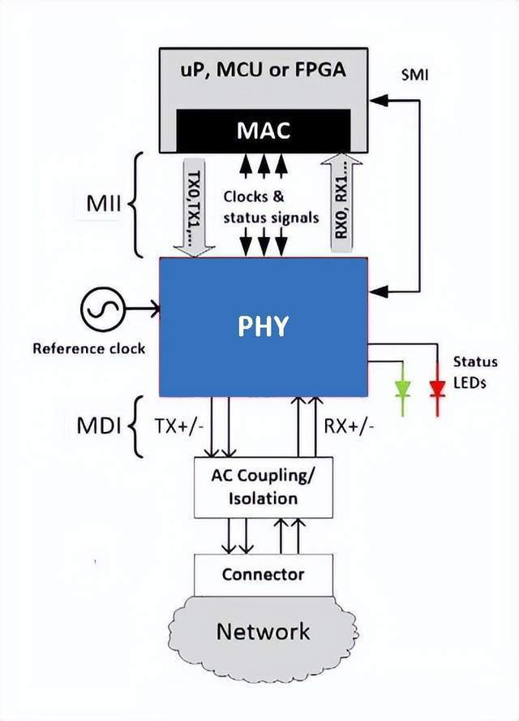
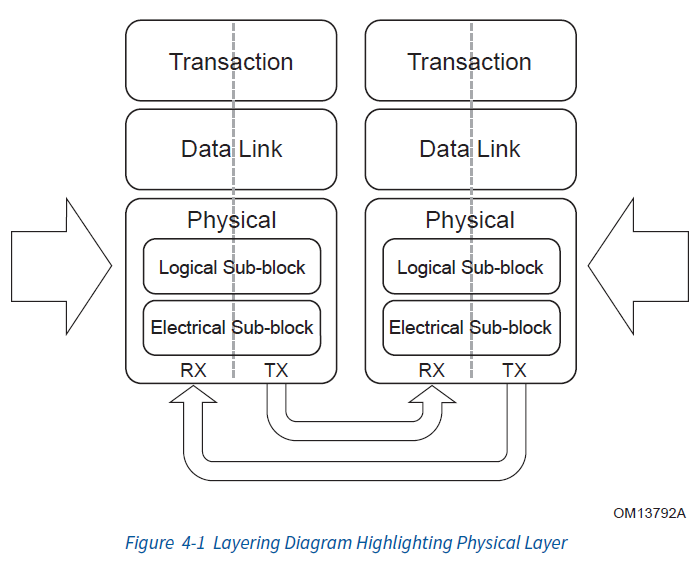
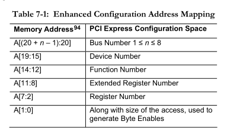
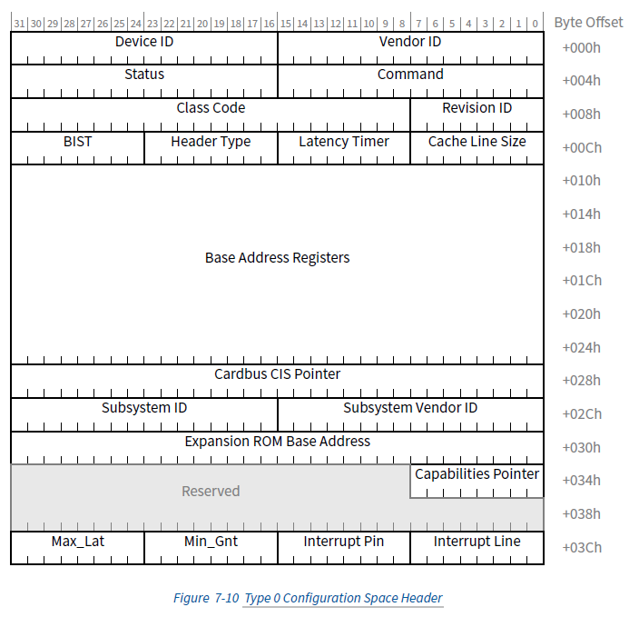
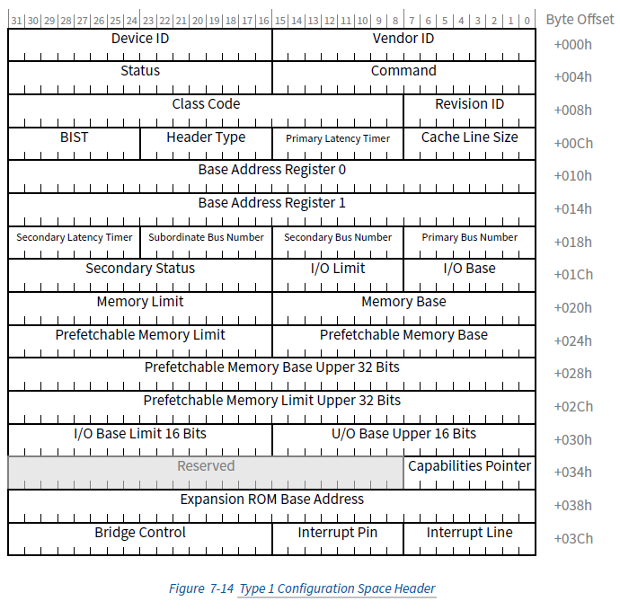
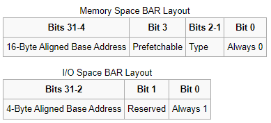

# 数据包到达网卡设备
数据包以数据帧的形式在网络上流转，会先到达网卡设备，由网卡处理后上送。
## background
计算机系统与设备数据的数据传输的方式有两种
1. Programmed I/O (PIO)：通过CPU指令控制数据传输，一条指令对应一次传输，且数据供cpu直接使用（同样可以由cpu转存到内存上供后续使用）。如果访问设备时，设备数据未准备好，cpu可能会踏步等待或者被调度让其他任务执行并等待设备中断。PIO的形式有两种，对于同一个设备两种方式可以同时使用
   
   - port-mapped I/O (PMIO)：指令根据设备的IO端口号（一种特殊的地址空间，与内存区别开来，早期就是为了防止设备挤占内存地址空间，所以用了另外一套）来指定设备获取数据，x86平台下的IN/OUT指令。通常读取键盘输入就是用的PMIO方式。
   
   - memory-mapped I/O (MMIO)：随着计算机硬件进步，CPU的位宽提高后，CPU可以访问的内存空间足够大，不需要额外的地址空间进行PMIO，可以让设备直接映射于内存地址（具体地址会由设备最初定义，主板BIOS会最终根据是否有冲突决定，传输地址的具体含义详见设备说明，可能由PMIO读取），CPU直接使用常规访存指令访问内存上的设备地址即可以访问设备数据。
2. Direct Memory Access (DMA)：使用PIO的方式虽然简单但需要全程CPU参与，在内存以及传输跟不上CPU的速度的情况(大数据量传输)下，浪费计算资源，DMA使得CPU从数据传输的工作中解放出来去做更有效的任务。DMA有以下三种类型
   - third-party DMA（standard DMA）：最初的DMA方式，这种方式在ISA总线和IBM PC上使用，由于当时大多是**共享总线**，且外部设备一般只能作为总线的从设备，不能够主动发出请求，所以需要在共享总线上有且仅有一个的DMAC(DMA Controller，在IBM PC上是Intel 8237)，DMAC替代了CPU在PIO中的位置。DMAC和CPU都可以作为FSB的master，都可以向内存控制器发送内存读写请求。为执行DMA事务，CPU需要先通过PIO设置DMAC（DMA描述符，至少包括数据传输的源地址（SA）、目的地址（DA）、需要传输的数据量（data size）和每次总线传输的数据位宽（transfer size））。设置完成后，DMAC会发起对共享总线的使用请求，成为共享总线的master。
   - bus master（first-party DMA）：现在普遍使用的PCI总线是一种点对点模型，且多数设备有自己的DMA控制器。当设备需要进行内存访问时，设备设置自己的DMA寄存器（DMA描述符，至少包括数据传输的源地址（SA）、目的地址（DA）、需要传输的数据量（data size）和每次总线传输的数据位宽（transfer size）），设备的DMA控制器主动向总线发出DMA读写请求，请求总线控制权，获得控制权后暂时作为bus master，向内存目标地址进行读写。
### 地址空间
```
             CPU                  CPU                  Bus
           Virtual              Physical             Address
           Address              Address               Space
            Space                Space

          +-------+             +------+             +------+
          |       |             |MMIO  |   Offset    |      |
          |       |  Virtual    |Space |   applied   |      |
        C +-------+ --------> B +------+ ----------> +------+ A
          |       |  mapping    |      |   by host   |      |
+-----+   |       |             |      |   bridge    |      |   +--------+
|     |   |       |             +------+             |      |   |        |
| CPU |   |       |             | RAM  |             |      |   | Device |
|     |   |       |             |      |             |      |   |        |
+-----+   +-------+             +------+             +------+   +--------+
          |       |  Virtual    |Buffer|   Mapping   |      |
        X +-------+ --------> Y +------+ <---------- +------+ Z
          |       |  mapping    | RAM  |   by IOMMU
          |       |             |      |
          |       |             |      |
          +-------+             +------+
```
CPU物理地址空间的排布可以通过`/proc/iomem`查看，不仅包括了内存条上的内存地址(System ROM)还包括PCIe 配置空间等
CPU执行的指令（内核和用户程序）使用的是CPU Virtual Address Space的地址**C**，通过MMU（段/页内存机制）转换得到了CPU Physical Address Space上的地址**B**，PA的归属最终由硬件电路决定。CPU发出的物理地址会被送到内存控制器（Memory Controller）或芯片组（Host Bridge Chipset），根据预定义的地址路由规则判断，如果是MMIO地址就会进一步对设备进行操作
I/O设备上的芯片（包括DMA）读写内存使用的是Bus Address Space的地址**Z**(总线地址/dma地址)（某些系统中总线地址恰好与CPU Physical Address相同），通过IOMMU转换得到了CPU Physical Address Space上的地址**Y**
PCIe枚举后，内核可以得到设备MMIO使用的PA地址**B**，然后通过ioremap()将physical Address 映射到 CPU Virtual Address Space 地址**C**以供程序（用户程序、驱动程序）访问MMIO使用。在使用完设备之后（比如在模块的 exit 例程中），调用 iounmap（）将地址空间返回给内核。
## 网卡硬件设备介绍

网卡工作于物理层和数据链路层，其功能模块可以简单分为两个部分
1. MAC（Media Access Control 媒体访问控制层）：主要负责数据链路层的处理。MAC向上连接PCI总线上送收到的数据包给操作系统/接收操作系统待发送的数据包，向下通过MII接口连接到PHY，提供接受/发送的数据进行数据帧的构建、错误校验等功能
2. PHY（Physical Layer）：主要负责物理层的处理。PHY通过物理介质连接到网络，提供接受信号、物理信号（指电压/电流波形/光信号等）与数据之间的相互转换、数据编码、时间基准等功能


现代网络设备通常通过PCIe总线与CPU连接，数据以包（packet）为单位通过PCIe协议进行传输。（pcie细节可以参考[5](https://r12f.com/posts/pcie-2-config/)的系列文章继续了解）
## 设备初始化
### 设备配置
一般来说
1. 系统上电后BIOS/UEFI通过ACPI（Advanced Configuration and Power Interface）完成PCI总线上设备的枚举，为所有设备分配配置空间并将所有设备的配置空间映射到物理地址空间中，并生成ACPI表（ECAM基地址存放于ACPI表的MCFG表中）。UEFI将其数据通过内核启动参数传递给内核。
2. 内核初始化`start_kernel(void)`中针对特定体系架构进行初始化`setup_arch()`，在其中进行`efi_init()`efi的初始化。从`struct boot_params boot_params`中获取到`struct efi efi`数据结构，其中包含ACPI表信息。
3. 之后`setup_arch()`->`acpi_boot_table_init(void)`->`acpi_table_init(void)`->`acpi_initialize_tables`函数中通过`acpi_os_get_root_pointer(void)`获取ACPI表的RSDP地址，并进一步通过`acpi_tb_parse_root_table`函数将ACPI表的内容解析到全局数据结构`struct acpi_table_list acpi_gbl_root_table_list`中。
4. 内核初始化`start_kernel(void)`中初始化ACPI子系统`acpi_early_init(void)`，其中`acpi_load_tables(void)`->`acpi_tb_load_namespace(void)`函数将解析全局数据结构`struct acpi_table_list acpi_gbl_root_table_list`并加载到ACPI命名空间树`struct acpi_namespace_node *acpi_gbl_root_node`中。
5. acpi子系统的初始化通过`subsys_initcall(acpi_init);`注册，再通过执行`start_kernel(void)`最后一步`rest_init(void)`->`kernel_thread(kernel_init, NULL, CLONE_FS | CLONE_SIGHAND)`->`kernel_init(void *unused)`->`kernel_init_freeable(void)`->`do_basic_setup(void)`->`do_initcalls(void)`函数时被调用。 
6. `acpi_init(void)`->`acpi_scan_init(void)`时，会注册设备扫描handler其中就包括`struct acpi_scan_handler pci_root_handler`，注册后`acpi_bus_scan(ACPI_ROOT_OBJECT)`函数会扫描ACPI命名空间树，通过注册的扫描handler寻找并创建设备（包括PCI Root Bridge 设备）
7. 对于创建好的PCI Root Bridge设备，`acpi_bus_scan(ACPI_ROOT_OBJECT)`还会调用`acpi_bus_device_attach`->`acpi_scan_attach_handler`函数中注册了的`pci_root_handler`的`acpi_pci_root_add`从ACPI表中获取PCI Root Bridge的domain和bus（包括之前ACPI表的MCFG地址）（参考如下dmesg日志）并构建一个`struct acpi_pci_root *root`数据结构，通过函数`struct pci_bus *pci_acpi_scan_root(struct acpi_pci_root *root)`继续扫描PCI设备。
8. `pci_acpi_scan_root`->`pci_create_root_bus`函数中会遍历列举在PCI Root Bridgebus上的resource。
9. `pci_scan_child_bus`->`pci_scan_slot`->`pci_scan_single_device`->`pci_scan_device`->`pci_setup_device`中创建`struct pci_dev *dev`数据结构并为pci设备设置配置空间。
简单来说就是，BIOS通过ECAM（Enhanced Configuration Access Mapping）（PCI时代是CAM机制）将其转交给操作系统内核。操作系统使用BDF（Bus总线号 + Device设备号 + Function功能号）构成了每个PCIe设备节点的唯一标识，通过ECAM基址+设备BDF偏移获得设备配置空间对应的物理内存地址，获得设备配置空间对应的物理内存地址则可以通过MMIO读写配置空间。
``` dmesg
[    1.371200] PCI: Using host bridge windows from ACPI; if necessary, use "pci=nocrs" and report a bug
[    1.371247] ACPI: Enabled 6 GPEs in block 00 to 7F
[    1.409123] ACPI: PCI Root Bridge [PC00] (domain 0000 [bus 00-16])
[    1.409128] acpi PNP0A08:00: _OSC: OS supports [ExtendedConfig ASPM ClockPM Segments MSI]
[    1.409219] acpi PNP0A08:00: _OSC: platform does not support [SHPCHotplug AER]
[    1.409300] acpi PNP0A08:00: _OSC: OS now controls [PCIeHotplug PME PCIeCapability]
[    1.409705] PCI host bridge to bus 0000:00
[    1.409708] pci_bus 0000:00: root bus resource [io  0x0000-0x03af window]
[    1.409709] pci_bus 0000:00: root bus resource [io  0x03e0-0x0cf7 window]
[    1.409710] pci_bus 0000:00: root bus resource [io  0x03b0-0x03bb window]
[    1.409712] pci_bus 0000:00: root bus resource [io  0x03c0-0x03df window]
[    1.409713] pci_bus 0000:00: root bus resource [io  0x1000-0x3fff window]
[    1.409714] pci_bus 0000:00: root bus resource [mem 0x000a0000-0x000bffff window]
[    1.409716] pci_bus 0000:00: root bus resource [mem 0x000c4000-0x000c7fff window]
[    1.409717] pci_bus 0000:00: root bus resource [mem 0xfe010000-0xfe010fff window]
[    1.409718] pci_bus 0000:00: root bus resource [mem 0x90000000-0x9d7fffff window]
[    1.409719] pci_bus 0000:00: root bus resource [mem 0x380000000000-0x383fffffffff window]
[    1.409721] pci_bus 0000:00: root bus resource [bus 00-16]
[    1.409729] pci 0000:00:00.0: [8086:2020] type 00 class 0x060000
[    1.409897] pci 0000:00:04.0: [8086:2021] type 00 class 0x088000
[    1.409913] pci 0000:00:04.0: reg 0x10: [mem 0x383ffff2c000-0x383ffff2ffff 64bit]
[    1.410040] pci 0000:00:04.1: [8086:2021] type 00 class 0x088000
[    1.410055] pci 0000:00:04.1: reg 0x10: [mem 0x383ffff28000-0x383ffff2bfff 64bit]
[    1.410183] pci 0000:00:04.2: [8086:2021] type 00 class 0x088000
[    1.410197] pci 0000:00:04.2: reg 0x10: [mem 0x383ffff24000-0x383ffff27fff 64bit]
[    1.410322] pci 0000:00:04.3: [8086:2021] type 00 class 0x088000
[    1.410337] pci 0000:00:04.3: reg 0x10: [mem 0x383ffff20000-0x383ffff23fff 64bit]
[    1.410463] pci 0000:00:04.4: [8086:2021] type 00 class 0x088000
[    1.410478] pci 0000:00:04.4: reg 0x10: [mem 0x383ffff1c000-0x383ffff1ffff 64bit]
[    1.410606] pci 0000:00:04.5: [8086:2021] type 00 class 0x088000
[    1.410621] pci 0000:00:04.5: reg 0x10: [mem 0x383ffff18000-0x383ffff1bfff 64bit]
[    1.410747] pci 0000:00:04.6: [8086:2021] type 00 class 0x088000
[    1.410761] pci 0000:00:04.6: reg 0x10: [mem 0x383ffff14000-0x383ffff17fff 64bit]
[    1.410888] pci 0000:00:04.7: [8086:2021] type 00 class 0x088000
[    1.410902] pci 0000:00:04.7: reg 0x10: [mem 0x383ffff10000-0x383ffff13fff 64bit]
```


> 上述流程是在服务器端的一般情况，因为服务器端用户对不同硬件的兼容性上有需求，UEFI+ACPI的生态已经相对完善，实现也相对灵活。在ARM嵌入式端则采用了设备树（DeviceTree）的方式对设备进行枚举。另外有些设备不支持ECAM机制需要能通过I/O-based (CF8/CFC mechanism)来访问PCI设备配置空间.



配置空间中的BAR（Base Address Register）用于描述不同的内存空间或者IO空间的地址基址和范围（为了描述不同类型的地址空间，这里的地址不是单纯的指针，有特定结构），BAR的值最初也是由BIOS配置， 设备和系统通过一个握手协议对BAR进行多次读写来协商基址和范围，具体的值可以通过`lspci -vv`查看。

``` bash
[root@localhost /]# cat /proc/iomem | grep 18:00.0
    a9800000-a9ffffff : 0000:18:00.0
    aa400000-aa7fffff : 0000:18:00.0
    aa808000-aa80ffff : 0000:18:00.0
    aa910000-aaa0ffff : 0000:18:00.0
    aae80000-aaefffff : 0000:18:00.0
[root@localhost /]# lspci -vv -s 18:00.0
    18:00.0 Ethernet controller: Intel Corporation Ethernet Controller XL710 for 40GbE QSFP+ (rev 02)
	Subsystem: Intel Corporation Ethernet Converged Network Adapter XL710-Q2
	Control: I/O- Mem+ BusMaster+ SpecCycle- MemWINV- VGASnoop- ParErr- Stepping- SERR- FastB2B- DisINTx+
	Status: Cap+ 66MHz- UDF- FastB2B- ParErr- DEVSEL=fast >TAbort- <TAbort- <MAbort- >SERR- <PERR- INTx-
	Latency: 0, Cache Line Size: 32 bytes
	Interrupt: pin A routed to IRQ 37
	NUMA node: 0
	Region 0: Memory at a9800000 (64-bit, prefetchable) [size=8M]
	Region 3: Memory at aa808000 (64-bit, prefetchable) [size=32K]
	Expansion ROM at aae80000 [disabled] [size=512K]
	Capabilities: [40] Power Management version 3
		Flags: PMEClk- DSI+ D1- D2- AuxCurrent=0mA PME(D0+,D1-,D2-,D3hot+,D3cold+)
		Status: D0 NoSoftRst+ PME-Enable- DSel=0 DScale=1 PME-
	Capabilities: [50] MSI: Enable- Count=1/1 Maskable+ 64bit+
		Address: 0000000000000000  Data: 0000
		Masking: 00000000  Pending: 00000000
	Capabilities: [70] MSI-X: Enable+ Count=129 Masked-
		Vector table: BAR=3 offset=00000000
		PBA: BAR=3 offset=00001000
	Capabilities: [a0] Express (v2) Endpoint, MSI 00
		DevCap:	MaxPayload 2048 bytes, PhantFunc 0, Latency L0s <512ns, L1 <64us
			ExtTag+ AttnBtn- AttnInd- PwrInd- RBE+ FLReset+ SlotPowerLimit 0.000W
		DevCtl:	Report errors: Correctable+ Non-Fatal+ Fatal+ Unsupported+
			RlxdOrd+ ExtTag+ PhantFunc- AuxPwr- NoSnoop- FLReset-
			MaxPayload 256 bytes, MaxReadReq 512 bytes
		DevSta:	CorrErr- UncorrErr- FatalErr- UnsuppReq- AuxPwr- TransPend-
		LnkCap:	Port #0, Speed 8GT/s, Width x8, ASPM L1, Exit Latency L0s <2us, L1 <16us
			ClockPM- Surprise- LLActRep- BwNot- ASPMOptComp+
		LnkCtl:	ASPM L1 Enabled; RCB 64 bytes Disabled- CommClk+
			ExtSynch- ClockPM- AutWidDis- BWInt- AutBWInt-
		LnkSta:	Speed 8GT/s, Width x8, TrErr- Train- SlotClk+ DLActive- BWMgmt- ABWMgmt-
		DevCap2: Completion Timeout: Range ABCD, TimeoutDis+, LTR-, OBFF Not Supported
		DevCtl2: Completion Timeout: 50us to 50ms, TimeoutDis-, LTR-, OBFF Disabled
		LnkCtl2: Target Link Speed: 2.5GT/s, EnterCompliance- SpeedDis-
			 Transmit Margin: Normal Operating Range, EnterModifiedCompliance- ComplianceSOS-
			 Compliance De-emphasis: -6dB
		LnkSta2: Current De-emphasis Level: -3.5dB, EqualizationComplete+, EqualizationPhase1+
			 EqualizationPhase2+, EqualizationPhase3+, LinkEqualizationRequest-
	Capabilities: [e0] Vital Product Data
		Product Name: XL710 40GbE Controller
		Read-only fields:
			[PN] Part number: 
			[EC] Engineering changes: 
			[FG] Unknown: 
			[LC] Unknown: 
			[MN] Manufacture ID: 
			[PG] Unknown: 
			[SN] Serial number: 
			[V0] Vendor specific: 
			[RV] Reserved: checksum good, 0 byte(s) reserved
		Read/write fields:
			[V1] Vendor specific: 
		End
	Capabilities: [100 v2] Advanced Error Reporting
		UESta:	DLP- SDES- TLP- FCP- CmpltTO- CmpltAbrt- UnxCmplt- RxOF- MalfTLP- ECRC- UnsupReq- ACSViol-
		UEMsk:	DLP- SDES- TLP- FCP- CmpltTO- CmpltAbrt- UnxCmplt- RxOF- MalfTLP- ECRC- UnsupReq+ ACSViol-
		UESvrt:	DLP+ SDES+ TLP- FCP+ CmpltTO- CmpltAbrt- UnxCmplt- RxOF+ MalfTLP+ ECRC- UnsupReq- ACSViol-
		CESta:	RxErr- BadTLP- BadDLLP- Rollover- Timeout- NonFatalErr-
		CEMsk:	RxErr- BadTLP- BadDLLP- Rollover- Timeout- NonFatalErr+
		AERCap:	First Error Pointer: 00, GenCap+ CGenEn- ChkCap+ ChkEn-
	Capabilities: [140 v1] Device Serial Number c0-6c-46-ff-ff-b7-a6-40
	Capabilities: [150 v1] Alternative Routing-ID Interpretation (ARI)
		ARICap:	MFVC- ACS-, Next Function: 1
		ARICtl:	MFVC- ACS-, Function Group: 0
	Capabilities: [160 v1] Single Root I/O Virtualization (SR-IOV)
		IOVCap:	Migration-, Interrupt Message Number: 000
		IOVCtl:	Enable- Migration- Interrupt- MSE- ARIHierarchy+
		IOVSta:	Migration-
		Initial VFs: 64, Total VFs: 64, Number of VFs: 0, Function Dependency Link: 00
		VF offset: 16, stride: 1, Device ID: 154c
		Supported Page Size: 00000553, System Page Size: 00000001
		Region 0: Memory at 00000000aa400000 (64-bit, prefetchable)
		Region 3: Memory at 00000000aa910000 (64-bit, prefetchable)
		VF Migration: offset: 00000000, BIR: 0
	Capabilities: [1a0 v1] Transaction Processing Hints
		Device specific mode supported
		No steering table available
	Capabilities: [1b0 v1] Access Control Services
		ACSCap:	SrcValid- TransBlk- ReqRedir- CmpltRedir- UpstreamFwd- EgressCtrl- DirectTrans-
		ACSCtl:	SrcValid- TransBlk- ReqRedir- CmpltRedir- UpstreamFwd- EgressCtrl- DirectTrans-
	Capabilities: [1d0 v1] #19
	Kernel driver in use: i40e
	Kernel modules: i40e
```
### PCIe设备与驱动匹配
驱动通过`module_init`进行加载，加载时通过`pci_register_driver`对`igb_driver`注册到PCI子系统中。DPDK则使用`pci_register_driver`注册了uio驱动。已经注册的pci驱动可以通过`ls /sys/bus/pci/drivers`查看
```C
// file: drivers\net\ethernet\intel\igb\igb_main.c
/**
 *  igb_init_module - Driver Registration Routine
 *
 *  igb_init_module is the first routine called when the driver is
 *  loaded. All it does is register with the PCI subsystem.
 **/
static int __init igb_init_module(void)
{
	int ret;
	pr_info("%s - version %s\n",
	       igb_driver_string, igb_driver_version);

	pr_info("%s\n", igb_copyright);

#ifdef CONFIG_IGB_DCA
	dca_register_notify(&dca_notifier);
#endif
	ret = pci_register_driver(&igb_driver);
	return ret;
}

module_init(igb_init_module);
```
驱动对应的所有设备型号会存放在`pci_driver`结构中的`id_table`中。通过PCIe设备配置空间的Device ID 和 Vendor ID找到`igb_pci_tbl`中的设备后，`probe`函数（在这里也就是`igb_probe`）将会对设备作为PCI设备进行初始化。
```C
// file: drivers\net\ethernet\intel\igb\igb_main.c
static struct pci_driver igb_driver = {
	.name     = igb_driver_name,
	.id_table = igb_pci_tbl,
	.probe    = igb_probe,
	.remove   = igb_remove,
#ifdef CONFIG_PM
	.driver.pm = &igb_pm_ops,
#endif
	.shutdown = igb_shutdown,
	.sriov_configure = igb_pci_sriov_configure,
	.err_handler = &igb_err_handler
};
```
也可以通过手动将PCI设备解绑绑定到某一个驱动
``` bash
# 解绑
echo <BDF> > /sys/bus/pci/devices/<BDF>/driver/unbind

# 绑定

lspci -nn -s <BDF> 
# > 18:00.1 Ethernet controller [0200]: Intel Corporation Ethernet Controller XL710 for 40GbE QSFP+ [8086:1583] (rev 02)
# 8086 1583
echo "<vendor device>" > /sys/bus/pci/drivers/igb_uio/new_id
echo <BDF> > /sys/bus/pci/drivers/<driver>/bind
```
### 驱动初始化
绑定驱动后，驱动的`probe`函数会被调用。

#### 内核驱动
```C
// file: drivers\net\ethernet\intel\igb\igb_main.c
/**
 *  igb_probe - Device Initialization Routine
 *  @pdev: PCI device information struct
 *  @ent: entry in igb_pci_tbl
 *
 *  Returns 0 on success, negative on failure
 *
 *  igb_probe initializes an adapter identified by a pci_dev structure.
 *  The OS initialization, configuring of the adapter private structure,
 *  and a hardware reset occur.
 **/
static int igb_probe(struct pci_dev *pdev, const struct pci_device_id *ent)
{
	struct net_device *netdev;
	struct igb_adapter *adapter;
	struct e1000_hw *hw;
	u16 eeprom_data = 0;
	s32 ret_val;
	static int global_quad_port_a; /* global quad port a indication */
	const struct e1000_info *ei = igb_info_tbl[ent->driver_data];
	unsigned long mmio_start, mmio_len;
	int err, pci_using_dac;
	u8 part_str[E1000_PBANUM_LENGTH];

	/* Catch broken hardware that put the wrong VF device ID in
	 * the PCIe SR-IOV capability.
	 */
	if (pdev->is_virtfn) {
		WARN(1, KERN_ERR "%s (%hx:%hx) should not be a VF!\n",
			pci_name(pdev), pdev->vendor, pdev->device);
		return -EINVAL;
	}

	err = pci_enable_device_mem(pdev);
	if (err)
		return err;

	pci_using_dac = 0;
	err = dma_set_mask(&pdev->dev, DMA_BIT_MASK(64));
	if (!err) {
		err = dma_set_coherent_mask(&pdev->dev, DMA_BIT_MASK(64));
		if (!err)
			pci_using_dac = 1;
	} else {
		err = dma_set_mask(&pdev->dev, DMA_BIT_MASK(32));
		if (err) {
			err = dma_set_coherent_mask(&pdev->dev,
						    DMA_BIT_MASK(32));
			if (err) {
				dev_err(&pdev->dev,
					"No usable DMA configuration, aborting\n");
				goto err_dma;
			}
		}
	}
	······
	err = -ENOMEM;
	netdev = alloc_etherdev_mq(sizeof(struct igb_adapter),
				   IGB_MAX_TX_QUEUES);
	if (!netdev)
		goto err_alloc_etherdev;

	SET_NETDEV_DEV(netdev, &pdev->dev);

	pci_set_drvdata(pdev, netdev);
	adapter = netdev_priv(netdev);
	adapter->netdev = netdev;
	adapter->pdev = pdev;
	hw = &adapter->hw;
	hw->back = adapter;
	adapter->msg_enable = netif_msg_init(debug, DEFAULT_MSG_ENABLE);

	mmio_start = pci_resource_start(pdev, 0);
	mmio_len = pci_resource_len(pdev, 0);

	err = -EIO;
	hw->hw_addr = ioremap(mmio_start, mmio_len);
	if (!hw->hw_addr)
		goto err_ioremap;

	netdev->netdev_ops = &igb_netdev_ops;
	igb_set_ethtool_ops(netdev); // 注册ethtool工具使用的操作函数
	netdev->watchdog_timeo = 5 * HZ;
	······
	/* setup the private structure */
	err = igb_sw_init(adapter);
	if (err)
		goto err_sw_init;
	······
	err = register_netdev(netdev);
	······
}
```
##### 网卡启动
内核驱动会调用`register_netdev`将设备`netdev`以内核网络设备注册到网络子系统中。`netdev->netdev_ops`也就是`igb_netdev_ops`中定义了内核网络设备的各类操作接口实现。
其中`struct net_device_ops`的`ndo_open`成员函数会在`dev_open`的时候被调用（比如网卡up的时候），`igb_netdev_ops`中就是`igb_open`，`igb_open`会调用`igb_setup_all_rx/tx_resources`根据队列数量调用`igb_setup_rx_resources`分配RingBuffer，建立内存和Rx/Tx队列的映射关系。
- `rx_ring->desc`是网卡使用的内存地址，网卡设备通过dma将数据搬运到内存上的地址。`union e1000_adv_rx_desc` 是网卡设备硬件规定的描述符格式，将其大小与描述符数量相乘（并4k（页大小）对其）得到所需的dma内存大小，最终通过`dma_alloc_coherent`申请的一致性dma内存（处理器虚拟内存地址空间上的地址）。
- `rx_ring->rx_buffer_info`是内核使用的内存地址。用于存储数据包元数据，会对应`rx_ring->desc`里的数据包，用于之后`build_skb`使用。
``` C
// file: drivers/net/igb/igb_main.c
/**
 *  igb_setup_rx_resources - allocate Rx resources (Descriptors)
 *  @rx_ring: Rx descriptor ring (for a specific queue) to setup
 *
 *  Returns 0 on success, negative on failure
 **/
int igb_setup_rx_resources(struct igb_ring *rx_ring)
{
	struct device *dev = rx_ring->dev;
	int size;

	size = sizeof(struct igb_rx_buffer) * rx_ring->count;

	rx_ring->rx_buffer_info = vzalloc(size);
	if (!rx_ring->rx_buffer_info)
		goto err;

	/* Round up to nearest 4K */
	rx_ring->size = rx_ring->count * sizeof(union e1000_adv_rx_desc);
	rx_ring->size = ALIGN(rx_ring->size, 4096);

	rx_ring->desc = dma_alloc_coherent(dev, rx_ring->size,
					   &rx_ring->dma, GFP_KERNEL);
	if (!rx_ring->desc)
		goto err;
	······
}
```
`igb_open`还会调用`igb_request_irq`向操作系统内核注册中断，这里注册两种中断
1. Message Signaled Interrupts (MSI)-X中断：msi中断是消息标记中断，是pci设备使用的中断。PCI3.0提出了MSI-X，比MSI支持了更多的中断。MSI是指设备通过对特殊地址的写操作，通知CPU中断事件的到来。传统INTx中断可能会有多个设备共享一个中断引脚，同时多个功能也共享一个引脚，当触发中断后，中断处理程序需要查询中断对应的具体设备和具体事件。而MSI中断通过PCIe 内存写入事务（Memory Write TLP） 发送中断消息，每个中断对应唯一的目标地址（Message Address），设备间不共享，而且一个设备可以有中断向量（多个中断）代表不同的中断事件。同时传统中断可能存在设备数据写入内存行为已触发，但未真正写入内存，但中断已经到达的情况，MSI中断都是写内存行为所以可以保证顺序性。
2. INTx中断：设备通过针脚发送电信号到中断控制器，中断控制器通知CPU中断事件到来。
```C
// file: drivers/net/igb/igb_main.c
/**
 * igb_request_irq - initialize interrupts
 *
 * Attempts to configure interrupts using the best available
 * capabilities of the hardware and kernel.
 **/
static int igb_request_irq(struct igb_adapter *adapter)
{
	struct net_device *netdev = adapter->netdev;
	struct pci_dev *pdev = adapter->pdev;
	int err = 0;

	if (adapter->msix_entries) {
		err = igb_request_msix(adapter);
		if (!err)
			goto request_done;
		/* fall back to MSI */
		igb_clear_interrupt_scheme(adapter);
		if (!pci_enable_msi(adapter->pdev))
			adapter->flags |= IGB_FLAG_HAS_MSI;
		igb_free_all_tx_resources(adapter);
		igb_free_all_rx_resources(adapter);
		adapter->num_tx_queues = 1;
		adapter->num_rx_queues = 1;
		adapter->num_q_vectors = 1;
		err = igb_alloc_q_vectors(adapter);
		if (err) {
			dev_err(&pdev->dev,
			        "Unable to allocate memory for vectors\n");
			goto request_done;
		}
		err = igb_alloc_queues(adapter);
		if (err) {
			dev_err(&pdev->dev,
			        "Unable to allocate memory for queues\n");
			igb_free_q_vectors(adapter);
			goto request_done;
		}
		igb_setup_all_tx_resources(adapter);
		igb_setup_all_rx_resources(adapter);
	} else {
		igb_assign_vector(adapter->q_vector[0], 0);
	}

	if (adapter->flags & IGB_FLAG_HAS_MSI) {
		err = request_irq(adapter->pdev->irq, igb_intr_msi, 0,
				  netdev->name, adapter);
		if (!err)
			goto request_done;

		/* fall back to legacy interrupts */
		igb_reset_interrupt_capability(adapter);
		adapter->flags &= ~IGB_FLAG_HAS_MSI;
	}

	err = request_irq(adapter->pdev->irq, igb_intr, IRQF_SHARED,
			  netdev->name, adapter);

	if (err)
		dev_err(&adapter->pdev->dev, "Error %d getting interrupt\n",
			err);

request_done:
	return err;
}
```
`igb_request_msix`中通过`request_irq`中断注册函数为每个队列注册了中断处理函数`igb_msix_ring`。
```C
// file: drivers/net/igb/igb_main.c
static irqreturn_t igb_msix_ring(int irq, void *data)
{
	struct igb_q_vector *q_vector = data;

	/* Write the ITR value calculated from the previous interrupt. */
	igb_write_itr(q_vector);

	napi_schedule(&q_vector->napi);

	return IRQ_HANDLED;
}
```
todo 如何找到队列的MSI-X中断号以及如何设置/proc/irq/IRQ_NUMBER/smp_affinity
#### 用户态驱动
用户态驱动进进行部分初始化，剩余工作交给用户态程序处理。比如不申请dma内存，由用户态根据情况申请。比如DPDK就可以根据网卡的numa affinity 来申请dma内存
#####  uio驱动
uio驱动通过`struct uio_info`的`open`函数开启设备，这里也就是`igbuio_pci_open`。
```C
// file: http://dpdk.org/git/dpdk-kmods/linux/igb_uio/igb_uio.c
static int
igbuio_pci_probe(struct pci_dev *dev, const struct pci_device_id *id)
{
	struct rte_uio_pci_dev *udev;
	dma_addr_t map_dma_addr;
	void *map_addr;
	int err;
	······
	/* fill uio infos */
	udev->info.name = "igb_uio";
	udev->info.version = "0.1";
	udev->info.irqcontrol = igbuio_pci_irqcontrol;
	udev->info.open = igbuio_pci_open;
	udev->info.release = igbuio_pci_release;
	udev->info.priv = udev;
	udev->pdev = dev;
	atomic_set(&udev->refcnt, 0);
	······
}
```
`igbuio_pci_open`->`igbuio_pci_enable_interrupts`函数中的`pci_enable_msix`使能msix中断（貌似作为传统API不推荐使用了）以及调用`pci_alloc_irq_vectors`分配中断向量。如果在调用`pci_alloc_irq_vectors`函数时，参数`flag`中设置了`PCI_IRQ_AFFINITY`则中断会被分散到可用CPU上。
##### vfio驱动
```C
// file: drivers\vfio\pci\vfio_pci.c
static int vfio_pci_probe(struct pci_dev *pdev, const struct pci_device_id *id)
{
	u8 type;
	struct vfio_pci_device *vdev;
	struct iommu_group *group;
	int ret;

	pci_read_config_byte(pdev, PCI_HEADER_TYPE, &type);
	if ((type & PCI_HEADER_TYPE) != PCI_HEADER_TYPE_NORMAL)
		return -EINVAL;

	group = iommu_group_get(&pdev->dev);
	if (!group)
		return -EINVAL;

	vdev = kzalloc(sizeof(*vdev), GFP_KERNEL);
	if (!vdev) {
		iommu_group_put(group);
		return -ENOMEM;
	}

	vdev->pdev = pdev;
	vdev->irq_type = VFIO_PCI_NUM_IRQS;
	mutex_init(&vdev->igate);
	spin_lock_init(&vdev->irqlock);
	atomic_set(&vdev->refcnt, 0);

	ret = vfio_add_group_dev(&pdev->dev, &vfio_pci_ops, vdev);
	if (ret) {
		iommu_group_put(group);
		kfree(vdev);
	}

	return ret;
}
```
## 接收网络数据
### 
### dma

## 参考
1. [Memory-mapped IO vs Port-mapped IO](https://www.bogotobogo.com/Embedded/memory_mapped_io_vs_port_mapped_isolated_io.php)
2. [网卡硬件收发包流程](https://www.cnblogs.com/winter-blogs/p/12003210.html)
3. [DMA介绍](https://jianyue.tech/posts/dma/)
4. [DMA指南](https://www.kernel.org/doc/html/latest/core-api/dma-api-howto.html)
5. [PCIe设备配置](https://r12f.com/posts/pcie-2-config/)
6. https://r12f.com/posts/pcie-3-tl-dll/
7. https://r12f.com/posts/pcie-4-phy/
8. https://read.seas.harvard.edu/cs161/2019/lectures/lecture17/
9. https://www.kernel.org/doc/html/latest/driver-api/device-io.html
10. https://zhuanlan.zhihu.com/p/588313000
11. [以太网介绍及硬件设计](https://blog.csdn.net/sinat_15677011/article/details/105470683)
12. 张彦飞. 深入理解Linux网络: ：修炼底层内功，掌握高性能原理. 北京: 电子工业出版社, 2022.
13. [ACPI设备树- ACPI命名空间的表示](https://www.cnblogs.com/wanglouxiaozi/p/18720529)
14. [msi中断](https://docs.kernel.org/translations/zh_CN/PCI/msi-howto.html)
15. [Dynamic DMA mapping using the generic device](https://www.kernel.org/doc/html/latest/core-api/dma-api.html)