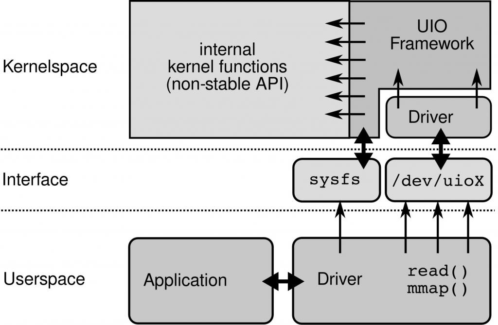

# driver
内核中的uio驱动框架：一个linux设备驱动的主要任务包括1）存取设备内存；2）处理设备产生的中断。UIO驱动框架提供了对非标准设备的定制驱动的开发框架。对于存取设备内存UIO核心使用了mmap实现了设备内存的映射。对于设备中断的处理，对设备中断的应答必须在内核空间进行，uio在内核中对中断进行应答和禁止，剩余的中断处理实现交给用户空间处理。一个uio驱动的实现（参考）包含两个部分，一部分是运行在内核空间的，主要包括有1）分配和记录设备需要的资源和注册UIO设备(igb_uio: module_init(igbuio_pci_init_module)->pci_register_driver->igbuio_pci_probe->uio_register_device->后续进入linux内核uio调用)；2）处理中断，这个有小部分在内核实现，另外的部分在用户空间（DPDK代码）中实现（实际上dpdk的处理就是不管这些中断，由cpu不断访问RX/TX描述符来处理数据包的收发时机）

### kernal driver
1. IGB_UIO: enable the Poll mode driver
2. VFIO: enable the Poll mode driver
3. KNI:

## linux net driver
Linux网络设备驱动程序遵循通用的接口，设计时采用的是面向对象的方法，一个设备就是一个对象（net_device结构）。一个网络设备最基本的方法有初始化、发送和接收

## 参考
https://www.kerneltravel.net/blog/2020/network_ljr7/
