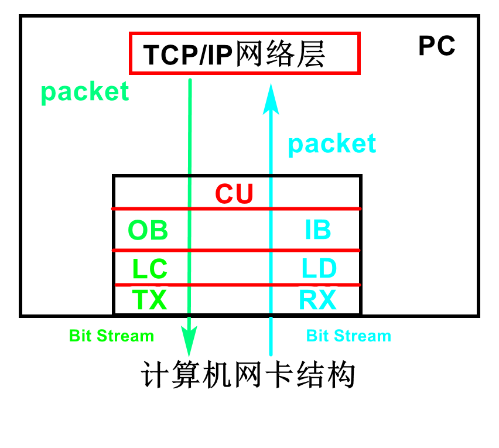

# 网卡收发包
## 网卡硬件

- CU（Control Unit，控制单元）
- OB（Output Buffer，输出缓存）/ IB（Input Buffer，输入缓存）
- LC（Line Coder，线路编码器）/ LD（Line Decoder，线路解码器）
- TX（Transmitter，发射器）/ RX（Receiver，接收器）
## 网卡硬件收包
1. RX从传输介质（例如双绞线）接收到物理信号（指电压/电流波形等），对物理信号的功率特性进行调整，再将调整后的物理信号传递给LD。
2. LD对来自RX的物理信号进行线路解码，将物理信号解码为0/1，并以帧为单位传递给IB。
3. IB从LD接收到帧以后，会按照帧的接收顺序将这些帧逐渐排列成一个队列，然后将队列中的帧逐个传递给CU
4. CU从IB接收到帧以后，会对帧进行处理，有两种可能的处理方式：1）丢弃；2）将这个帧的帧头和帧尾丢弃，得到数据包，将数据包上传给TCP/IP模型的网络层。
## DPDK - RX
### 网卡到内存
#### 网卡上送
内核准备好DMA描述符（至少包括数据传输的源地址（SA）、目的地址（DA）、需要传输的数据量（data size）、和每次总线传输的数据位宽（transfer size））通过PIO/DMA告知DMA控制器，由DMA控制器执行数据传输工作（由DMA控制器掌管总线），CPU则执行其他任务，传输完成后DMA控制器通知CPU（交还总线控制权）。

一个DMA事务，需要内核创建一个支持DMA的存储区域，将进程虚拟地址转换成真实物理地址告知DMA，并启动DMA事务。这过程需要上下文切换、地址的查找和转换操作，这不利于高性能输入/输出。

DPDK通过询问内核来计算它的物理地址后使用`eal_unix_memory.c:rte_mem_lock`锁定内存，这样网卡硬件可以在IO事务时使用这些物理地址，网卡硬件可以自己启动DMA事务的方式配置硬件，使DPDK避免了不必要的开销，并且可以完全从用户空间执行输入/输出（？）。

### 内存到处理

### DMA
驱动程序将虚拟地址X提供给dma_map_single（）等接口，该接口设置任何所需的IOMMU映射并返回总线地址Z。然后驱动程序告诉设备对总线地址Z进行DMA，IOMMU将其映射到系统RAM中地址Y处的缓冲区。

## 网卡硬件发包
1. CU接收到要发送的数据包，将每个数据包封装成帧（Frame）。在以太网中封装的数据帧为以太帧（Ethernet Frame）逐个传递给OB。
2. OB从CU收到帧后，会按帧的接收顺序将这些帧排成一个队列，逐个传递给LC
3. LC从OB收到帧后，会对这些帧进行线路编码，将0/1编码为物理信号，将物理信号传递给TX。
4. TX从LC收到物理信号后，会对物理信号的功率等特性进行调整，然后将调整后的物理信号通过线路发送出去。

## 参考
1.[网卡硬件结构及收发包流程](https://www.cnblogs.com/winter-blogs/p/12003210.html)