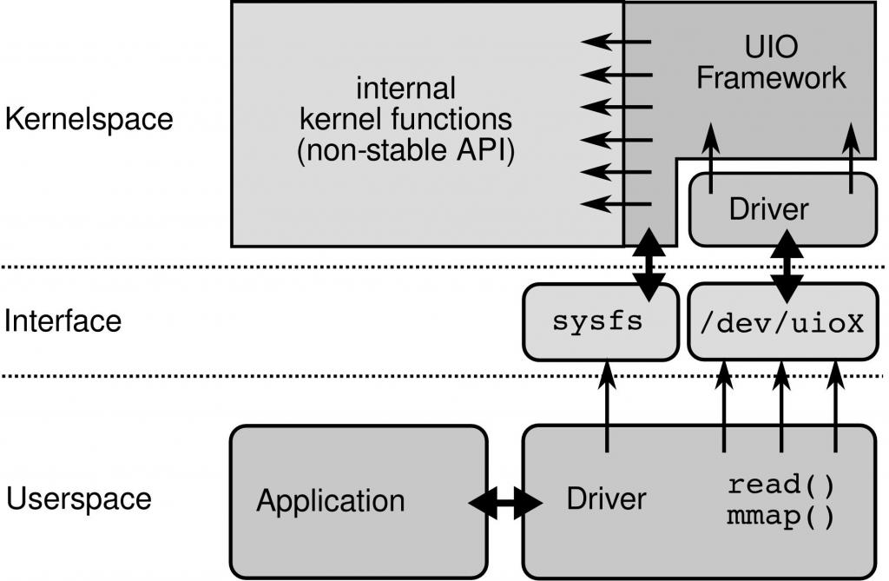
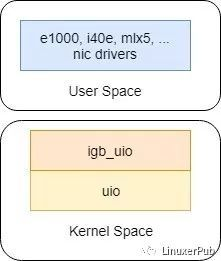

# DPDK中的内存
## 基本概念
1. 大页内存 hugepage: 使用大页内存可以用有限的TLB管理映射更多的内存，减少TLB miss
2. 内存NUMA亲和性: NUMA架构下CPU中内存控制器对本地内存的的访问更快，DPDK API提供明确的NUMA感知能力提升内存访问速率
3. 直接内存访问 DMA：DMA传输将数据从一个地址空间复制到另一个地址空间，提供在外设和存储器之间或者存储器和存储器之间的高速数据传输。当CPU初始化这个传输动作，传输动作本身是由DMA控制器来实现和完成的。实际上就是CPU将部分总线操作的工作交给了DMA控制器。一方面针对用户空间进程，DPDK利用DMA拷贝到内存后，用mmap直接将RX buffer数据映射到了用户空间，实现了零拷贝技术。另一方面针对设备，作为DMA用途的内存地址必须申请为[Pinned Memory(a.k.a. Page Locked Memory, Locked Pages, etc):Pinned memory are virtual memory pages that are specially marked so that they cannot be paged-out to disk](https://archive.kernel.org/oldlinux/htmldocs/kernel-api/API-get-user-pages-fast.html)，作为pinned memory，其物理地址会在一段时间内不改变，DPDK设备可以直接使用这些pinned memory的物理地址自行启动DMA传输，加速操作。
4. IOMMU & IOVA: 管理硬件设备可访问的内存，以便不可信进程污染内存。当IOMMU使用时，硬件设备访问的地址可能时由IOMMU分配的虚拟地址(IOVA)。DPDK可以感知物理内存布局，并利用IOMMU针对不同的用例更合理地利用内存。
5. DPDK内存分配: DPDK分配大页并在此内存中创建一个堆(heap)并将其提供给用户应用程序并用于存取应用程序内部的数据结构。自定义的内存分配器使得上述优化得以实行。DPDK也实现了固定大小内存的内存池，并进行了极致的优化，并向用户提供了可选的线程安全等级
6. 内核中的uio驱动框架：一个linux设备驱动的主要任务包括1）存取设备内存；2）处理设备产生的中断。UIO驱动框架提供了对非标准设备的定制驱动的开发框架。对于存取设备内存UIO核心使用了mmap实现了设备内存的映射。对于设备中断的处理，对设备中断的应答必须在内核空间进行，uio在内核中对中断进行应答和禁止，剩余的中断处理实现交给用户空间处理。一个uio驱动的实现（参考）包含两个部分，一部分是运行在内核空间的，主要包括有1）分配和记录设备需要的资源和注册UIO设备(igb_uio: module_init(igbuio_pci_init_module)->pci_register_driver->igbuio_pci_probe->uio_register_device->后续进入linux内核uio调用)；2）处理中断，这个有小部分在内核实现，另外的部分在用户空间（DPDK代码）中实现（实际上dpdk的处理就是不管这些中断，由cpu不断访问RX/TX描述符来处理数据包的收发时机）

7. DPDK本身并不执行所有硬件设备寄存器和中断映射，它需要内核的帮助。为此，DPDK要使用的所有硬件设备都需要绑定到一个通用PCI内核驱动程序（igb_uio/vfio_pci）。DPDK的UIO驱动屏蔽了硬件发出中断，然后在用户态采用主动轮询的方式，这种模式被称为PMD（Poll Mode Driver）。正常情况下，网卡收到数据包后，会发出中断信号，内核接收到中断信号后，会停止正在运行的程序，保护断点地址和处理机当前状态，转入相应的中断服务程序并执行中断服务程序，完成后，继续执行中断前的程序。DPDK PMD采用轮询的方式，直接访问RX和TX描述符而没有任何中断，以便在用户的应用程序中快速接收，处理和传送数据包。这样可以减少CPU频繁中断，切换上下文带来的消耗。在网卡大流量时，DPDK这种PMD的方式会带来较大的性能提升；但是在流量小的时候，CPU不断轮询，导致CPU性能浪费和功耗问题。为此，DPDK推出了Interrupt DPDK模式，它的原理和Linux的NAPI很像，就是没包可处理时进入睡眠，改为中断通知。

8. VFIO与UIO类似，VFIO内核模块与vfio-pci使设备寄存器和设备中断可供用户空间应用程序使用，并可使用IOMMU设置IOVA映射以从用户空间执行IO。
9. DPDK还实现了无需通用内核PCI驱动程序只靠标准内核的PMD，包括可用于libpcap的PMD
## DPDK
DPDK是一个用户态应用框架，其提供了用户态PMD和一组API以实现完全以用户态执行IO操作。
硬件操作（比如DMA）使用的是IO地址（物理地址或者IOMMU提供的IO虚拟地址），无法直接读取用户空间程序使用的虚拟地址（VA），且高速DMA需要大块连续的IO地址进行操作。
DPDK API统一使用ret_iova_t来代表硬件操作的物理地址或IO虚拟地址。
- 使用物理地址（PA）的情况：在初始化分配内存时使用的就是物理地址。优点是简单，对硬件无IOMMU要求，且其可以被内核空间使用（PA非常容易转换为内核空间地址）；缺点是需要root权限以获取物理地址的映射，且如果分配时当前物理内存空间分段过多导致没有足够大的连续空间使用时，就会导致分配失败、初始化失败（可以通过系统使用更大的分页解决，同时预留冗余的内存空间）
- 使用IO虚拟地址（IOVA）的情况：初始化分配内存时使用的是一块连续的IOVA地址，但在物理地址上可以不连续，对硬件来说相当于一块连续空间。优点是内存连续，且不需要root权限，缺点硬件及平台限制。

## 参考

1. https://www.intel.com/content/www/us/en/developer/articles/technical/memory-in-dpdk-part-1-general-concepts.html
2. https://www.intel.com/content/www/us/en/developer/articles/technical/memory-in-dpdk-part-2-deep-dive-into-iova.html
3. https://www.intel.com/content/www/us/en/developer/articles/technical/memory-in-dpdk-part-3-1711-and-earlier-releases.html
4. https://www.intel.com/content/www/us/en/developer/articles/technical/memory-in-dpdk-part-4-1811-and-beyond.html
5. https://zhuanlan.zhihu.com/p/363622877
6. https://archive.kernel.org/oldlinux/htmldocs/kernel-api/API-get-user-pages-fast.html
7. [PMD原理及代码解析](https://cloud.tencent.com/developer/article/1411982) 
8. [dpdk网卡绑定代码分析](https://blog.csdn.net/aixueai/article/details/114790649)