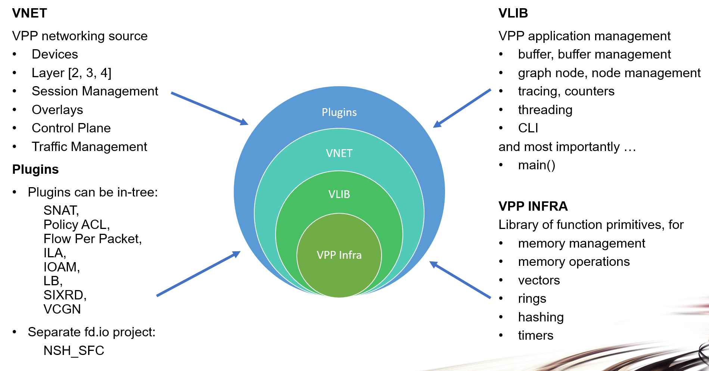

# VPP The Vector Packet Processor
网络数据的目的是交流，而交流存在自相似性。VPP通过矢量处理来解决自相似性带来的复杂性，从而提升性能
## VPP项目架构

## 配置VPP
对于所以配置参数，可以在源代码中搜索VLIB_CONFIG_FUNCTION和VLIB_EARLY_CONFIG_FUNCTION的调用。  
VLIB_CONFIG_FUNCTION(foo_config, "foo"):函数将"foo"参数块中给出的所有参数(foo{arg1 arg2 arg3})传递给foo_config函数进行调用
### unix
启动和行为类型属性，以及和os相关的属性
### api-trace
跟踪，转储和重播控制平面视图要求转发平面执行的操作和数据  
通常情况下，只需要简单的
```
api-trace {
    api-trace on
}
```
### api-segment
控制VPP二进制API接口
### socksvr
使用了一个Unix域名socket来处理二进制api消息，如果这个参数没有设置，则vpp不会通过socket处理二进制api消息。当以root运行时默认会使用`/run/vpp/api.sock`，其他用户会使用`/run/user/<uid>/api.sock`  
详情可见 .../vlibmemory/socket_api.c
### cpu
配置main thread/ worker thread和CPU core的绑定
### buffers
numa的buffer配置
### dpdk
dpdk配置
白名单形式：`dev <pci-dev> | default {...}`  
黑名单形势：`blacklist <pci-dev>`
### plugins
插件配置，有两种方式，可以禁用全部插件再启用某些，也可以启用全部再禁用某些。  
插件的加载时在构建图之前，所有插件加载完毕后才开始构建节点图
### statseg
// ? 统计部分？

## 开发者部分
### plugin development
在vpp插件的开发框架下开发插件有以下步骤：
1. 使用vpp/extras/emacs/make-plugin.sh脚本在vpp/src/plugins目录下生成模板代码
2. 在vpp/src/plugins/<your plugin>目录下进行开发
3. 在vpp目录下rebuild
#### 开发规范
可以参考src/plugins下的代码
##### 其他
1. 在vpp中用vlib_call_init_function宏去调用其他的init functions，在插件中要使用vlib_call_plugin_init_function
2. 如果你想要从另一个插件中获得一个指针，要用vlib_get_plugin_symbol
## 术语
FIB: 转发表Forwarding Info Base
RIB: 路由表Routing Info Base
