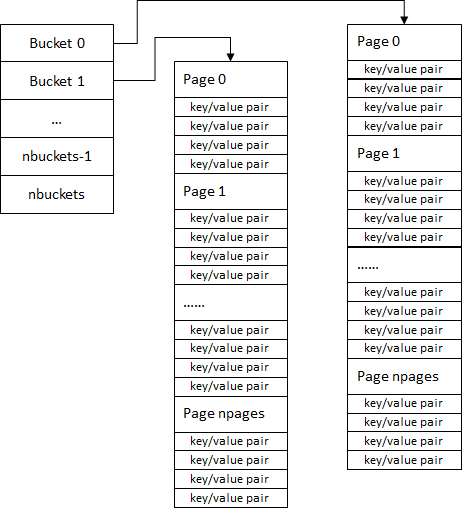

# HASH
数据结构头文件目录
- src/vppinfra/bihash_*_*.h(前一个\*代表key的字节数，后一个\*代表value的字节数)
- src/vppinfra/bihash_doc.h
- src/vppinfra/bihash_template.h(主数据结构和方法)
## 简介
VPP 底层库提供了两种hash实现，一种是普通hash，基于Vector，不具备线程安全，适用于静态查询场景。
另外一种是Bihash(Bounded-index extensible hashing),key大小规定，但线程安全。Bihash具有依据当前哈希冲突事件，动态扩大哈希表容量的能力，节省存储空间的同时，能够降低冲突的概率。

数据平面在处理数据包分类，session查询经常要使用Bihash。普通hash用于控制平面进行字符串匹配等。
通常Bihash使用是自己的heap上下文进行内存管理，也可以直接使用mmap来进行内存分配。

## Bihash
### Bihash原理
  
1. Bihash使用了三层来管理kv entry，第一层被管理单位为bucket， 第二层被管理单位为page，第三层被管理单位为kv pair(每个page可以存放一定数目的kv entry，一般来说是4个)。
2. bihash用类似pool的数据结构来管理固定数量的buckets，用动态数组来管理一个bucket里可变数量的page
3. 一个bucket中的page在虚拟内存中是顺序存放的。一个bucketet 最多管理256个page。
4. search过程，给定一个key，计算该key的hash code，选这个一个bucketet，定位该bucketet在内存中存放page的起始地址，
计算page offset，找到该key所在page，遍历page中的每一项，对比key，从而找到该value。
#### 算法分析
1. 每个bucket单元被整合为了一个64位int，同时vpp所适用的CPU支持64位原子操作。基于此，当要修改特定bucket时，采用以下操作免除读锁(todo)：
   1. 创建一个当前的bucket副本
   2. 通过原子操作将在bucket数组中的原bucket指针与此bucket副本指针交换
   3. 修改原bucket数据
   4. 通过原子操作交换回来
2. 查找时：我们取用hash key的最低N(N=n_log2nbuckets)位来索引bucket，次低N(N=n_log2pages)位来索引page，最后在page中遍历条目，对比关键字来找到精确匹配的记录(只在一个page中遍历而不是所有page时本算法的主要目的)。
3. 添加记录：当pages发生bucket冲突时，会将现有bucket的数量扩容一倍，rehash，并将bucket中可容纳的page数量扩容一倍。但当pages内发生连续的records冲突时，bucket内的存储会回退为线性存放，查找会回退到线性遍历一个bucket中所有的page中的record。所以为了尽量避免这种情况要选择合适的hash函数以及合适的bucket数量来控制page的使用率，查找性能通常不会因为bucket数组容量大小而产生显著变化
4. 删除记录：删除记录与查找过程类似，先定位record，若查询到则递减bucket->refcnt(当前bucket下有效记录数)，当bucket->refcnt==0时，释放回收Bucket指向的Page数组空间
5. hash函数：hash函数的选择会极大程度印象性能，特别是page利用率，vpp选用了cpu支持的crc32算法进行加速
### 源码解析
/vppinfra/bihash_template.h - Bihash模板头文件
/vppinfra/bihash_template.c - Bihash模板实现文件
/vppinfra/bihash_8_8.h      - Bihash实例头文件（键值对key为8字节，value为8字节）
/vppinfra/bihash_doc.h      - 作为Bihash解释性文档，列举Bihash实例化时需要定义的宏和实现的函数，作为实例化的参考文件
#### 数据结构及方法 (以bihash_8_8.h为例)
bihash表主结构
```c
typedef
BVS (clib_bihash)
{
  BVT (clib_bihash_bucket) * buckets;
  volatile u32 *alloc_lock;

  BVT (clib_bihash_value) ** working_copies; // 用于动态扩容时暂时存放数据
  int *working_copy_lengths;
  BVT (clib_bihash_bucket) saved_bucket;

  u32 nbuckets;
  u32 log2_nbuckets;
  u64 memory_size;
  u8 *name;
  format_function_t *fmt_fn;
  void *heap;
  BVT (clib_bihash_alloc_chunk) * chunks;

  u64 *freelists;

#if BIHASH_32_64_SVM
  BVT (clib_bihash_shared_header) * sh;
  int memfd;
#else
  BVT (clib_bihash_shared_header) sh;
#endif

  u64 alloc_arena;		/* Base of the allocation arena */
  volatile u8 instantiated;

  /**
    * A custom format function to print the Key and Value of bihash_key instead of default hexdump
    */
  format_function_t *kvp_fmt_fn;

  /** Optional statistics-gathering callback */
#if BIHASH_ENABLE_STATS
  void (*inc_stats_callback) (BVS (clib_bihash) *, int stat_id, u64 count);

  /** Statistics callback context (e.g. address of stats data structure) */
  void *inc_stats_context;
#endif

} BVT (clib_bihash);
```
bihash的HASH表头多CPU间共享的信息: 此结构只能由主CPU初始化。
```c
/* *INDENT-OFF* */
typedef CLIB_PACKED (struct {
  /*
   * Backing store allocation. Since bihash manages its own
   * freelists, we simple dole out memory starting from alloc_arena[alloc_arena_next].
   */
  u64 alloc_arena_next;	/* Next offset from alloc_arena to allocate, definitely NOT a constant */
  u64 alloc_arena_size;	/* Size of the arena */
  u64 alloc_arena_mapped;	/* Size of the mapped memory in the arena */
  /* Two SVM pointers stored as 8-byte integers */
  u64 alloc_lock_as_u64;
  u64 buckets_as_u64; // bucket数组的偏移
  /* freelist list-head arrays/vectors */
  u64 freelists_as_u64; // 空闲链的偏移
  u32 nbuckets;	/* Number of buckets */
  /* Set when header valid */
  volatile u32 ready; // 表明结构体数据是否在多cpu间都初始化完成
  u64 pad[1];
}) BVT (clib_bihash_shared_header);
/* *INDENT-ON* */
```
bihash的backet(hash槽): backet会记录page动态数组的首地址以供访问page
```c
typedef struct
{
  union
  {
    struct
    {
      u64 offset:BIHASH_BUCKET_OFFSET_BITS;
      u64 lock:1;
      u64 linear_search:1;
      u64 log2_pages:8; // 当前有数据的page数量(pages = 1 << log2_pages)
      u64 refcnt:16; // todo: 是有效键值对？
    };
    u64 as_u64; // 便于整体读取上述字段，用于原子操作
  };
} BVT (clib_bihash_bucket);
```
bihash的page(hash表项): 一个page存有BIHASH_KVP_PER_PAGE个键值对，page回收后放入空闲链(可通过next_free_as_u64找到)中不返还系统
```c
typedef struct BV (clib_bihash_value)
{
  union
  {
    BVT (clib_bihash_kv) kvp[BIHASH_KVP_PER_PAGE];
    u64 next_free_as_u64;
  };
} BVT (clib_bihash_value);
```
bihash的单个key-value对数据结构如下
```c
/** 8 octet key, 8 octet key value pair */
typedef struct
{
  u64 key;			/**< the key */
  u64 value;			/**< the value */
} clib_bihash_kv_8_8_t;
```
### 使用方法
参考/src/plugins/unittest/bihash_test.c
```c
...
#include <vppinfra/bihash_8_8.h>
#include <vppinfra/bihash_template.c>
...

```
| 序号 | 宏或者函数 | 说明 | 备注 |
| - |----------------|------------------|---------------------|
| 1 | clib_bihash_init_8_8(clib_bihash_8_8 *h, char *name, u32 nbuckets, uword memory_size) | 初始化名为name的，有nbuckets个buckets(事实上会优化为2的幂次的buckets)的0，总共为memory_size大小的bihash h | |
| 2 | clib_bihash_search_8_8(clib_bihash_8_8 *h, clib_bihash_kv_8_8_t *search_v, clib_bihash_kv_8_8_t *return_v) | 在bihash中查询key为search_v，value放在return_v中 | |
| 3 | clib_bihash_add_del_8_8(clib_bihash_8_8 *h, clib_bihash_kv_8_8 *add_v, int is_add) | 向bihash h删除(is_add = 0)/添加(is_add = 1)add_v键值对| |
| 4 | 累了。。。希望大家继续补充| | |
### 优化
其中散列函数和关键字比较函数对性能影响比较大。如果关键字比较函数比较慢，那么查找过程也将比较慢。如果哈希值计算过程比较慢，那么查找过程也将比较慢。充分利用好CPU架构向量化计算功能，将能较好提升性能。
## hash

## 参考
1. [VPP-BIHASH实现分析](https://blog.csdn.net/weixin_40870382/article/details/84851781?utm_medium=distribute.pc_relevant.none-task-blog-baidujs_title-1&spm=1001.2101.3001.4242)
2. [思科VPP源码分析（Bihash分析）](https://blog.csdn.net/jqh9804/article/details/55100994)
3. [vpp官方bihash介绍翻译和博主自己的一些总结](https://aijishu.com/a/1060000000017558)
4. 