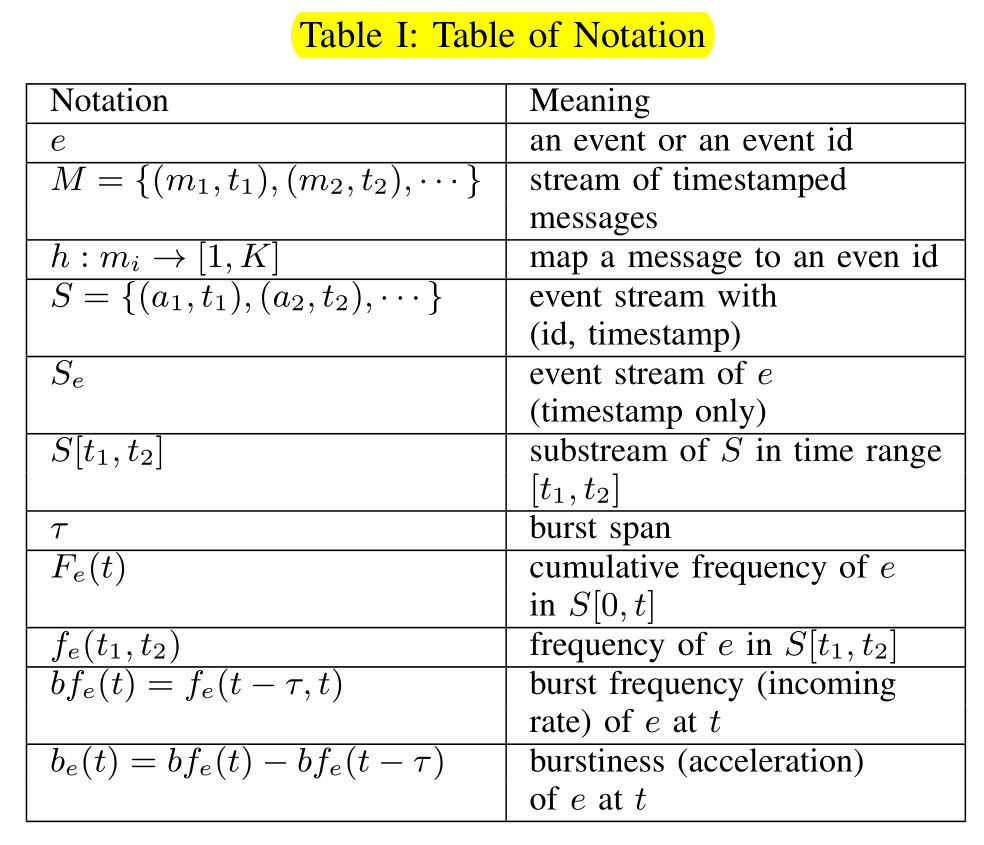
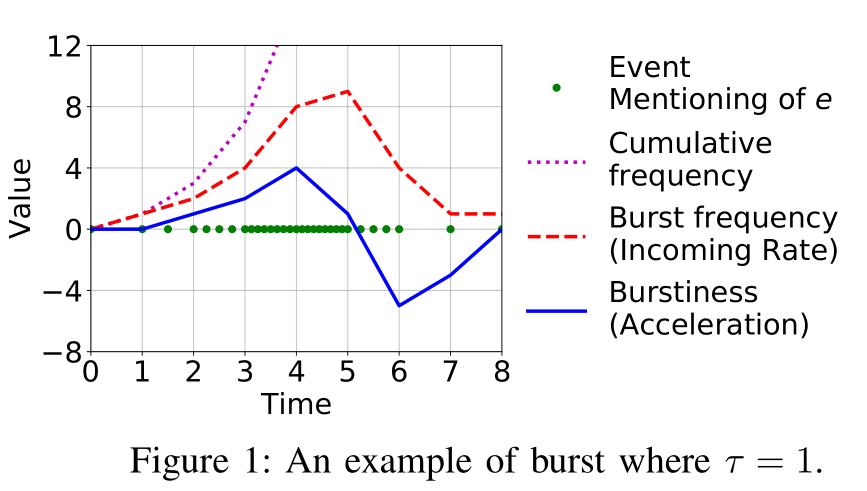
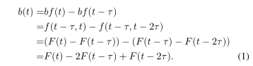

# Bursty Event Detection Throughout Histories
## 创新点
1. 提出了从流量历史数据中找到爆发性事件这方面研究的缺失
2. 提出了定量分析爆发性事件的概念值brustiness及其计算方法
3. 提出了从历史数据中查找一定brustiness值的事件的算法
4. 优化了上述算法
## 基本概念
### 概念解释

结合这张简单的示例图来说

简单地理解就是一条数据流中，对于同一事件e，其出现的次数总数为Cumulative frequency，单位事件内出现的次数为Burst frequency，两者的关系很好理解，对Cumulative frequency求导即为Burst frequency。进一步来说，文章定义对Burst frequency 求导所得的值就是Burstiness。这个值可以体现事件是否在短时间内大量爆发（即在数据流中的出现频率突增）。但是对于数据流中对应的时间戳是离散的。要在此定义一个时间区间$\tau$进行统计计算。

通常我们会需要得出以下三个数据
1. Point query $q(e,t,\tau)$: 在时间点t上事件e的burstiness值
2. Bursty time query $q(e,\theta, \tau)$: e的burstiness值大于阈值$\theta$的所有时间戳集合
3. Bursty event query $q(t,\theta, \tau)$: 多事件流场景下，burstiness值大于阈值$\theta$的所有事件e 

### 算法与数据结构
为得出上述数据，方案涉及以下步骤
1. 按照时间戳存储事件流，或者进一步来说，存储F(t)
2. 根据存储的F(t)，可以很容易的计算得出b(t)

最基本的方案是
1. 按照时间戳全量存储整条事件流，空间占用为O(n)
2. 对于Point query的时间复杂度为O(log n);没预先计算和存储Burstiness值的情况下Bursty time query的时间复杂度为O(n)，预计算的情况下为O(log n);bursty event query的时间复杂度为O(log n)

从实际应用来看，基本方案会随着时间增长导致事件流变得异常庞大，导致查询效率低下，最终使得基本方案维护及使用成本极大。但是往往在实际应用中，可以接受一定的误差以获取一个近似值，这让我们有机会拿可接受的误差换取查询效率。接下来就是相应的优化手段

#### 单事件流
##### 步骤一: 存储

#### 多事件流  