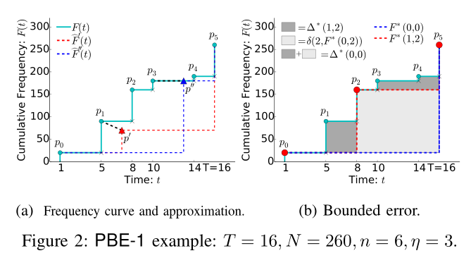
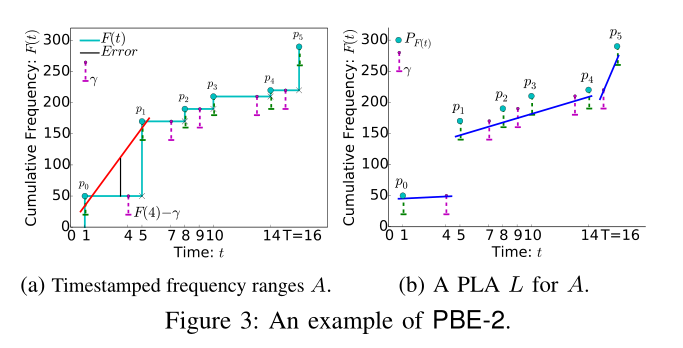
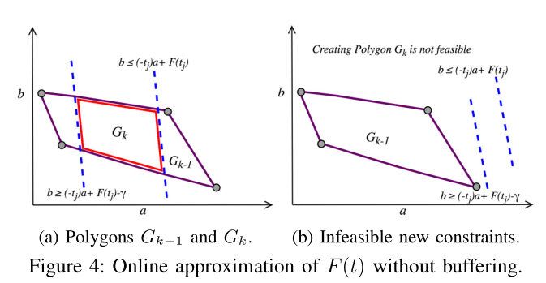

# Bursty Event Detection Throughout Histories
## 创新点
1. 提出了从流量历史数据中找到爆发性事件这方面研究的缺失
2. 提出了定量分析爆发性事件的概念值brustiness及其计算方法
3. 提出了从历史数据中查找一定brustiness值的事件的算法
4. 优化了上述算法
## 基本概念
### 概念解释

结合这张简单的示例图来说

简单地理解就是一条数据流中，对于同一事件e，其出现的次数总数为Cumulative frequency(F(t))，单位事件内出现的次数为Burst frequency(f(t))，两者的关系很好理解，对Cumulative frequency求导即为Burst frequency(b(t))。进一步来说，文章定义对Burst frequency 求导所得的值就是Burstiness。这个值可以体现事件是否在短时间内大量爆发（即在数据流中的出现频率突增）。但是对于数据流中对应的时间戳是离散的。要在此定义一个单位时间区间$\tau$进行统计计算。因此，F(t)图像在应用场景中将是一个单调增长的阶梯线。

通常我们会需要得出以下三个数据
1. Point query $q(e,t,\tau)$: 在时间点t上事件e的burstiness值
2. Bursty time query $q(e,\theta, \tau)$: e的burstiness值大于阈值$\theta$的所有时间戳集合
3. Bursty event query $q(t,\theta, \tau)$: 多事件流场景下，burstiness值大于阈值$\theta$的所有事件e 

### 算法与数据结构
为得出上述数据，很简单只要得到事件b(t)在t各个时刻的值（即b(t)函数的图像）即可，可通过以下步骤达成
1. 按照时间戳存储事件流数据，或者进一步来说，存储F(t)在t各个时刻的值（即F(t)图像）
2. 根据存储的F(t)，可以根据下列公式很容易地计算得出b(t)，同时可以通过简单的二分算法找到Bursty time query
$$
\begin{aligned}
b(t) & =b f(t)-b f(t-\tau) \\
& =f(t-\tau, t)-f(t-\tau, t-2 \tau) \\
& =(F(t)-F(t-\tau))-(F(t-\tau)-F(t-2 \tau)) \\
& =F(t)-2 F(t-\tau)+F(t-2 \tau)
\end{aligned}
$$

最基本的方案是
1. 按照时间戳全量存储整条事件流，空间占用为O(n)
2. 对于Point query的时间复杂度为O(log n);没预先计算和存储Burstiness值的情况下Bursty time query的时间复杂度为O(n)，预计算的情况下为O(log n);bursty event query的时间复杂度为O(log n)

从实际应用来看，基本方案会随着时间增长导致事件流变得异常庞大，导致查询效率低下，最终使得基本方案维护及使用成本极大。但是往往在实际应用中，可以接受一定的误差以获取一个近似值，这让我们有机会拿可接受的误差换取查询效率。接下来就是相应的优化压缩数据的方案

#### 单事件流
先以单事件流为例
##### 方案一
方案一通过利用F(t)阶梯线的性质，从中丢弃部分数据点，选用最具代表性的数据点来实现数据压缩。
###### 算法实现原理
- $F(t)$: Cumulative frequency事件累计出现频率函数
- $\widehat{F}(t)$: $F(t)$近似函数
- $F^*(t)$: 最优近似函数
- $\Delta$: $F(t)$与$\widehat{F}(t)$的差值积分$\Delta=\int_0^T(F(t)-\widehat{F}(t))$
- $\eta$: 用户指定数据点数量
- $P_F$: $F(t)$函数上的所有数据点集合
- $P_{F^*}$: $F^*(t)$上的$\eta$个数据点集合

假设压缩后的近似F(t)的函数$\widehat{F}(t) \leq F(t)$，存在一个近似函数与原函数的差值积分$\Delta=\int_0^T(F(t)-\widehat{F}(t))$，当这个差值积分$\Delta$最小的时候我们可以认定此时近似函数$\widehat{F}(t)$最接近F(t)，最能体现F(t)原有的数据。

根据上述假设，需要用户给出的其需要的数据点的数量$\eta$，给出的数据点数量小于原有F(t)函数数据点数量即数据压缩。接下来只需要在挑选出$\eta$个数据点能使得$\Delta$最小，那么所选出的点得出的函数就是最优近似函数了。利用反证法可以得出在假设$\widehat{F}(t) \leq F(t)$成立的情况下，$P_{F^*} \in  P_F$且必须包含两个边界点。现在问题被抽象为，只要在去除两个边界点的$P_F$中选取$\eta-2$个数据点，可以使得$\Delta$最小，则由两个边界点和选取的$\eta-2$个数据点组成的数据点集合，即为最优近似函数的数据点集合。

可以看示例图中，用户指定数据点数量为3，$P_F$有6个点，首先$P_{F^*}$必须包含${p_0}和{p_5}$,只需要在$P_F$剩下的点中再挑选一点使得图中2(b)中深灰色区域最小则可以获得包含三个最具代表性的数据点集合$P_{F^*}$

文章采用了动态规划算法实现了找出$\Delta$最小的算法，此处不再赘述
###### 优劣势分析
此方法采用了动态规划的算法，因此需要把原始数据$P_F$缓存下来，是一个离线算法。
- 劣势在于无法应对线上不断更新的数据。
- 优势在于对于数据压缩比可以较好保证达到用户预期
##### 方案二
方案二通过算法将阶梯线近似为多段分段函数来实现数据压缩
###### 算法实现原理
- $F(t)$: Cumulative frequency事件累计出现频率函数
- $\widehat{F}(t)$: $F(t)$近似函数
- $F^*(t)$: 最优近似函数
- $\gamma$: 用户给定的可接受误差范围
- $P_F$: $F(t)$函数上的所有数据点集合

此方案依旧假设压缩后的近似F(t)的函数$\widehat{F}(t) \leq F(t)$，且$\widehat{F}(t)$需要在根据用户给定的可接受误差范围$\gamma$内，即$F(t)-\gamma \leq \widehat{F}(t) \leq F(t)$。然而如果当相邻的点比如(t1,F(t1)),(t2,F(t2))的F(t)差值过大时简单的拟合会导致$[t1,t2]$区间的拟合点超过用户给定的可接受误差范围。为了解决这个问题我们要引入一些新的点，对于每个$p_i \in P_F$加一个$(t_i,F(t_i -1)$到$P_F$中，此时$P_F$中的点的数量为2n，现在问题变成了
$$
\begin{aligned}
& 对于所有的点p_i \in P_F(|P_F| = 2n)都满足不等式: \\
&   F(t_i)-\gamma \leq a_k*t_i + b_k \leq F(t_i) \\
& 其中a_k, b_k用于描述分段函数中第k段一次函数拟合线 \\
\end{aligned}
$$

可以通过解不等式的手段，找到符合要求的分段函数拟合线。首先将上述问题中的不等式化简可得
$$
\begin{aligned}
& b_k \geq (-{t_j}) a + F(t_j) - \gamma, \\
& b_k \leq (-{t_j}) a + F(t_j) \\
\end{aligned}
$$
根据$P_F(|P_F| = 2n)$中前k-1个点可以得出2(k-1)个不等式，组成一个解空间集合(示例图4(a))$G_k-1$。当一个新的点k到来时，带入又得到两个不等式，新的两个不等式的解空间集合在原空间集合中为两条平行线中间的部分，若新的两个不等式带来的解空间集合$G_k-1$交集不为空(示例图4(a))则解空间集合为其交集，若交集为空(示例图4(b))则存储$G_k-1$中一点为解，得出前k-1个点的拟合曲线解$y=a_k-1 x + b_k-1$，并等待下一个到来的k+1点带来新的不等式以获得新的解集合空间。以此类推，可得到满足要求的拟合分段函数。

###### 优劣势分析
此方法支持数据实时更新，是实时算法
- 优势在于不用缓存大部分数据，可以实时计算拟合线
- 劣势在于没有办法保证一个确定压缩比，特别式数据变化剧烈的时间段压缩比越差，$\gamma$越小，分段函数分段越多，压缩效果越差
#### 多事件流  
//todo