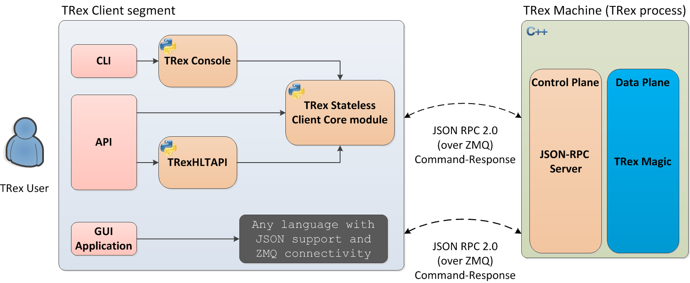
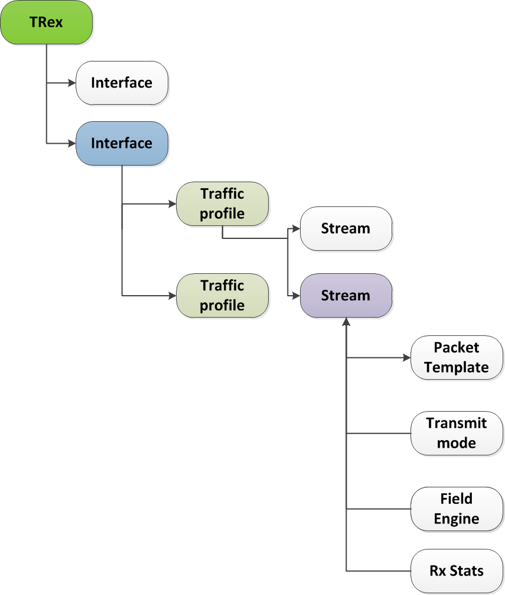

# stateless 无状态

- 层级
  - 控制传输协议:REQ(请求)/RES(响应)模式下的ZMQ
  - 在控制传输层之上采用JSON-RPC2协议
  - 其他一些异步传输协议:SUB(订阅)/PUB(发布)模式下的ZMQ
- 使用方式
  - python API
  - CLI控制台(底层使用了Python API)
  - GUI(在JSON-RPC2层上实现的)
## trex对象
  
- TRex: trex实例
- interface: 每个trex实例可以有多个interface用于TX/RX packets
- Traffic profile: 每个interface可以有多个Traffic profile用于发送packets
- Stream: 每个Traffic profile(流量样本)可以有多个Stream发送packets
  - Packet Template: 包模板(可以理解为pcap，最大9KB)
  - Field Engine: 用于修改包内的字段与大小
  - Mode: 用于决定发送数据包的模式，包括:Continuous/Burst/Multi-burst
  - Rx Stats: 用于采集每条Stream的统计数据
  - Rate: pps/bps
  - Action: 指定当前流完成后的下一条流（当Continuous/Burst模式下使用)
## usage
样例代码可以参考script/stl目录下的python文件
### stl/udp_1pkt_simple.py
在trex-console中使用这个python文件
```
[bash]>trex-console

Connecting to RPC server on localhost:4501                   [SUCCESS]
connecting to publisher server on localhost:4500             [SUCCESS]
Acquiring ports [0, 1, 2, 3]:                                [SUCCESS]

125.69 [ms]

trex>start -f stl/udp_1pkt_simple.py -m 10mbps -a

```
```python
from trex_stl_lib.api import *
import argparse


class STLS1(object):

    def create_stream (self):                                                   # 定义流
        return STLStream(                       
            packet =                                                            # 定义Packet Template
                    STLPktBuilder(
                        pkt = Ether()/IP(src="16.0.0.1",dst="48.0.0.1")/
                                UDP(dport=12,sport=1025)/(10*'x')
                    ),
             mode = STLTXCont())                                                # 定义Mode

    def get_streams (self, tunables, **kwargs):                                 # 用于解析在console调用此脚本时的参数，并根据参数和create_stream，播放流量
        parser = argparse.ArgumentParser(description='Argparser for {}'.format(os.path.basename(__file__)), 
                                         formatter_class=argparse.ArgumentDefaultsHelpFormatter)
        args = parser.parse_args(tunables)
        # create 1 stream 
        return [ self.create_stream() ]


# dynamic load - used for trex console or simulator
def register():                                                                 # 注册后才能使用
    return STLS1()
```
### python API
```python
# 导入stl_trex库路径
import stl_path
# 导入TRex Stateless库
from trex.stl.api import *

import time
import json

# simple packet creation 用Scapy的包生成器
def create_pkt (size, direction):

    ip_range = {'src': {'start': "10.0.0.1", 'end': "10.0.0.254"},
                'dst': {'start': "8.0.0.1",  'end': "8.0.0.254"}}

    if (direction == 0):
        src = ip_range['src']
        dst = ip_range['dst']
    else:
        src = ip_range['dst']
        dst = ip_range['src']
    # 详细用法查看Field Engine API
    vm = [                                                                      
        # src
        STLVmFlowVar(name="src",min_value=src['start'],max_value=src['end'],size=4,op="inc"),
        STLVmWrFlowVar(fv_name="src",pkt_offset= "IP.src"),

        # dst
        STLVmFlowVar(name="dst",min_value=dst['start'],max_value=dst['end'],size=4,op="inc"),
        STLVmWrFlowVar(fv_name="dst",pkt_offset= "IP.dst"),

        # checksum
        STLVmFixIpv4(offset = "IP")
        ]


    base = Ether()/IP()/UDP()
    pad = max(0, size-len(base)) * 'x'

    return STLPktBuilder(pkt = base/pad,
                         vm  = vm)


def simple_burst (port_a, port_b, pkt_size, rate):
   
  
    # create client 创建一个trex stateless客户端对象
    c = STLClient()
    passed = True

    try:
        # turn this on for some information
        #c.set_verbose("debug")

        # create two streams
        s1 = STLStream(packet = create_pkt(pkt_size, 0),
                       mode = STLTXCont(pps = 100))

        # second stream with a phase of 1ms (inter stream gap)
        s2 = STLStream(packet = create_pkt(pkt_size, 1),
                       isg = 1000,
                       mode = STLTXCont(pps = 100))


        # connect to server 连接Trex 服务端，默认本地服务
        c.connect()

        # prepare our ports 获取并重置trex port
        c.reset(ports = [port_a, port_b])

        # add both streams to ports
        c.add_streams(s1, ports = [port_a])
        c.add_streams(s2, ports = [port_b])

        # clear the stats before injecting 清除port上的统计数据
        c.clear_stats()

        # here we multiply the traffic lineaer to whatever given in rate
        print("Running {:} on ports {:}, {:} for 10 seconds...".format(rate, port_a, port_b))
        # 加载traffic profile开始打流
        c.start(ports = [port_a, port_b], mult = rate, duration = 10)

        # block until done 阻塞等待至流量播放完成
        c.wait_on_traffic(ports = [port_a, port_b])                             

        # read the stats after the test 获取统计数据
        stats = c.get_stats()

        print(json.dumps(stats[port_a], indent = 4, separators=(',', ': '), sort_keys = True))
        print(json.dumps(stats[port_b], indent = 4, separators=(',', ': '), sort_keys = True))

        lost_a = stats[port_a]["opackets"] - stats[port_b]["ipackets"]
        lost_b = stats[port_b]["opackets"] - stats[port_a]["ipackets"]

        print("\npackets lost from {0} --> {1}:   {2} pkts".format(port_a, port_b, lost_a))
        print("packets lost from {0} --> {1}:   {2} pkts".format(port_b, port_a, lost_b))

        if c.get_warnings():
            print("\n\n*** test had warnings ****\n\n")
            for w in c.get_warnings():
                print(w)

        if (lost_a == 0) and (lost_b == 0) and not c.get_warnings():
            passed = True
        else:
            passed = False

    except STLError as e:
        passed = False
        print(e)

    finally:
        # 与trex 服务器断开连接
        c.disconnect()

    if passed:
        print("\nTest has passed :-)\n")
    else:
        print("\nTest has failed :-(\n")

# run the tests
simple_burst(0, 3, 64, "50%")
```

