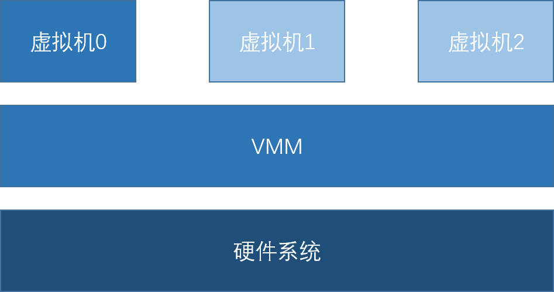
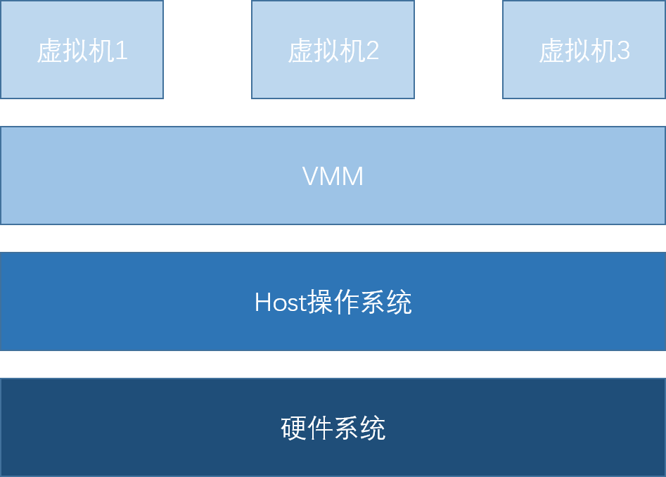

# 虚拟化技术及实例

## 虚拟化技术分类
虚拟化技术最起初是用软件实现了全指令进行二进制翻译（qemu）。但此方案性能太差，就选择采用相同架构下，用户态指令直接跑在物理cpu上，特权指令特殊处理，这就导致了如何识别特权指令的问题。早期解决方案使用修改guest操作系统来识别特权指令（早期Xen），这个方案比较局限，随着技术的发展，发展出来可以识别当前运行的是guest的还是host的指令的硬件系统来解决这个问题。[3][4]
### 软件虚拟化和硬件虚拟化
根据客户机虚拟化的实现技术

| 表1 | 软件虚拟化 | 硬件虚拟化 |
| ------ | --------- | --------- |
| 概念 | 纯软件实现的虚拟化 | 利用硬件平台提供的对特殊指令的截获和重定向到硬件的支持实现的虚拟化 |
| 技术原理 | 全指令二进制翻译（性能最差），为了加速让同架构下指令可以直接在cpu上运行，则遇到了特权指令该怎么处理的问题，解决方案有特权解除（优先级压缩），陷入模拟（二进制翻译）[1][2]| CPU可以知道特权指令是由guest机还是host机发出的，所以可以直接执行特权指令。 |
| 缺点 | 性能较差 | 可模拟的架构平台受限以及host机cpu要求支持硬件虚拟化技术 |
| 优点 | 可以模拟不同架构平台的虚拟机 | 性能较好 |
| 例子 | qemu（全指令翻译），vmware |  现在基本能用的都用上了 |

### 准虚拟化和全虚拟化
根据客户机与VMM的关系

| 表2 | 准虚拟化（para-virtualization） | 全虚拟化（full virtualization） |
| ------ | ---------------|--------------- |
| 技术原理 | 通过改动guest操作系统已获取cpu执行时是host还是guest | 不改动操作系统，通过别的手段（软件虚拟化和硬件虚拟化） |
| 硬件虚拟化支持 | 不需要 | 不一定 |
| 例子 | 早期Xen | kvm |

### 类型一和类型二
书上将市场上的虚拟机分成了两个主要类型。  
类型一：  
  
类型一在系统上电后首先加载VMM，然后再加载一个虚拟机0。由虚拟机0来运行需要提供给用户日常操作和管理使用。主要由VMM层来接管虚拟机对于硬件系统的请求。  
类型二：  
  
类型二在系统上电后运行一般意义上的host操作系统，再有host操作系统启动VMM。用户直接在host机上运行日常操作和管理使用，与普通机器无异。主要由VMM层和操作系统共同处理虚拟机对于硬件系统的请求，可以很大程度上的复用操作系统的代码。  
总结如下：

| 表3 | 类型一 | 类型二 |
| --- | ------ | ------ |
| 启动上的区分 | 系统上电后首先加载虚拟机监控程序 | 系统上电后首先加载一般意义上的操作系统，虚拟机监控程序作为特殊的程序运行 |
| 架构上的区分 | 虚拟机监控程序管理硬件 | 复用Host操作系统的管理硬件的代码 |
| 例子 | Xen、VMware ESX/ESXi、Hyper-V | KVM、VMware workstation、 VirtualBox |

## 实例
### kvm
基于硬件虚拟化的全虚拟化。类型二。
### Xen
早期是准虚拟化，现在可以使用基于硬件虚拟化的全虚拟化。类型一。
### VMware
早期是基于软件虚拟化的全虚拟化，现在可以使用硬件虚拟化的全虚拟化。
### VirtualBox
同时支持基于软件虚拟化和硬件虚拟化的全虚拟化
### Hyper-V
基于硬件虚拟化的全虚拟化

## 参考资料
[1]https://blog.csdn.net/dongfei2033/article/details/82756634  
[2]https://blog.csdn.net/jmilk/article/details/  51031118#%E5%85%A8%E8%99%9A%E6%8B%9F%E5%8C%96-full-virtualization  
[3]《KVM虚拟化技术实战与原理解析》，任永杰，单海涛  
[4]https://www.zhihu.com/question/24123210/answer/100874195  