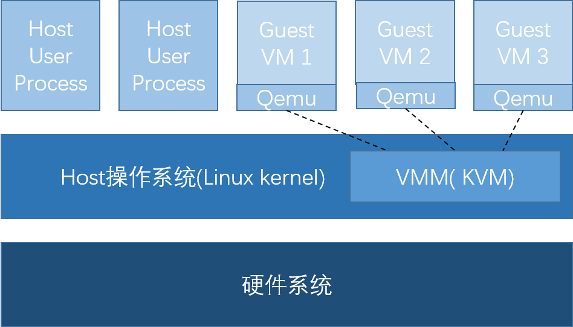
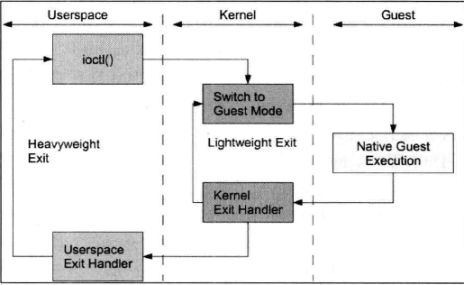
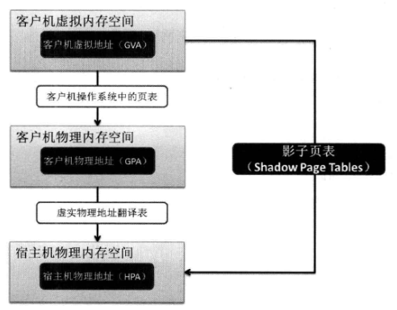
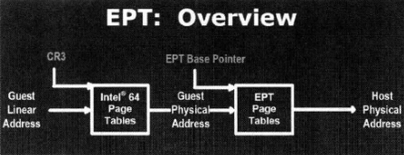
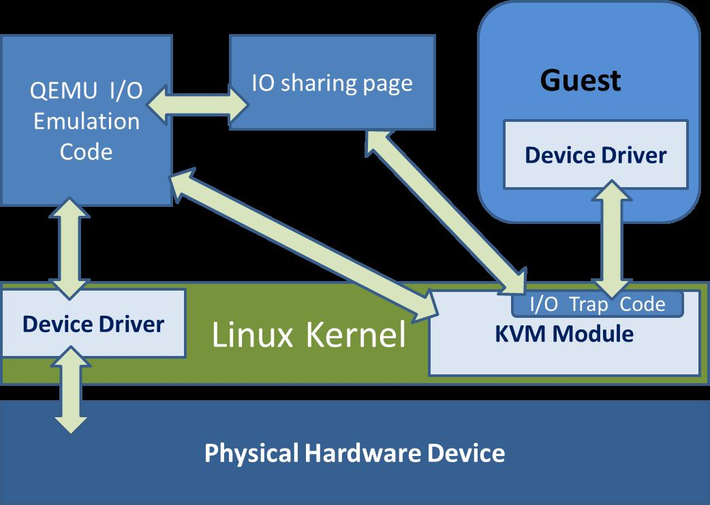
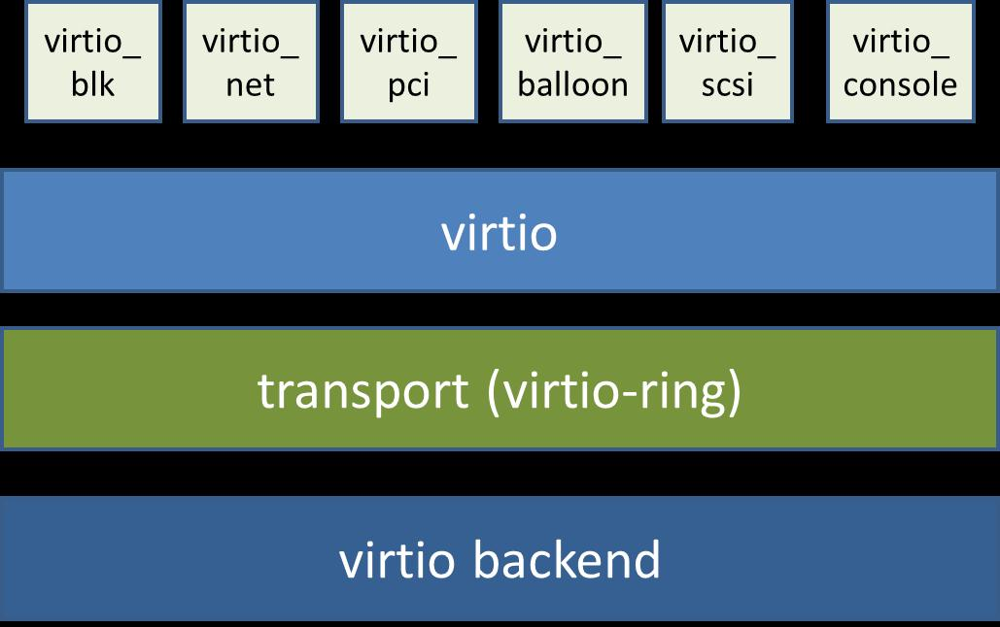

# ch2 KVM原理简介 & ch4 KVM核心基础功能
## 架构
接上一篇笔记所述，KVM属于类型二虚拟机，但又有所不同。  
  
KVM全称为Kernel-based Virtual Machine，也就是说KVM的实现是在类型二的基础上将VMM层封装进了Linux kernel。通过在内核层来管理虚拟机，而不再是由应用层程序管理。  
KVM使用的方法是通过加载KVM内核模块而将Linux内核直接转换为一个虚拟机管理程序。KVM模块将作为一个管理虚拟硬件的设备驱动，该驱动使用字符串设备/dev/kvm作为管理接口，主要通过IOCTL调用进行通信。  
也就是说，KVM的内核部分是作为可动态加载内核模块运行在宿主机中的。分为两个主模块一个是与硬件平台无关的实现虚拟化的核心模块，另一个是提供平台接口的kvm_intel(或kvm_amd)模块。  
KVM中的一个客户机是作为一个用户空间进程（qemu-kvm）运行的，一个客户机的多个vCPU就是一个qemu-kvm进程中的多个线程。这也使得KVM可以复用linux的调度代码。

### 处理器虚拟化
以intel架构为例，其为虚拟化支持增加了两种操作系统模式，VMX root operation 和 VMX non-root operation，这两个操作模式都支持Ring 0 ~ Ring 3特权级。Host操作系统以及VMM运行在VMX root，guest操作系统运行在VMX non-root，不过当遇到某些指定的特权指令时会产生中断交由VMM（此时会经历VMX的模式转换）进一步处理。KVM利用此机制将Linux内核增加了除Kernel mode和User mode之外的第三种模式———guest mode（也就是对应于cpu的VMX non-root）。guest机在guest mode下直接运行除I/O及其他敏感指令外的所有指令，guest机的I/O及其他敏感指令会被捕获并通过QEMU交由KVM进行进一步处理。基于此，KVM解决了虚拟化中的处理器虚拟化模块。  
更具体来看，如下图  
  
表1 | 用户模式 | 内核模式 | 客户模式
---- |-------- | --------- | --------
英文|User Mode | Kernel Mode | Guest Mode
功能 |I/O模拟和管理| 高性能和安全相关的指令，如处理客户模式到内核模式的转换。，处理客户模式下的I/O指令或其他特权指令引起的退出（VM-Exit），处理影子内存管理（shadow MMU）| Guest机中的大部分指令，I/O和一些特权指令除外（它们会引起VM-Exit，被hypervisor截获并模拟）
实现模块 | qemu | Host机kernel | guest机

### 内存虚拟化
KVM在实例化Guest机时会为每个guest机都分配并映射了自己的地址空间（0地址开始的连续的物理内存空间），当然这个地址空间不是真实的物理地址空间。实际上，映射给Guest机的物理内存是映射给这个guest机进程（guest机的运行对于host机来说类似于一个用户进程）的虚拟内存。所以这里存在两层地址转换，需要先将guest机的虚拟地址（Guest Virtual Address, GVA）->guest机物理地址（guest机进程的虚拟地址）（也就是客户机以为的物理地址（Guest Physical Address,GPA）->host机的真实物理地址（Host Physical Address, HPA）。第一层转换由Guest机操作系统完成，第二层由KVM完成。  
KVM使用了影子页表（Shadow Page Tables）表来解决这个问题（如图）  
  
当guest机运行时（cpu处于VMX non-root模式），处理器使用的页表并非guest机维护的guest机虚拟地址->guest机物理地址的页表而是guest机虚拟地址->host机真实物理地址的影子页表。KVM将影子页表载入到物理上的内存管理单元（MMU）中进行地址翻译。但是影子页表的实现复杂，开发、调试、维护都十分困难，而且影子页表的内存开销也比较大，因为每一个guest机都要对应一个影子页表。新的处理器在硬件上为影子页表的实现做了增强（intel EPT技术\AMD NPT技术）。基于此，KVM解决了虚拟化中的内存虚拟化模块。
#### intel EPT技术
  
在实现EPT技术的intel芯片上，CR3（控制寄存器3）将guest机虚拟地址转化为guest机物理地址，然后通过EPT将guest机物理地址转化为host机物理地址。这两次转换都是由CPU硬件实现。在使用EPT技术进行转换时，guest机内部的Page Fault、INVLPG（使TLB失效）指令、CR3的访问不会引起VM-exit，所以减少了VMX模式转换带来的开销。另外，EPT只需要维护一张EPT表，不需要每个guest机一张影子页表，从而也减少了内存的开销。  
VPID（VirtualProcessorIdentifiers，虚拟处理器标识）是在硬件上对TLB的优化，为每个TLB添加了一个VPID的标识，可以区分不同guest机的地址空间。这也是的VMX模式转换后TLB不会全失效。同时VPID对实时迁移（Live Migration）有很好的效率提升）。

### 设备虚拟化
设备虚拟化分为全虚拟化与半虚拟化，全虚拟化虚拟程度高，但速度慢，半虚拟化通常使用virtio驱动，效率高。
#### 全虚拟化
guest机在执行过程中对设备的访问主要通过I/O指令和MMIO。其中I/O指令会被捕获并通过QEMU的设备模拟（性能要求不高的设备）和KVM（性能要求高的设备，如虚拟中断控制器和虚拟时钟）一起进行进一步处理，区分不同性能要求的设备交由不同模块来处理可以很大程度上减少VMX模式转换带来的开销。而MMIO则会通过配置内存虚拟化来捕获。  
具体步骤如下：
  
1. 当 guest 中的设备驱动程序发起 I/O 操作请求时，KVM 中的 I/O 操作捕获代码会将这次 I/O 请求拦截
2. 经过处理后将这次 I/O 请求的信息放在 I/O 共享页并通知 QEMU 程序
3. QEMU 获得 I/O 操作的具体信息后，交由硬件模拟代码模拟出本次 I/O 操作
4. 硬件模拟完成后，将QEMU将结果放回 I/O 共享页，并通知 KVM 模块中的 I/O 操作捕获代码。
5. KVM 模块中的捕获代码读取 I/O 共享页中的操作结果，把结果返回到客户机中
6. 另外，倘若 guest 通过 DMA 访问大块 I/O 时，QEMU 不会把操作结果放在 I/O 共享页中，而是通过内存映射的方式将结果直接写到 guest 的内存中。

#### 半虚拟化

最上面一排 (virtio_blk 等) 是前端驱动，它们是在客户机中存在的驱动程序模块，而后端处理程序是在 QEMU 中实现的。在前端和后端之间，定义了两层来支持 guest 和 QEMU 之间的通信。virtio 层是虚拟队列借口，一个前端驱动程序可以使用多个队列。虚拟队列实际上是 guest 操作系统和 hyperviosr 的衔接点。而 virtio-ring 实现了环形缓冲区，它用来保存前端驱动和后端处理程序执行的信息，并且它可以一次性保存前端驱动的多次 I/O 请求，并且交由后端驱动去批量处理，最后实际调用 host 中设备驱动实现物理上的 I/O 操作，这样做就可以实现批量处理，而不是客户机中的每次 I/O 请求都需要处理一次，从而提高了 guest 和 hypervisor 信息交换的效率
## 执行流程

### 初始化
KVM初始化过程如下：  
KVM会先初始化内部的数据结构->KVM模块会检测系统当前CPU->打开CPU控制寄存器CR4中的虚拟化模式开关->执行VMXON指令将Host操作系统(包括KVM模块本身)置于虚拟化模式中的根模式（也就是管理员模式）->KVM内核模块导出了一个名为/dev/kvm的设备等待来自用户空间（qemu）的命令。  
创建虚拟机过程如下：TODO  

### 

## 参考资料
[1] https://www.ibm.com/developerworks/cn/linux/l-linux-kvm/index.html#artrelatedtopics  
[2] https://blog.51cto.com/song49/1096279  
[3] https://www.cnblogs.com/tu240302975/p/13370288.html  
[4] intel CPU 手册  
[5] https://www.ibm.com/developerworks/cn/linux/l-cn-vt/  
[6] https://www.cnblogs.com/sammyliu/p/4543597.html  
[7] 《KVM虚拟化技术实战与原理解析》，任永杰，单海涛  
[8] https://www.linux-kvm.org/page/Initialization ioctl接口的一些使用
[9] https://www.dazhuanlan.com/quxiaobai/topics/1068752