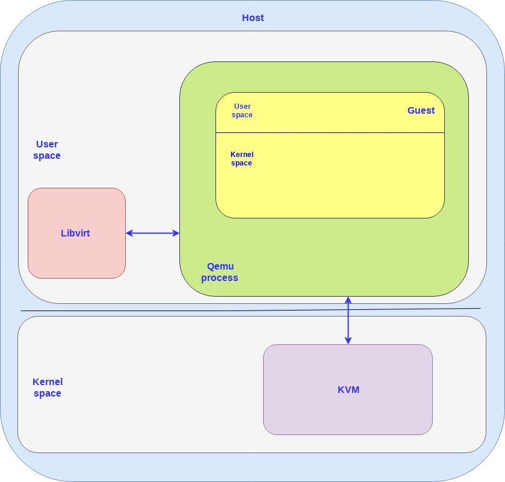
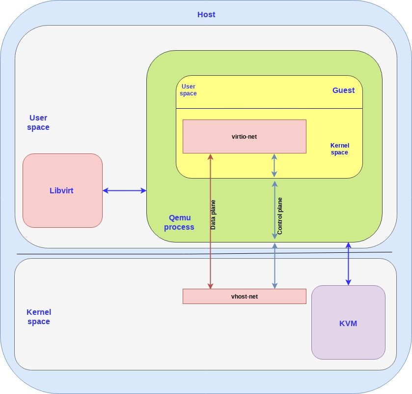

# virtio\vhost-net\vhost-user
## intro 

在现代的kvm平台中通常存在以下三个部件
- QEMU: 在host用户态的虚拟机进程
- KVM: 在host内核为QEMU提供指令虚拟化等一些支持(由qemu打开/dev/kvm)
- Libvirt: 在host用户态管理qemu进程  

virtio则是在guest上的一个用于直接获取host机上设备的数据的接口
## virtio
virtio 实现了半虚拟化I/O，其分为两个组件
- 后端: 在host
- 前端: 在guest中

可以将virtio分为两个层面
- 控制平面: 用于控制host与guest之间数据平面的管理。为此要尽可能灵活以支持更丰富的设备类型
- 数据平面: 用于传输数据。为此要尽可能高效以提升传输性能  
### 控制平面
控制平面由virtio spec在host的用户态的qemu进程内部实现，
### 数据平面
数据平面由vhost protocol定义，在host机实现(以便device上的数据bypass到qemu进程以提升性能)(vhost-net(in kernel), vhost-user(in user space))。同时需要实现设计环形队列以收发包。
#### vhost-net

- backend: vhost-net in host kernel
- frontend: virtio-net in guest kernel

## 参考
1. https://www.redhat.com/en/blog/introduction-virtio-networking-and-vhost-net
2. https://www.dazhuanlan.com/quxiaobai/topics/1068752
3. https://www.redhat.com/en/blog/deep-dive-virtio-networking-and-vhost-net (还没看)
4. https://www.redhat.com/en/blog/how-vhost-user-came-being-virtio-networking-and-dpdk (还没看)
5. https://www.redhat.com/en/blog/journey-vhost-users-realm (还没看)