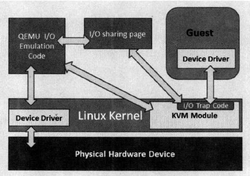
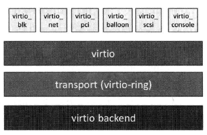

# 5 KVM高级功能详解
## 5.1 半虚拟化驱动
传统方式是使用QEMU纯软件方式来模拟I/O设备，但其效率不高。可以使用半虚拟化驱动（Paravirtualized Driver，PV Driver）来提高I/O性能。通常会采用virtio设备驱动标准框架来实现。
### 5.1.1 QEMU模拟I/O设备
  
kvm捕获I/O请求，将请求信息处理后放到共享页（sharing page），并通知QEMU。  
QEMU硬件模拟代码模拟I/O，完成后结果放回共享页，并通知KVM。  
如guest机通过DMA访问大块I/O时，直接通过内存映射方式将结果映射到客户机内存中。  
- 优点：通用性高（可模拟设备种类多），无需修改guest机OS  
- 缺点：性能差（涉及较多VM模式切换，上下文切换）
### 5.1.2 virtio
virtio是一个在Hypervisor之上的抽象API接口，让guest机知道自己运行在虚拟环境中，进而根据virtio标准与Hypervisot协作。
  
- 最上层的前端驱动（灰白色这一层）是在guest机中存在
- 中间两层支持guest机与qemu之间的通信。
  - virtio层是虚拟队列接口，概念上将前端驱动程序附加到后端处理程序。一个前端驱动可以使用0或多个队列，具体数量取决与需求。 
  - virtio-ring实现了环形缓冲区（ring buffer），用于保存前端驱动和后端的信息。可以一次保存多次I/O请求，并交由后端批量处理，提高了效率。
- virtio backend是QEMU实现。

优点：效率高  
缺点：暴露虚拟环境，支持的OS较少
#### virtio安装

### 5.1.6 kvm_clock配置
由于虚拟机的中断并非真的中断，而是通过host机像guest机注入的虚拟终端，因此中断并不总能同时且立即传递给一个guest机所有vCPU。另一方面，在需要向guest机注入中断时，host机的物理CPU可能正在执行其他客户机的vCPU或其他非虚拟机相关的进程。这使得中断的时间精确性无法保证。进一步使得一些依赖时间戳到应用产生问题。  
QEMU/KVM通过提供一个半虚拟化的时钟，即kvm_clock，为客户机提供精确的System time和Wall time，从而避免客户机中不准确的问题。  
kvm_clock需要硬件支持，如不变的时钟计数器（Constant Time Stamp Counter）。（可通过/proc/cpuinfo 查看）

## 5.2 设备直接分配（VT-d）
