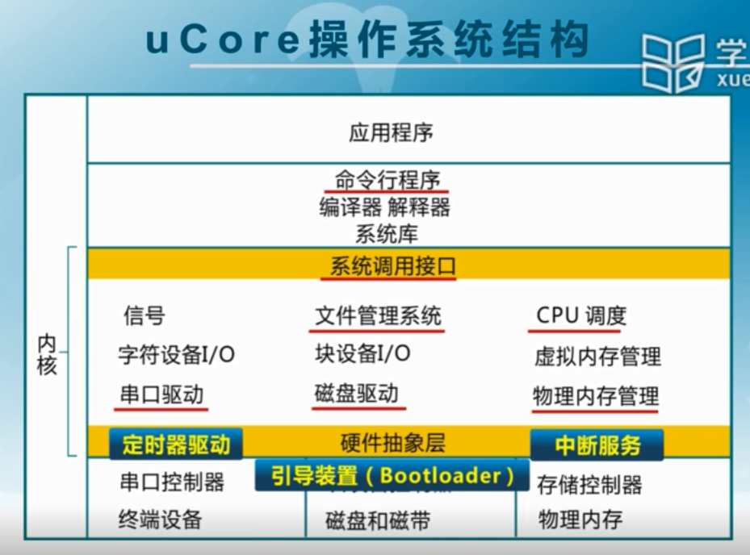

# OS
## 操作系统本质

计算任务的处理核心部件是CPU和Memory Unit，其他均可以是为input和output。
操作系统是辅助计算机硬件完成计算任务（job）的。操作系统的功能可以根据计算机发展阶段来分析。
- 第一阶段：单用户系统：无功能（none）：CPU和Memory Unit的指令&数据直接从硬件上获取，Input和Output均只有单一形式；
- 第二阶段：批处理系统&多道程序系统：基础功能（basic）：CPU和Memory Unit的指令&数据由操作系统提供，Input和Output由操作系统管理
- 第三阶段：分时系统、多用户系统、分布式系统：更优秀的功能（more efficient and more flexible）：CPU、Memory Unit、I/O进行抽象，使得多个计算任务更有效率更灵活

同时，可以将操作系统的各模块按照冯·诺依曼结构的来分类：
1. 进程管理：CPU
2. 内存管理：Memory
3. IPC：I/O
4. I/O设备：I/O
5. 文件系统：I/O
6. 网络：I/O
7. 系统调用、中断、程序异常：操作系统底层机制

## 操作系统结构
隔离硬件和用户软件接口
### 宏内核

分层层次多
### 微内核
保留少数功能，但增加了性能损失
### 外核
类似于VMM(KVM)