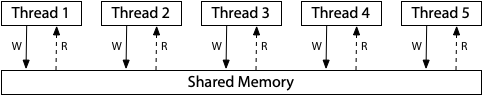
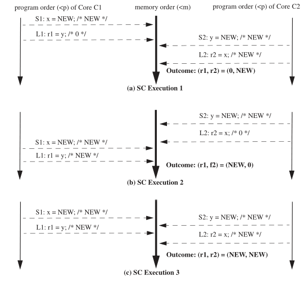
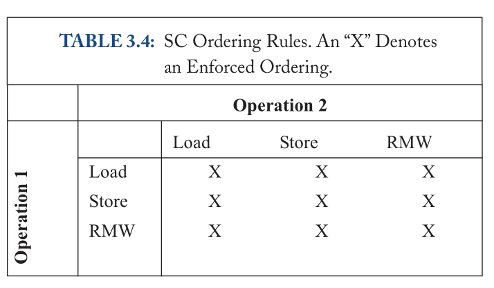
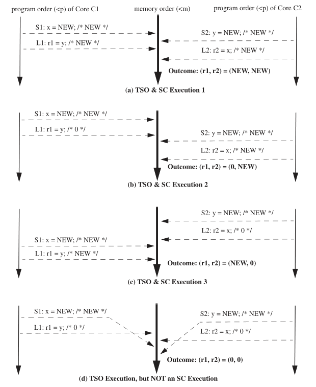
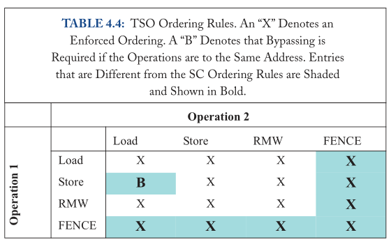
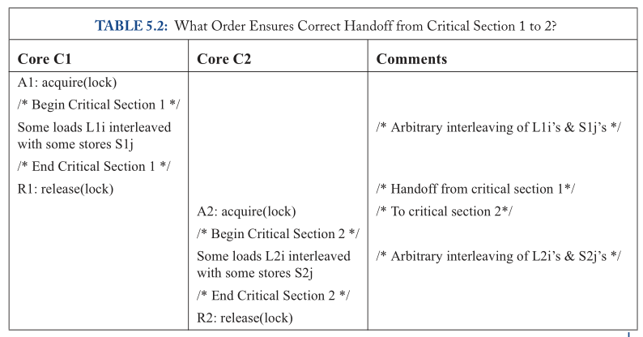
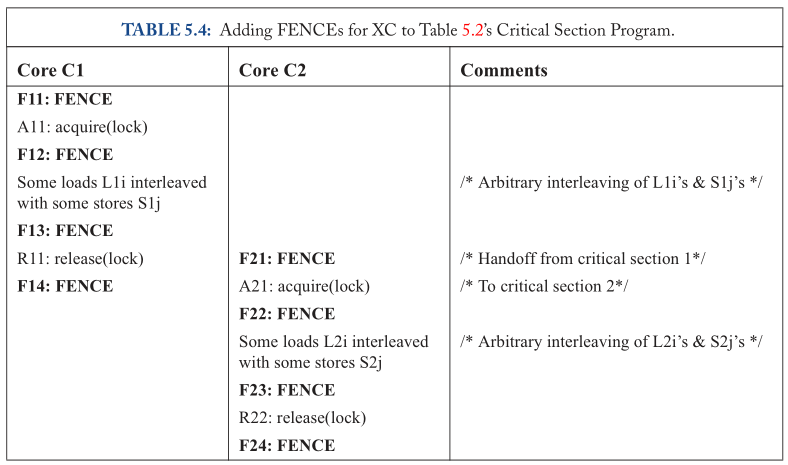

# 并发问题和内存一致性模型（memory consistency model）
在计算机追寻计算性能的发展道路上，冯诺依曼模型单核CPU性能遇到功耗墙，此后芯片厂商开辟出了通过增加核心数目来增强计算性能的新道路。


多核情况下，CPU们共享内存（现代cpu上内存的含义被进一步拓展为多级缓存，这里的指的共享内存不包括cpu本地缓存（L1Cache），包括但不限于多cpu共享缓存(L3Cache)）。在对共享内存的读写操作上，多核心计算机在计算过程中需要保证以下一致性，防止竞争条件（race condition）的发生，以达到和单核相同的计算正确性。而讨论正确性的时候可以将其划分为两个子问题
- memory consistency: 内存一致性问题包含了内存读写操作的规则 
- cache coherence：缓存一致性问题是支持内存一致性的组成部分之一。其目的是让硬件cache在对共享内存的读写操作没有任何影响，就和没有cache是一样的。问题的主要由硬件工程师解决，不在本文中做重点讨论（多线程程序中伪共享导致的性能问题就是缓存一致性协议带来的）。
1. 读/写都有原子性：读/写在执行完成前都不可能有另一个读/写生效 **（互斥）**
2. 写保证顺序性: 保证读之前的所有并发的写的结果是代码编写人员期望的末序（最后一个）写入的结果 **（同步）**
3. 读保证可见性：保证上述写之后的结果对所有并发的读可见 **（同步）**
为了保证上述特性，我们需要将这一系列读/写操作打包放入 **(原子性)互斥** 的临界区中以保证 **同步**。
## 1. 单核CPU上的优化导致的多核并发问题
假设我们希望通过软件实现的方法实现同步原语，部分针对单核的一些优化手段会给同步原语的实现带来更多的挑战。
### 1.1. 编译优化
在1970年代，Frances E. Allen和 John Cocke一起提出了一种称为"规则依赖分析"（Dependency Analysis）的编译器优化技术。该技术可以自动识别程序中的数据依赖关系，并利用这些信息在不影响程序执行结果的前提下（eventually consistency），来进行指令重排和其他优化。通过减少数据相关性依赖，使得指令执行时减少（指令流水线中的取存阶段的）等待时间以及提升分支预测准确率。编译优化分为两个方面。
- 一方面，识别数据依赖关系时，编译器会默认指令访问的内存为当前指令序列独占。这大多数情况下优化的效果是读写操作的压缩，将多次内存的读/写压缩为单次的读/写和计算时的寄存器操作。当多核情况下，就会导致原本在某一个核心A的读/写之间的另一个核心B的读写在指令执行时放到了A读/写之外（**顺序性**被破坏）。
```C
// 假设一个简单的情况
// 某一个线程A调用lock函数，不停read 共享变量done的值并等待
// 另一个线程B将write 共享变量done的值让线程A结束等待
int lock()
{
  while (done == 0);
}

// 编译优化后，代码逻辑变成了这样。原本线程B在线程A两次read done变量之间的write就不可能发生了导致了lock函数违背了其设计初衷。
int lock()
{
  if (done == 0) while (1);
}
```
- 另一方面，指令重排会使得编译后的机器指令并不完全按照程序编写人员编写的代码逻辑顺序执行，这部分和指令优化相似不过是层级不同（一个是多条指令的顺序，一个是多条指令中的micro指令的顺寻）。
#### 1.1.1. 编译优化导致的并发问题解决方法
主要是打破内存独占的假设，告诉编译器内存可能在指令之间被修改，使得编译器对依赖这部分内存的指令不优化
- 方法1：插入 “不可优化” 代码
``` C
// “Clobbers memory”
asm volatile ("" ::: "memory");
```
- 方法2：标记变量 load/store 为不可优化: 
``` C
// 使用 volatile 变量
extern int volatile done;
while (!done) ;
```
### 1.2. 指令优化
经过编译优化后的指令在处理器上执行。处理器将一部分数据相关性的问题带到硬件设计中解决，通过数据无关的指令并行执行以提高效率。现代乱序处理器中单个逻辑CPU中指令首先被处理器前端译码，并分成多个微指令（Macro-Op）然后被分派到各自的处理管线（port）中执行，cpu中有多条处理管线同时运行，也就是说多条指令在多条流水线上并行执行，指令执行完成顺序变得不可预测（**顺序性**被破坏）。与编译优化类似，乱序执行受限于上述的数据依赖关系，不会影响单核程序执行的结果。但多核场景下，会导致多条读/写指令的**有序性**被破坏。以peterson算法为例
``` C
int turn;
bool flag[2];

void lock(int thread_index)
{
  flag[thread_index] = true;
  turn = 1 - thread_index;
  while (flag[1-thread_index] && turn == 1-thread_index);
}

void unlock(int thread_index)
{
  flag[thread_index] = false;
}

int thread_func(int thread_index)
{
  init();
  do {
    // entry section
    lock(thread_index);
    // critical section
    // do something
    // exit section
    unlock(thread_index);
    // remainder section
  } while (true);
}
```
在lock函数中，如果按照代码顺序正常执行但存在随机调度的情况下，可以保证两个线程不同时运行临界区的代码（**互斥**）。turn设置为另一个线程的线程id可以保证进步性（process）（防止死锁），且保证了最多等一次的有限等待（bounded waiting）（防止饥饿）。看似完美的方案，
但是！
指令优化会导致问题，由于lock函数中使用的两个共享变量`flag[thread_index]`和`turn`没有实际的数据关联性，导致cpu在进行指令优化时，可能导致真正的读写顺序与代码所写的期望顺序颠倒，导致代码逻辑失效。
``` C
// lock函数中未经指令优化的期望的读写顺序
void lock(int thread_index)
{
  // step 1
  write (flag[thread_index], true);
  // step 2
  write (turn, 1 - thread_index);
  // step 3
  read (flag[1-thread_index]);
  // step 4
  read (turn);
}
// 可能发生如下情况
// turn = 0
// flag[0] = false
// flag[1] = false
// thread 0                 |     thread 1
// step 3                   |     
// read flag[1] = false     |
// ...                      |     step 3
// ...                      |     read flag[0] = false
// step 1                   |      
// write flag[0] = true     |
// ...                      |     ...
// 因为读取到的flag[0/1]都是false
// flag[1-thread_index] && turn == 1-thread_index 条件都不满足
// go into critial section  |     go into critial section
```
#### 1.2.1. 指令优化中的重排序类型
现代的处理器核可以重排许多内存访问，但讨论两个内存操作的重排序已经足够了。大多数情况下，我们只需要讨论一个核重排序两个不同地址的两个内存操作（因为同一个核上同一个地址的内存操作会因为数据相关的原因不会重排，即保证了单核上的重排优化不影响执行结果）。我们将可能的重排序分解成四种场景。
##### 1.2.1.1. Store-Store 重排序
##### 1.2.1.2. Load-Load 重排序
##### 1.2.1.3. Store-Load 重排序
##### 1.2.1.4. Load-Store 重排序
会导致一些错误，比如在释放锁之后去加载一个被锁保护的值（假设store是解锁操作）

#### 1.2.2. 指令优化导致的并发问题解决方法
使用硬件提供的**内存屏障指令**（栅栏FENCE指令）。
屏障指令可以保证在屏障之前的操作执行先完成，屏障之后的操作再执行（对后面提到的缓存优化也有用）。
``` C
// 通过以下修改保证读写顺序，即保证flag[thread_index]的写操作完成在先，对flag[1-thread_index]的读在后
int turn;
bool flag[2];

void lock(int thread_index)
{
  flag[thread_index] = true;
  turn = 1 - thread_index;
  // 内存屏障指令 （事实上就是mfence, lfence, sfence）
  __sync_synchronize();

  while (flag[1-thread_index] && turn == 1-thread_index);
}

```
### 1.3. 缓存优化
上面提到的两个优化的导致的问题都是由于冯诺依曼模型中CPU指令执行的顺序乱序导致的，还未涉及内存一致性问题。其解决方案也都是在[内存顺序一致性模型](#参考7)的前提下有效的。

#### 1.3.1. 内存一致性模型
内存一致性模型，或简称内存模型。上述提到了的内存顺序一致性模型就是其中一种。内存模型是一个规范，指明了使用共享内存执行的多线程程序所被允许的行为，目的是为了精确定义
   - 编程者能够期望什么行为 
   - 系统实现者可以使用哪些优化
我们采用Weaver和Germond的形式化语言，使用如下符号：**L(a)** 和 **S(a)** 表示一次load和一次store操作，这两个操作作用到一个地址a。顺序符号 **<p** 和 **<m** 定义了程序和全局内存顺序。程序顺序 **<p** 是一个单核总顺序，此顺序和每个核逻辑（顺序）执行的内存操作顺序是一致的。全局内存顺序 **<m** 是所有核的内存操作的总顺序。
假设有如下例程A
``` C
int x = 0;
int y = 0;

void func_on_core_1()
{
  x = 1;
  print(y);
}

void func_on_core_2()
{
  y = 1;
  print(x);
}
```
下面根据例程A介绍几个常见的内存模型
##### 1.3.1.1. 内存顺序一致性模型（SC）
内存顺序一致性模型，即程序顺序与内存顺序一致模型，是最理想情况下的内存模型（MIPS R10000使用的此类内存模型），从硬件角度看可以类比于所有的处理器直接连接到一块共享的每次只允许一个处理器读/写的内存上且处理器和共享内存间没有cache。
- 每次任意一个处理器对共享内存上的读，直接从共享内存读。
- 每次任意一个处理器对共享内存上的写，直接写到共享内存。
使用形式化语言描述此结构
1. 所有核遵循自身的程序顺序，插入它们的load和store操作到顺序 **<m** 中，不管这些操作的目的地址是相同的还是不同的（即a = b或 a ≠ b ）。有四种情况：
```
Load->Load:   if L(a) <p L(b) then L(a) <m L(b)
Load->Store:  if L(a) <p S(b) then L(a) <m S(b)
Store->Store: if S(a) <p S(b) then S(a) <m S(b)
Store->Load:  if S(a) <p L(b) then S(a) <m L(b)
```

2. 每个load操作获取的值来自其 **<m** 序列中向前最近一次的store结果
3. 顺序一致性模型在下表中的这些内存操作必须要按照内存顺序执行（其中RMW是原子读-改-写指令，如test-and-set）

>就是说对于例程A来说，是不可能出现输出"0 0"的结果的，可以用[Model Check](https://github.com/jiangyy/mosaic)验证
##### 1.3.1.2. x86 Total Store Order(x86-TSO)

为了加速性能，硬件上在CPU和内存间多了一个FIFO的local write queue（a write back cache \ write buffer）。因为实际上大多数情况并不需要保证Store->Load情况下的顺序一致性，所以这部分硬件上的小改动使得在TSO相比SC有了更优秀的性能。
> 实现上，微架构能够在物理上将store queue（未提交的store操作）和write buffer（已提交的store操作）组合到一起，并且/或者物理上独立出load和store queue。
使得读\写操作变得如下
- 每次任意一个处理器对共享内存上的读，先从local write queue查看是否存在，存在直接读local write queue，不存在则从共享内存读。
- 每次任意一个处理器对共享内存上的写，先写到local write queue，再一起写到共享内存。
对单核处理器来说，这个local write queue不会影响读\写操作的结果。
对于多核处理器上的例程A来说，假设指令顺序和代码一致，也会存在如下执行顺序
1. core1对x的赋值缓存在了core1的local write queue中
2. core2对y的赋值缓存在了core2的local write queue中
3. 两个core执行load操作都读到了内存上未被local write queue更新的旧值
4. load操作执行完成后local write queue更新到了内存中
上述结果是顺序一致性模型所不允许的。SPARC和x86就在此硬件基础上，实现了一个新的内存模型TSO。
使用形式化语言描述此结构
1. 所有核心遵循的内存顺序和程序顺序一致的有三种操作，满足这个顺序一致的前提是local write queue 必须是FIFO的，这样才能保证Store->Store的顺序。在Store->Load场景下，TSO并不保证程序顺序和内存顺序一致，但操作上可以通过给的S1和L1之间以及S2和L2之间添加FENCE指令来保证程序顺序和内存顺序一致。
```
Load->Load:   if L(a) <p L(b)   then L(a) <m L(b)
Load->Store:  if L(a) <p S(b)   then L(a) <m S(b)
Store->Store: if S(a) <p S(b)   then S(a) <m S(b)
#Store->Load: if S(a) <p L(b)   then S(a) <m L(b) /* SC包含但TSO不包含，TSO中可能store被缓存在了local write queue中还未更新到内存上，即S(a) < L(b), but L(b) <m S(a) */
Load->FENCE:  if L(a) <p FENCE  then L(a) <m FENCE
FENCE->Load:  if FENCE <p L(a)  then FENCE <m L(a)
Store->FENCE: if S(a) <p FENCE  then S(a) <m FENCE
FENCE->Store: if FENCE <p S(a)  then FENCE <m S(a)
FENCE->FENCE: if FENCE <p FENCE then FENCE <m FENCE
```

2. 每个load操作获取的值来自其 **<m** 序列中向前最近一次的store结果
3. TSO在下表中的有X的内存操作必须要按照程序顺序执行

>可以在实际中验证，会出现输出"0 0"
##### 1.3.1.3. Relaxed Memory Consistency
进一步说，大多数场景下多核的读/写操作并不需要保证顺序一致性，也就是说可以进一步放开内存模型的约束来加速性能，宽松内存模型也因此出现。其要求程序员通过显式的要求来保证少数场景下的顺序一致性。
举一个并发编程中常用的锁使用的例程B

这是使用锁实现临界区互斥，期望的程序顺序和内存顺序是`ALL L1i, ALL S1j -> R1 -> A2 -> ALL L2i, ALL S2j`，假定临界区内部的load/store只要考虑好操作间的数据依赖关系，可以根据任意顺序执行（临界区内退化为单核模型）。这样的假设的缘由是临界区内部的操作比锁的acquire和release要频繁，如果减少对临界区内部read/store的约束可以进一步提高性能。
###### 1.3.1.3.1. eXample relaxed Consistency model（XC）
为了教学目的，在[A Primer On Memory Consistency And Cache Coherence](#参考6)一书中介绍了一个eXample relaxed Consistency model（XC）
XC提供了一个FENCE指令，使得在FENCE前的指令必定在FENCE前完成，FENCE后的指令必定在FENCE后开始。
使用形式化语言描述此结构
1. XC存在以下顺序约束，
```
Load->Load:   if L(a) <p L(a)   then L(a) <m L(a) /* 与SC和TSO不同，这里XC只维护同一地址的顺序 */
Load->Store:  if L(a) <p S(a)   then L(a) <m S(a) /* 与SC和TSO不同，这里XC只维护同一地址的顺序 */
Store->Store: if S(a) <p S(a)   then S(a) <m S(a) /* 与SC和TSO不同，这里XC只维护同一地址的顺序 */
#Store->Load: if S(a) <p L(b)   then S(a) <m L(b) /* XC不管 */
Load->FENCE:  if L(a) <p FENCE  then L(a) <m FENCE
FENCE->Load:  if FENCE <p L(a)  then FENCE <m L(a)
Store->FENCE: if S(a) <p FENCE  then S(a) <m FENCE
FENCE->Store: if FENCE <p S(a)  then FENCE <m S(a)
FENCE->FENCE: if FENCE <p FENCE then FENCE <m FENCE
```
2. 每个load操作获取的值来自其 **<m** 序列中向前最近一次的store结果
3. XC在下表中的操作顺序约束

为了达到例程B中期望的程序顺序和内存顺序一致的效果就需要程序员在其中插入FENCE指令，如例程C


###### 1.3.1.3.2. POWER Relaxed Momory Moder
Power提供了一个表面上和XC相似的松散模型，但有很多重要的不同之处
1. Power中的store操作的执行会关注于其它core，不是memory。因此，Power不保证和XC创建出一样的总内存顺序( < m )
2. Power里的一些FENCE被定义为可累积的（cumulative）。
3. Power有三类FENCE（还有更多类型用于I/O内存），XC只有一种FENCE。意味在有更细分的FENCE指令的控制之下，会有更好的性能。
###### 1.3.1.3.3. ARM
ARM提供了一个核心思想接近于IBM Power的内存模型。和Power类似，
1. 它看起来并不保证有一个总内存顺序。
2. ARM有多种风格的FENCE，包括一个数据内存barrier，能够排序所有内存访问或只排序store操作，一个和Power的ISYNC类似的指令同步barrier，还有其它的用于I/O操作的FENCE。

#### 1.3.2. 缓存优化导致的并发问题解决方法
使用硬件提供的**内存屏障指令**（栅栏FENCE指令）。

## 2. 无数据竞争（Data Race Free）程序
多核并发编程要想获得上述这些性能优化手段的同时要避免顺序一致性导致的程序错误，最好的手段就是实现无数据竞争程序。
无数据竞争程序的中有两种操作，其实质都是对共享数据的读写，但是根据共享数据的用途不同，分为
1. SI: synchronization instruction（同步操作）：包括lock acquire 和 release
2. DI: data instruction（数据操作）
```
实现无数据竞争程序
|-需要保证所有的SC execution都是DRF的
  |-一个SC execution是DRF
    |-需要其没有数据操作的竞争
      |-一个数据操作没有竞争
        |-要么数据操作没有冲突
          |-一个数据操作没有冲突
            |-需要来自不同线程的数据操作，不存在对同一个内存位置的store操作
        |-要么对于一对冲突的数据操作Di <m Dj,当且仅当存在一对传递式冲突同步操作Si和Sj，使得Di <m Si <m < Sj <m Dj时，Di和Dj就不是数据竞争的。
          |-一个同步操作时传递式冲突
            |-要么同步操作Si和Sj冲突了
              |-一个同步操作有冲突是指如果它们来自不同core（线程），访问相同的内存位置（如相同的lock），并且这两个同步操作不兼容（如一个spinlock的acquire和release操作不兼容，但是在一个reader-writer lock上的两个read_lock是兼容的）。
            |-要么Si和某个同步操作Sk冲突，Sk <p Sk'（即Sk在core K的程序顺序中早于Sk'），并且Sk'和Sj是 传递式冲突的。
```
### 2.1. 线程间同步操作
同步操作的目的是防止数据操作的顺序发生问题，其本质上也是一种特殊的共享数据操作（**信号量（semaphore）**就是这种特殊数据操作所操作的数据），其实现必须是原子的，不会被打断的，否则其自身的执行顺序被打断，就更无法发挥其对临界区数据操作顺序的保护作用了。为了达成目的，无法通过现有的常规的数据操作的硬件指令实现，需要重新在硬件层面实现同步操作。信号量是最基本的同步原语，不同线程的业务需求（任务）决定了不同线程如何处理信号量。
#### 2.1.1. 原子指令
理想情况下，我们当然希望所有的临界区的数据操作按照我们的设想顺序全一起变为原子的，使得操作中间不会被打断，但对于硬件实现来说不现实。但我们可以退化到原子化某些简单的指令比如`++`操作，来保持对某一共享变量的多线程操作的顺序性保证。基于此，原子指令就可以用于实现同步操作。
##### 2.1.1.1. 测试并设置指令（原子交换）（test-and-set）
可以使用原子交换指令实现自旋锁
##### 2.1.1.2. 比较并交换（compare-and-exchange）
可以用于实现自旋锁，但是用于实现无等待同步时更强大
##### 2.1.1.3. 链接的加载（load-linked）和条件式存储指令（store-conditional）
在MIPS\Alpha\PowerPC\ARM平台提供了这类原子指令。
条件式存储只有上一次链接的加载指令在两条指令之间都没有更新才会成功。成功则更新，并返回成功。
##### 2.1.1.4. 获取并增加（fetch-and-add）
用两个变量控制可以让锁的公平地在不同的线程中轮转。
##### 2.1.1.5. 使用原子指令实现无等待数据结构
如果可以只用原子指令实现临界区的数据操作。对设计和编程技巧上来说要求更高。
#### 2.1.2. 锁/互斥量（mutex）
如果线程间的业务需求相似，对于信号量的操作会变为锁的表现形式。
当在临界区中对数据的操作不可以由原子指令实现时，就需要锁来保证临界区的互斥性了。一部分锁的实现也是基于原子指令实现的。锁包含两种操作lock/acquire和unlock/release，有了这两种操作使得编程人员可以在操作系统控制线程调度的基础上控制指令执行顺序。
评价锁可以从
1. 正确性：其能否提供互斥
2. 公平性：多线程情况，每个线程抢到锁的机会是否公平（是否会导致饿死）
3. 性能：使用锁的性能开销（线性拓展能力）
##### 2.1.2.1. 自旋锁
自旋锁，即当无法获取到锁时，让cpu不断尝试获取直到获取到。以下是自旋锁的最基本实现。
###### 2.1.2.1.1. 评价
1. 正确性：通过判断锁的lock/unlock状态作为进入临界区的依据，**lock状态的读和写的整合操作是原子的**，也就保证了任一时刻最多只有一个线程可以获得锁并进入临界区，保证互斥正确性
2. 公平性：毫无公平性保证，自旋的程序可能永远自旋
3. 性能：取决于临界区长短和cpu数量，如果临界区较短，则自旋时间惩罚较少，cpu数越多可能会导致自旋消耗的cpu周期总和较多，cpu较少可能会导致持有锁的线程被调度走，一直执行自旋操作也会导致cpu的浪费。
###### 2.1.2.1.2. 实现
1. test-and-set实现
``` C
// test-and-set原子指令
int TestAndSet(int *old_ptr, int new);

typedef struct lock_t {
    int flag;
} lock_t;

void init(lock_t *lock) {
    // 0: lock is avilable, 1: lock is held
    lock->flag = 0;
}

void lock(lock_t *lock) {
    while(TestAndSet(&lock->flag, 1) == 1)
        ; // spin-wait (do nothing else)
}

void unlock(lock_t *lock) {
    lock->flag = 0;
}
```
2. compare-and-exchange实现
```C
// compare-and-exchange原子指令
char CompareAndSwap(int *ptr, int old, int new);

// 对比test-and-set实现，仅需改变lock函数代码实现即可
void lock(lock_t *lock) {
    while(CompareAndSwap(&lock->flag, 0, 1) == 1)
        ; // spin-wait (do nothing else)
}
```
3. load-linked & store-conditional实现
``` C
// load-linked 指令
int LoadLinked(int *ptr);
// store-conditional 原子指令
int StoreConditional(int *ptr, int value);

void lock(lock_t *lock) {
  while(LoadLinked(&lock->flag) == 1 || StoreConditional(&lock->flag, 1) == 0) // spin-wait
}
```
##### 2.1.2.2. ticket锁
###### 2.1.2.2.1. 评价
1. 正确性：通过判断锁ticket与turn是否相同作为进入临界区的依据，因为ticket是原子递增的，所以每个线程持有的ticket是唯一的，保证了只有一个和turn相同的ticket才能进入临界区，保证了互斥正确性
2. 公平性：在自旋锁的基础上，添加了turn，使得所有线程都可以抢到锁。因为只要线程获取到了ticket，那么turn最终会调度上去。
3. 性能：和自旋锁一样
###### 2.1.2.2.2. 实现
fetch-and-add实现
``` C
//fetch-and-add 原子指令
int FetchAndAdd(int *ptr)

typedef struct lock_t {
  int ticket;
  int turn;
} lock_t;

void lock_init(lock_t *lock) {
  lock->ticket = 0;
  lock->turn = 0;
}

void lock(lock_t *lock) {
  int myturn = FetchAndAdd(&lock->ticket);
  while (lock->turn != myturn); // spin
}

void unlock(lock_t *lock) {
  FetchAndAdd(&lock->turn);
}
```
##### 2.1.2.3. 互斥锁/互斥量（mutex）
互斥锁，在自旋锁的基础上，通过yield操作系统元语将自旋的线程让出cpu，重新调度以减少cpu的浪费。
###### 2.1.2.3.1. 评价
1. 正确性：进入临界区的条件和操作与自旋锁一致，所以正确性也与自旋锁一致
2. 公平性：需要看具体互斥锁的实现，让出后cpu的调度策略决定了其公平性。
3. 性能：让出cpu使得线程运行可以减少cpu自旋的浪费，但是会增加调度的成本
###### 2.1.2.3.2. 实现
glibc-ntpl/lowlevellock.h实现
```C
void mutex_lock (int *mutex) {
  unsigned int v;
  /* Bit 31 was clear, we got the mutex (this is the fastpath) */
  if (atomic_bit_test_set (mutex, 31) == 0)
    return;
  atomic_increment (mutex);
  while (1) {
      if (atomic_bit_test_set (mutex, 31) == 0) {
          atomic_decrement (mutex);
          return;
      }
      /* We have to wait now. First make sure the futex value
         we are monitoring is truly negative (i.e. locked). */
      v = *mutex;
      if (v >= 0)
        continue;
      futex_wait (mutex, v);
  }
}
void mutex_unlock (int *mutex) {
  /* Adding 0x80000000 to the counter results in 0 if and only if
    there are not other interested threads - we can return (this is
     the fastpath).  */
  if (atomic_add_zero (mutex, 0x80000000))
    return;
  /* There are other threads waiting for this mutex,
     wake one of them up. */
  futex_wake (mutex);
}
```
##### 2.1.2.4. 读（共享）写（互斥）锁
读写锁与传统锁的锁/无锁两个状态不同，其有三种状态：
1. 读模式下加锁，
2. 写模式下加锁，
3. 无锁状态

对应的，其也有三种接口：
1. 加读锁：如果读写锁处于已加写锁状态，则申请锁的线程阻塞；否则把锁设置为已加读锁状态并成功返回。
2. 加写锁：如果读写锁处于未加锁状态，则把锁设置为已加写锁状态并成功返回；否则阻塞
3. 解锁：把锁设置为未加锁状态后返回。
###### 2.1.2.4.1. 评价
1. 正确性：读写锁需要保证的是进入写临界区的互斥正确性。进入写临界区只有再无锁状态获取写锁后才能进入写临界区。与自旋锁一样写锁的lock状态的读和写的整合操作实现也是原子的，故保证了写的互斥正确性
2. 公平性：基本没有公平性保证。有些具体实现可能会做出一些公平性的措施
3. 性能：更好地提升了多读少写场景下的并行度
###### 2.1.2.4.2. 实现
1. 信号量实现
```C
#include <semaphore.h>

typedef _rwlock_t
{
    sem_t lock;     // 用于控制reader变量的修改的锁
    sem_t wr_lock;  // 写锁
    int reader;     // 记录读者的数量
}rwlock_t;

int rwlock_init(rwlock_t* rwlock)
{
    ASSERT(rwlock != NULL);
    rwlock->reader = 0;
    sem_init(&rwlock->lock, 0, 1);
    sem_init(&rwlock->wr_lock, 0, 1);
    return 0;
}

void rwlock_destory(rwlock_t* rwlock)
{
    sem_destory(&rwlock->lock);
    sem_destory(&rwlock->wr_lock);
    return ;
}

int rwlock_rd_lock(rwlock_t* rwlock)
{
    // 获取对reader变量的锁，以修改reader的值
    sem_wait(&rw_lock->lock);
    rwlock->reader++;
    if (rwlock->reader == 1)
    {
        // 第一个读者线程获取写锁，防止写者线程进入临界区
        sem_wait(&rw_lock->wr_lock);
    }
    // 释放对reader变量的锁
    sem_post(&rwlock->lock);
    return 0;
}

rwlock_rd_unlock(rwlock_t* rwlock)
{
    // 获取对reader变量的锁，以修改reader的值
    sem_wait(&rw_lock->lock);
    rwlock->reader--;
    if (rwlock->reader == 0)
    {
        // 最后一个读者线程释放写锁
        sem_post(&rw_lock->wr_lock);
    }
    // 释放对reader变量的锁
    sem_post(&rwlock->lock);
    return 0;
}

rwlock_wr_lock(rwlock_t* rwlock)
{
    sem_wait(&rw_lock->wr_lock);
    return 0;
}

rwlock_wr_unlock(rwlock_t* rwlock)
{
    sem_post(&rw_lock->wr_lock);
    return 0;
}
```
##### 2.1.3. 条件变量
如果线程间的业务需求中任务执行有先后顺序的要求，信号量的操作表现为条件变量的形式。
条件变量更适用于线程之间执行的任务不相同的情况，需要与锁一起使用。大多数情况下是一个线程需要等待另一个线程完成某项工作才会继续进行，其中条件变量就是用于对这项工作的状态的同步。条件变量有两种相关操作：wait()和signal()
###### 2.1.3.1. 实现
用信号量实现条件变量
```C
#include <semaphore.h>

typedef _cond_t
{
    sem_t cond_lock;
}cond_t

int cond_init(cond_t *cond)
{
    ASSERT(cond != NULL);
    sem_init(&cond->cond_lock, 0 , 0);
}

void cond_destory(cond_t *cond)
{
    sem_destory(&cond->cond_lock);
    return;
}

// wait操作含有释放锁的语义，所以进行wait操作时需确定已经持有锁
int cond_wait(cond_t *cond, mutex_t* mutex)
{
    mutex_unlock(mutex);
    sem_wait(&cond->cond_lock);
    return 0;
}

// signal操作不强制要求持有锁，但通常持有锁，是一种有效且简单的选择
int cond_signal(cond_t *cond)
{
    sem_post(&cond->cond_lock);
    return 0;
}

```
###### 2.1.3.2. 用法
```C
#include <pthread.h>

pthread_t ntid;
int done;
mutex_t mutex;
cond_t cond;

int thr_func(void* arg)
{
    mutex_lock(&mutex);
    done = 1;
    printf("thr done\n");
    // 发信号时总是持有锁
    cond_signal(&cond);
    mutex_unlock(&mutex);
    return 0;
}

int main()
{
  cond_t cond;
  cond_init (&cond);
  done = 0;
  printf("start\n");

  int err = pthread_create(&ntid, NULL, thr_func, NULL);
  if (err != 0)
  {
    return err;
  }

  mutex_lock(&mutex);
  // 对条件变量进行检查时，用if可能会对（取决于signal的语义（具体实现）），但用while不会错（防止假唤醒）。
  while(done == 0)
      cond_wait(&cond, &mutex);
  mutex_unlock(&mutex);

  printf("main done");
  return 0;
}
```
##### 2.1.4. 同步操作使用细节
1. 多并发并不一定更快，需要用测试验证性能提升的有效性
2. 不要过度优化，
3. 注意控制流意外退出的情况，此时可能忘记释放某些资源，特别是锁
###### 2.1.4.1. 锁粒度问题
两阶段锁

###### 2.1.4.2. 避免死锁的方法
1. 在同时需要多个互斥量时，总是让他们以相同的顺序加锁。
2. 分配互斥资源时，可以使用银行家算法来控制资源调度给哪个线程
3. 某些场景下，应用程序的结构使得对互斥量进行排序是很困难的。如果涉及了太多的锁和数据结构，可用的函数并不能把它转换成简单的层次，那么就可以采用失败后释放的方法。在获取锁失败后，可以先释放已经占有的锁，做好清理工作，过一段时间后再尝试获取。针对这个情况，不少锁实现提供了trylock的接口以及带有超时的接口形式。
4. 死锁检测，系统运行一个检测死锁的程序，若检测到强制解除或者崩溃
### 2.2. 基于事件的并发（event-based concurrency）
基于线程的并发，一般来说任务到达时创建新线程处理任务的，如果任务中有阻塞的I/O请求，将发出I/O请求的线程挂起（等待I/O完成）时，其他线程可以运行，从而使程序能够充分利用CPU。I/O和其他计算的自然重叠（overlap）使得基于线程的编程非常自然和直接。但因为线程的创建和销毁的成本原因，适合任务数量有限的场景。比如MySQL，pthread库
基于事件的并发，一般来说会在初始化时创建多个线程，并通过事件循环来处理，工作线程为了避免阻塞的I/O操作浪费CPU时间，通常选择采用非阻塞（异步）I/O操作，但当事件处理程序发出异步I/O时，它必须打包一些程序状态，以便下一个事件处理程序在I/O最终完成时使用，这使得基于事件并发程序的代码通常比传统的基于线程的代码更复杂。另外在单cpu上基于事件的并发可以做到无锁，多cpu下可能无法避免和基于线程的并发一样的同步问题。总体来说，基于事件的并发，适用于大规模并发连接和I/O密集的场景。比如nginx，libuv库
### 2.3. 新并发编程模型（MapReduce）
todo
## 3. 参考
1. chatgpt
2. [编译器架构历史](https://en.wikipedia.org/wiki/History_of_compiler_construction)
3. [E. W. Dijkstra. 1965. Solution of a problem in concurrent programming control. Commun. ACM 8, 9 (Sept. 1965), 569. ](https://doi.org/10.1145/365559.365617)
4. [Peterson, Gary L.. “Myths About the Mutual Exclusion Problem.” Inf. Process. Lett. 12 (1981): 115-116.](https://doi.org/10.1016/0020-0190(81)90106-X)
5. [Intel® 64 and IA-32 Architectures Software Developer's Manual]() - Vol.2B, Chapter4.3 MFENCE
6. <span id="参考6"></span>S. V. Adve and K. Gharachorloo, "Shared memory consistency models: a tutorial," in Computer, vol. 29, no. 12, pp. 66-76, Dec. 1996, doi: 10.1109/2.546611.
7. <span id="参考7"></span>[Hardware Memory Models](https://research.swtch.com/hwmm)
8. [Intel® 64 and IA-32 Architectures Software Developer's Manual]() - Vol.3, Chapter8.2 MEMORY ORDERING
9. [内存一致性文章翻译版](https://www.zhihu.com/column/c_1468301126504771584)
10. [A Primer On Memory Consistency And Cache Coherence（内存一致性文章原文**非常好**）](./APrimerOnMemoryConsistencyAndCacheCoherence.pdf)
11. OSTEP