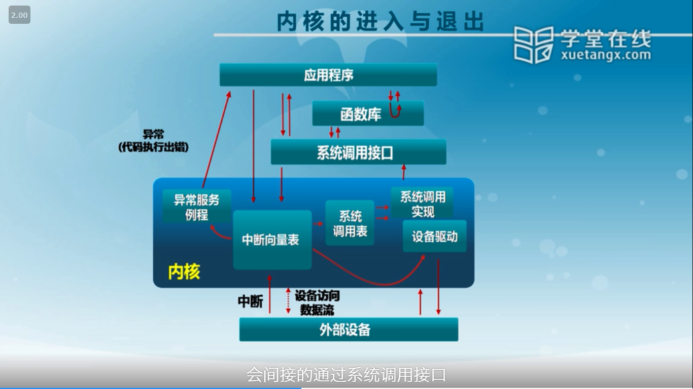

# 3.中断、异常和系统调用
- 为了方便应用程序使用操作系统提供的服务。内核是可信赖的，应用程序是不可信赖的。应用程序会需要使用部分特权指令(系统调用)
- 为了让计算机能对外部环境有响应(中断)
- 为了让计算机处理程序的异常行为(异常)  


## 区分
### 中断
- 源头: 外设
- 响应方式: 异步
- 处理机制: 持续，对用户应用程序是透明的。
### 异常
- 源头: 应用程序异常行为
- 响应方式: 同步
- 处理机制: 杀死或异常处理后重新执行应用程序指令
### 系统调用
- 源头: 应用程序请求操作系统提供服务
- 响应方式: 异步/同步
- 处理机制: 等待和持续
#### 函数库调用与系统调用的区别
系统调用使用指令INT/IRET(伴随堆栈切换和特权级切换);函数调用使用CALL/RET(没有堆栈切换)
#### 系统调用实例
```
ret = read(fd, data, len)
```
1. call 8001ed<read> (这里还是一个函数调用)
2. 8001ed<read>(这里是一个宏展开形成的系统调用里面有int指令(软中断 interupt)这里开始进入内核)
3. alltraps()&trap()获取中断信息的数据结构tf
4. trap_dispatch()根据中断向量tf->trapno进一步处理
5. syscall()根据系统调用编号tf->tf_regs.reg_eax进一步处理
6. sys_read()通过tf->sp获取系统调用参数
7. sysfile_read()读取文件
8. trapret() 里面有IRET指令
## 流程
1. 硬件处理: 在CPU初始化时要设置使能中断
    - 依据内部/外部事件设置中断标志
    - 依据中断向量调用相应中断服务例程
2. 软件处理: 
    - 现场保存(编译器实现)->中断向量表找对应的中断服务例程/对应的异常服务例程/系统调用表(再在系统调用表找到对应的系统调用服务例程)
    - 各个服务处理(操作系统实现的服务例程)
    - 清除中断标志(中断有，操作系统实现的服务例程)
    - 现场恢复(编译器实现)

备注可以根据优先级各种中断嵌套