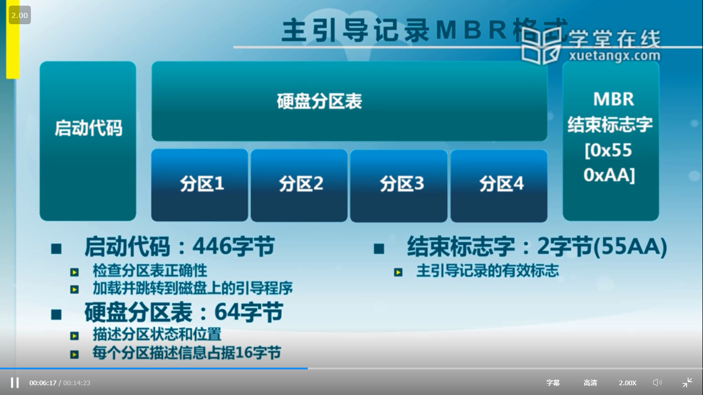

# 10.系统引导和初始化
## 10.1 流程
1. BIOS:加电后第一条指令，来自于主板上的ROM(Read-Only Mem)，映射在内存640KB-1MB位置，同时CPU将CS寄存器设置为0xf000,IP寄存器为0xfff0，此时系统处于实模式(即PC=CS(0xf000)<<4+IP(0xfff0)，同时此时地址总线为20位),ROM上的程序包括以下功能：
   1. 以中断调用的方式提供一些基本输入输出程序(在intel CPU规定这些只能工作在实模式下): 包括从磁盘读数据，从键盘读用户输入，在显示器上显示
   2. 配置系统信息ESCD: 系统从哪里启动，一些cpu特性是否开启等配置信息记录
   3. 开机后自检程序: 硬件自检POST, 查找并执行设备接口卡BIOS
   4. 系统自启动程序: 依据上述配置加载 加载程序(进一步加载操作系统内容的程序)和操作系统内容: 将加载程序(512B)从磁盘引导扇区加载到内存0x7c00并设置CS和IP寄存器使指令跳转执行()  
      1. BIOS读取主引导扇区的主引导记录(MBR)代码(决定我从哪个文件系统读加载程序):
      2. 主引导记录代码执行并读取活动分区的引导扇区代码:
         
      3. 引导扇区代码执行并读取文件系统加载程序:
         
2. 加载程序: 识别磁盘文件系统，并将操作系统从硬盘加载到内存中，并设置寄存器跳转执行，这里是因为考虑到文件系统多样性所以使用加载程序来解耦硬件(主板BIOS)和软件(操作系统)
   1. 读取操作系统的启动配置文件
   2. 依据配置加载内核
3. 操作系统: 开始运行