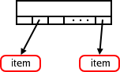

# tree
linux 内核中的各种树数据结构的实现。
## radix tree 基数树
基数树在数据结构上是一种多叉树型结构，但功能用途上类似于hash map，后续被替换为了xarray。这里先介绍被替换前的radix tree。
### 定义及初始化
todo 其中`gfp_mask`是Linux 底层的内存申请接口需要提供一类标识（flag）
可以直接手动声明然后用`RADIX_TREE_INIT`宏初始化，或者直接用`RADIX_TREE`宏声明的同时初始化。

```C
// linux-2.6.39
// file: include/linux/radix-tree.h
/* root tags are stored in gfp_mask, shifted by __GFP_BITS_SHIFT */
struct radix_tree_root {
	unsigned int		height;
	gfp_t			gfp_mask;
	struct radix_tree_node	__rcu *rnode;
};

#define RADIX_TREE_INIT(mask)	{					\
	.height = 0,							\
	.gfp_mask = (mask),						\
	.rnode = NULL,							\
}

#define RADIX_TREE(name, mask) \
	struct radix_tree_root name = RADIX_TREE_INIT(mask)
```


这是radix tree的节点的示意图，节点包含多个插槽，插槽用于存放指针。之前提到基数树是一种多叉树型结构，其叉数就是取决于slots的数量。一般内核代码使用的radix tree，会有64（1<<6）个槽位。同时槽位的offset（6）也是mask的长度，通过一下操作
```C
shift = (height-1) * RADIX_TREE_MAP_SHIFT;
i = (index >> shift) & RADIX_TREE_MAP_MASK;
```
即可获得槽位索引`i`,通过`slot->slots[i]`即可访问key在下一个height对应的节点。


```C
// linux-2.6.39
// file: include/linux/radix-tree.h
struct radix_tree_node {
	unsigned int	height;		/* Height from the bottom */
	unsigned int	count;
	struct rcu_head	rcu_head;
	void __rcu	*slots[RADIX_TREE_MAP_SIZE];
	unsigned long	tags[RADIX_TREE_MAX_TAGS][RADIX_TREE_TAG_LONGS];
};
```

### 插入删除接口
`radix_tree_insert`插入成功返回0，如果插入失败，返回失败原因（比如 内存不足返回`-ENOMEM`）。radix-tree不允许相同key的值覆盖，如果key已经在树中存在，再次插入会返回`-EEXIST`。
todo在某些情况下，基数树插入失败可能导致严重问题。为了帮助避免这种情况，提供了一对专用函数，函数会尝试为下一次插入分配足够的内存：
```C
int radix_tree_preload(gfp_t gfp_mask);
void radix_tree_preload_end(void);
```

```C
// linux-2.6.39
// file: lib/radix-tree.c
/**
 *	radix_tree_insert    -    insert into a radix tree
 *	@root:		radix tree root
 *	@index:		index key
 *	@item:		item to insert
 *
 *	Insert an item into the radix tree at position @index.
 */
int radix_tree_insert(struct radix_tree_root *root,
			unsigned long index, void *item)
{
	struct radix_tree_node *node = NULL, *slot;
	unsigned int height, shift;
	int offset;
	int error;

	BUG_ON(radix_tree_is_indirect_ptr(item));

	/* Make sure the tree is high enough.  */
	if (index > radix_tree_maxindex(root->height)) {
		error = radix_tree_extend(root, index);
		if (error)
			return error;
	}

	slot = indirect_to_ptr(root->rnode);

	height = root->height;
	shift = (height-1) * RADIX_TREE_MAP_SHIFT;

	offset = 0;			/* uninitialised var warning */
	while (height > 0) {
		if (slot == NULL) {
			/* Have to add a child node.  */
			if (!(slot = radix_tree_node_alloc(root)))
				return -ENOMEM;
			slot->height = height;
			if (node) {
				rcu_assign_pointer(node->slots[offset], slot);
				node->count++;
			} else
				rcu_assign_pointer(root->rnode, ptr_to_indirect(slot));
		}

		/* Go a level down */
		offset = (index >> shift) & RADIX_TREE_MAP_MASK;
		node = slot;
		slot = node->slots[offset];
		shift -= RADIX_TREE_MAP_SHIFT;
		height--;
	}

	if (slot != NULL)
		return -EEXIST;

	if (node) {
		node->count++;
		rcu_assign_pointer(node->slots[offset], item);
		BUG_ON(tag_get(node, 0, offset));
		BUG_ON(tag_get(node, 1, offset));
	} else {
		rcu_assign_pointer(root->rnode, item);
		BUG_ON(root_tag_get(root, 0));
		BUG_ON(root_tag_get(root, 1));
	}

	return 0;
}
EXPORT_SYMBOL(radix_tree_insert);

/**
 *	radix_tree_delete    -    delete an item from a radix tree
 *	@root:		radix tree root
 *	@index:		index key
 *
 *	Remove the item at @index from the radix tree rooted at @root.
 *
 *	Returns the address of the deleted item, or NULL if it was not present.
 */
void *radix_tree_delete(struct radix_tree_root *root, unsigned long index)
{
	/*
	 * The radix tree path needs to be one longer than the maximum path
	 * since the "list" is null terminated.
	 */
	struct radix_tree_path path[RADIX_TREE_MAX_PATH + 1], *pathp = path;
	struct radix_tree_node *slot = NULL;
	struct radix_tree_node *to_free;
	unsigned int height, shift;
	int tag;
	int offset;

	height = root->height;
	if (index > radix_tree_maxindex(height))
		goto out;

	slot = root->rnode;
	if (height == 0) {
		root_tag_clear_all(root);
		root->rnode = NULL;
		goto out;
	}
	slot = indirect_to_ptr(slot);

	shift = (height - 1) * RADIX_TREE_MAP_SHIFT;
	pathp->node = NULL;

	do {
		if (slot == NULL)
			goto out;

		pathp++;
		offset = (index >> shift) & RADIX_TREE_MAP_MASK;
		pathp->offset = offset;
		pathp->node = slot;
		slot = slot->slots[offset];
		shift -= RADIX_TREE_MAP_SHIFT;
		height--;
	} while (height > 0);

	if (slot == NULL)
		goto out;

	/*
	 * Clear all tags associated with the just-deleted item
	 */
	for (tag = 0; tag < RADIX_TREE_MAX_TAGS; tag++) {
		if (tag_get(pathp->node, tag, pathp->offset))
			radix_tree_tag_clear(root, index, tag);
	}

	to_free = NULL;
	/* Now free the nodes we do not need anymore */
	while (pathp->node) {
		pathp->node->slots[pathp->offset] = NULL;
		pathp->node->count--;
		/*
		 * Queue the node for deferred freeing after the
		 * last reference to it disappears (set NULL, above).
		 */
		if (to_free)
			radix_tree_node_free(to_free);

		if (pathp->node->count) {
			if (pathp->node == indirect_to_ptr(root->rnode))
				radix_tree_shrink(root);
			goto out;
		}

		/* Node with zero slots in use so free it */
		to_free = pathp->node;
		pathp--;

	}
	root_tag_clear_all(root);
	root->height = 0;
	root->rnode = NULL;
	if (to_free)
		radix_tree_node_free(to_free);

out:
	return slot;
}
EXPORT_SYMBOL(radix_tree_delete);
```

### 查找接口
```C
// linux-2.6.39
// file: lib/radix-tree.c
/*
 * is_slot == 1 : search for the slot.
 * is_slot == 0 : search for the node.
 */
static void *radix_tree_lookup_element(struct radix_tree_root *root,
				unsigned long index, int is_slot)
{
	unsigned int height, shift;
	struct radix_tree_node *node, **slot;

	node = rcu_dereference_raw(root->rnode);
	if (node == NULL)
		return NULL;

	if (!radix_tree_is_indirect_ptr(node)) {
		if (index > 0)
			return NULL;
		return is_slot ? (void *)&root->rnode : node;
	}
	node = indirect_to_ptr(node);

	height = node->height;
	if (index > radix_tree_maxindex(height))
		return NULL;

	shift = (height-1) * RADIX_TREE_MAP_SHIFT;

	do {
		slot = (struct radix_tree_node **)
			(node->slots + ((index>>shift) & RADIX_TREE_MAP_MASK));
		node = rcu_dereference_raw(*slot);
		if (node == NULL)
			return NULL;

		shift -= RADIX_TREE_MAP_SHIFT;
		height--;
	} while (height > 0);

	return is_slot ? (void *)slot : indirect_to_ptr(node);
}

/**
 *	radix_tree_lookup_slot    -    lookup a slot in a radix tree
 *	@root:		radix tree root
 *	@index:		index key
 *
 *	Returns:  the slot corresponding to the position @index in the
 *	radix tree @root. This is useful for update-if-exists operations.
 *
 *	This function can be called under rcu_read_lock iff the slot is not
 *	modified by radix_tree_replace_slot, otherwise it must be called
 *	exclusive from other writers. Any dereference of the slot must be done
 *	using radix_tree_deref_slot.
 */
void **radix_tree_lookup_slot(struct radix_tree_root *root, unsigned long index)
{
	return (void **)radix_tree_lookup_element(root, index, 1);
}
EXPORT_SYMBOL(radix_tree_lookup_slot);

/**
 *	radix_tree_lookup    -    perform lookup operation on a radix tree
 *	@root:		radix tree root
 *	@index:		index key
 *
 *	Lookup the item at the position @index in the radix tree @root.
 *
 *	This function can be called under rcu_read_lock, however the caller
 *	must manage lifetimes of leaf nodes (eg. RCU may also be used to free
 *	them safely). No RCU barriers are required to access or modify the
 *	returned item, however.
 */
void *radix_tree_lookup(struct radix_tree_root *root, unsigned long index)
{
	return radix_tree_lookup_element(root, index, 0);
}
EXPORT_SYMBOL(radix_tree_lookup);
```

还有一种查找接口，查找比`first_index`大的多个（不超过`max_items`）节点，返回查找到记录的条目数并根据关键字进行排序，返回的总节点数不超过`max_items`的大小。
todo 有一种说法是`radix_tree_gang_lookup`返回不足`max_items`时，radix-tree中仍然存在符合的键值，但出于性能考量未返回，需要用户自行根据上次返回结果填充新的`first_index`以及调整`max_items`，并再次调用`radix_tree_gang_lookup`，直到返回0。但我看代码好像单次调用会尽力遍历，需要测试一下以及了解一下代码的commit。
```C
// linux-2.6.39
// file: lib/radix-tree.c
/**
 *	radix_tree_gang_lookup - perform multiple lookup on a radix tree
 *	@root:		radix tree root
 *	@results:	where the results of the lookup are placed
 *	@first_index:	start the lookup from this key
 *	@max_items:	place up to this many items at *results
 *
 *	Performs an index-ascending scan of the tree for present items.  Places
 *	them at *@results and returns the number of items which were placed at
 *	*@results.
 *
 *	The implementation is naive.
 *
 *	Like radix_tree_lookup, radix_tree_gang_lookup may be called under
 *	rcu_read_lock. In this case, rather than the returned results being
 *	an atomic snapshot of the tree at a single point in time, the semantics
 *	of an RCU protected gang lookup are as though multiple radix_tree_lookups
 *	have been issued in individual locks, and results stored in 'results'.
 */
unsigned int
radix_tree_gang_lookup(struct radix_tree_root *root, void **results,
			unsigned long first_index, unsigned int max_items)
{
	unsigned long max_index;
	struct radix_tree_node *node;
	unsigned long cur_index = first_index;
	unsigned int ret;

	node = rcu_dereference_raw(root->rnode);
	if (!node)
		return 0;

	if (!radix_tree_is_indirect_ptr(node)) {
		if (first_index > 0)
			return 0;
		results[0] = node;
		return 1;
	}
	node = indirect_to_ptr(node);

	max_index = radix_tree_maxindex(node->height);

	ret = 0;
	while (ret < max_items) {
		unsigned int nr_found, slots_found, i;
		unsigned long next_index;	/* Index of next search */

		if (cur_index > max_index)
			break;
		slots_found = __lookup(node, (void ***)results + ret, cur_index,
					max_items - ret, &next_index);
		nr_found = 0;
		for (i = 0; i < slots_found; i++) {
			struct radix_tree_node *slot;
			slot = *(((void ***)results)[ret + i]);
			if (!slot)
				continue;
			results[ret + nr_found] =
				indirect_to_ptr(rcu_dereference_raw(slot));
			nr_found++;
		}
		ret += nr_found;
		if (next_index == 0)
			break;
		cur_index = next_index;
	}

	return ret;
}
EXPORT_SYMBOL(radix_tree_gang_lookup);

/**
 *	radix_tree_gang_lookup_slot - perform multiple slot lookup on radix tree
 *	@root:		radix tree root
 *	@results:	where the results of the lookup are placed
 *	@first_index:	start the lookup from this key
 *	@max_items:	place up to this many items at *results
 *
 *	Performs an index-ascending scan of the tree for present items.  Places
 *	their slots at *@results and returns the number of items which were
 *	placed at *@results.
 *
 *	The implementation is naive.
 *
 *	Like radix_tree_gang_lookup as far as RCU and locking goes. Slots must
 *	be dereferenced with radix_tree_deref_slot, and if using only RCU
 *	protection, radix_tree_deref_slot may fail requiring a retry.
 */
unsigned int
radix_tree_gang_lookup_slot(struct radix_tree_root *root, void ***results,
			unsigned long first_index, unsigned int max_items)
{
	unsigned long max_index;
	struct radix_tree_node *node;
	unsigned long cur_index = first_index;
	unsigned int ret;

	node = rcu_dereference_raw(root->rnode);
	if (!node)
		return 0;

	if (!radix_tree_is_indirect_ptr(node)) {
		if (first_index > 0)
			return 0;
		results[0] = (void **)&root->rnode;
		return 1;
	}
	node = indirect_to_ptr(node);

	max_index = radix_tree_maxindex(node->height);

	ret = 0;
	while (ret < max_items) {
		unsigned int slots_found;
		unsigned long next_index;	/* Index of next search */

		if (cur_index > max_index)
			break;
		slots_found = __lookup(node, results + ret, cur_index,
					max_items - ret, &next_index);
		ret += slots_found;
		if (next_index == 0)
			break;
		cur_index = next_index;
	}

	return ret;
}
EXPORT_SYMBOL(radix_tree_gang_lookup_slot);
```

### 使用
基数树最广泛的使用是在内存管理代码中，在`mm/vmalloc.c`中就使用radix tree。todo主要用于跟踪后备存储的 address_space 结构包含一个基数树，该树跟踪与该映射关联的内存页。除此之外，这棵树允许内存管理代码快速找到已标记为脏或正在写回的页。

> 另外可以发现，radix-tree的API中没有销毁radix-tree的接口，因为一般情况下，默认基数树会一直存在，实际操作中，可以通过删除radix-tree上所有的节点之后进一步释放根节点内存来释放所有radix-tree申请的内存。

## xarray

## rb-tree
## maple-tree
## reference 参考 
1. [Linux inside - Linux内核中的数据结构 - 基数树](https://github.com/hust-open-atom-club/linux-insides-zh/blob/master/DataStructures/linux-datastructures-2.md)
2. [Trees I: Radix trees - lwn.net](https://lwn.net/Articles/175432/)
3. [The XArray data structure - lwn.net](https://lwn.net/Articles/745073/)
4. [Trees II: red-black trees - lwn.net](https://lwn.net/Articles/184495/)
5. [Introducing maple trees](https://lwn.net/Articles/845507/)
6. [Red-black Trees (rbtree) in Linux](https://www.kernel.org/doc/html/latest/translations/zh_CN/core-api/rbtree.html)