# Linux Performance Tools
## Methodologies 方法论
### Objectives 
1. Recognize th Streetlight Anti-Method
   认识反方法论  
   反方法论包括
   1. 一上来就是各种命令查看系统状态
   2. 对照实验：调参看运气
   3. 指责别人
   4. ···
2. 真·方法论
   1. Problem Statement Method: 准确（量化）描述问题
   2. Workload Characterization Method  
   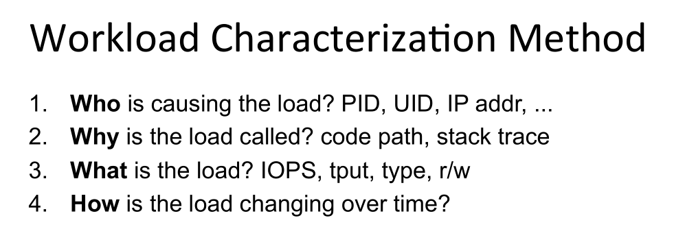
   3. USE Method  
   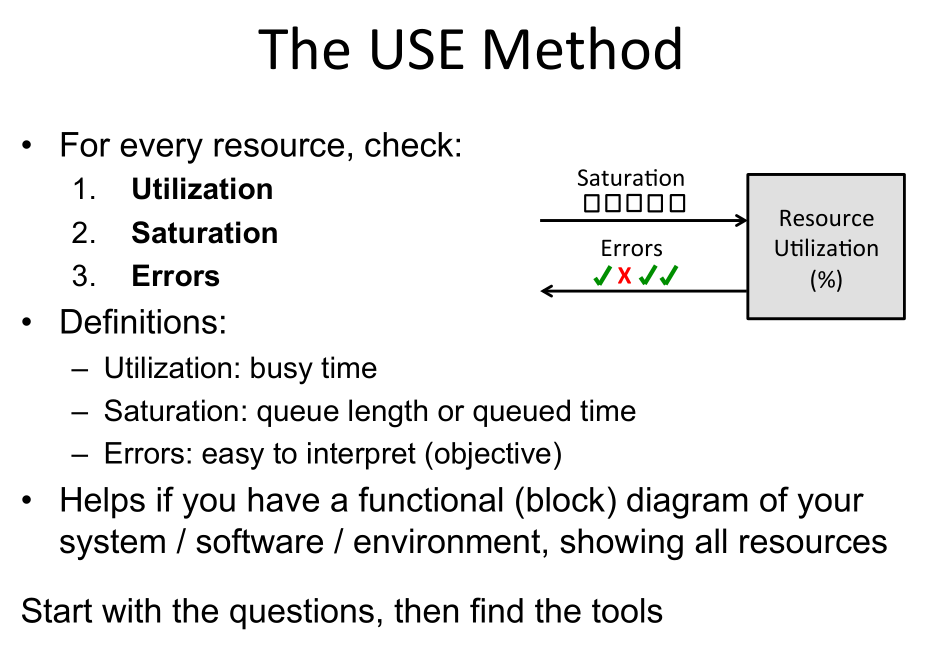
   4. Off-CPU Analysis: 存在一些并发复杂问题（互锁、竞争、阻塞、网络堆栈）时使用  
   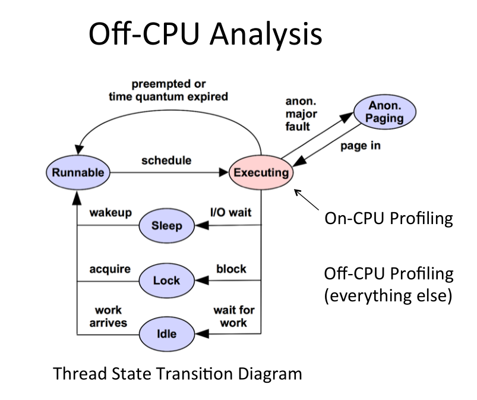
   5. CPU Profile Method: Flame graph 火焰图
   6. RTFM Method: Read the fucking man
   7. Active Benchmarking
   8. Static Performance Tuning
## Tools
|Tyep|Characteristic|
|-|-|
|Observability|Watch activity Safe,depending on resource overhead|
|Benchmarking|Load test Caution: production tests can cause issues due to contention|
|Tuning 调优|Change Danger: changes could hurt performance, now or later with load|
|Static|Check configuration Should be safe|

再开始之前可以先列出系统有关的功能和组件图，这样可以根据图标逐一检查
### Observability Tools
------- Basic -------
1. uptime: cpu load averages
2. top(htop/atop(for short-lived processes)): System and per-process interval summary
3. ps: Process status listing (ps -ef f)
4. vmstat: Virtual memory statistics and more
5. iostat: Block I/O (disk)stat
6. mpstat: Multi-processor statistics,per-CPU
7. free: main memory usage  

------- Intermediate -------
1. strace: System call tracer (may slow things down)
2. tcpdump: Sniff network packets for post analysis (现在比较难用)
3. netstat: Various network protocol statistics
4. nicstat: Network interface stats, iostat-like output
5. pidstat: Very useful process stats
6. swapon: Show swap device usage
7. lsof: Shows file descriptor usage, whick for some apps, equals current active network connections
8. sar: System Activity Report  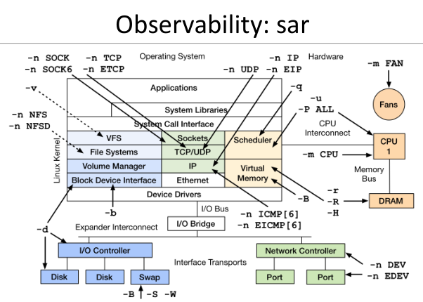

------- Advanced -------
1. ss: More socket statistics
2. iptraf: a net tool gives you a histogram of the network
3. iotop: Block device I/O (disk) by process
4. slabtop: Kernel slab allocator memory usage
5. pcstat: show page cache residency by file
6. perf_event: Provides the "perf" command
7. tiptop: Gice you a in general how quickly is the thread retiring instructions on CPU(love it)
8. rdmsr: Model Specific Registers
9. others   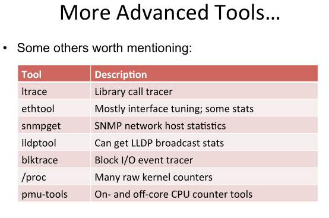  

------- Graph -------  
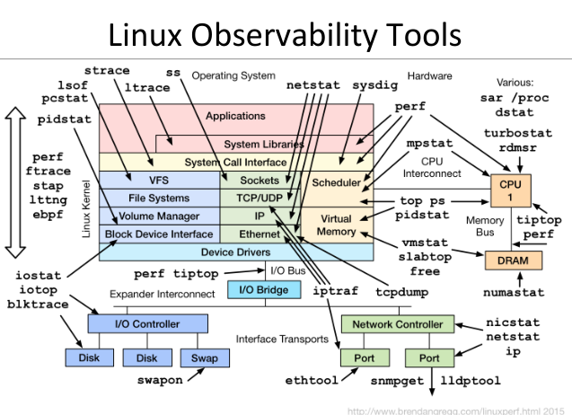  
### Benchmarking Tools
#### Benchmarking Method
1. Run the benchmark with Observability Tools
#### tools
1. fio: FS or disk I/O micro-benchmarks
2. pchar: Traceroute with bandwidth per hop  
------- Graph -------  
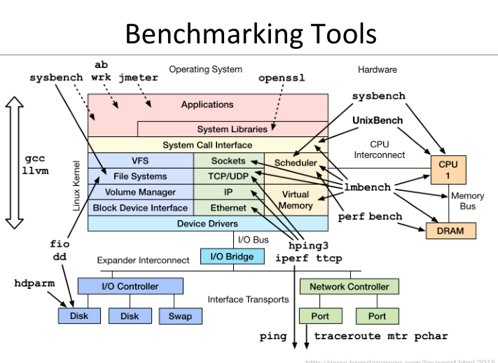  
### Tuning Tools
Tuning the targets after using Observability Tools  
------- Graph -------  
  
### Static Tools
在系统没有工作的情况下，查看系统的状态  
------- Graph -------  
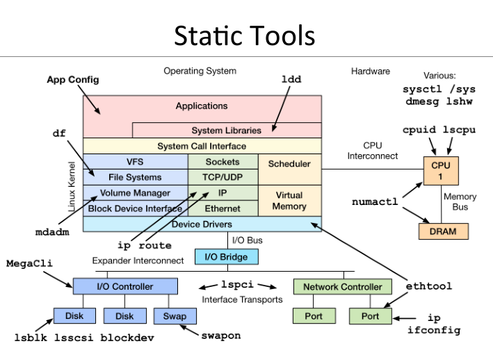  
## Profiling
### Objectives
- Profile CPU usage by stack sampling(栈取样？): 对cpu运行时的栈进行固定间隔的取样
- Generate CPU flame graphs
- Understand gotchas with stacks & symbols
### tools
perf -> Flame Graph  
------- Graph -------  
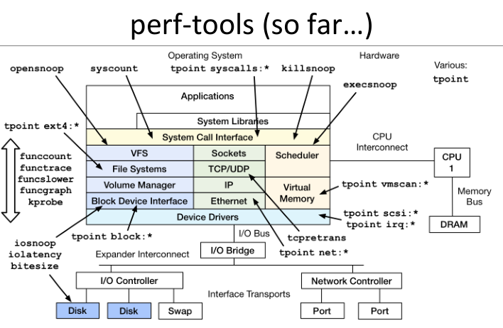  
------- workflow --------  
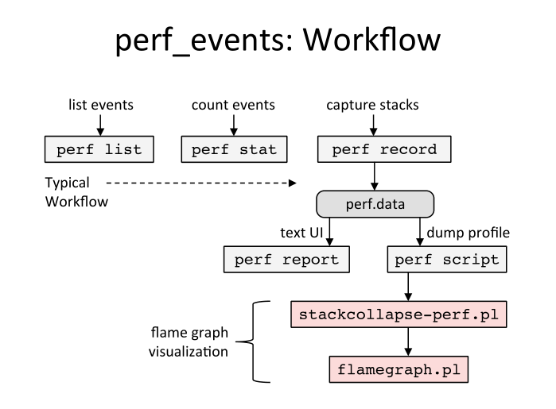  
## Tracing
### Objectives
- Understand frameworks: tracepoints, kprobes, uprobes
- Understand mainline tracers: ftrace, perf_events, eBPF
- Awareness of other tracers: systemtap, LTTng, ktap, sysdig
- Awareness of what tracing can accomplish(eg, perf-tools)
### framworks
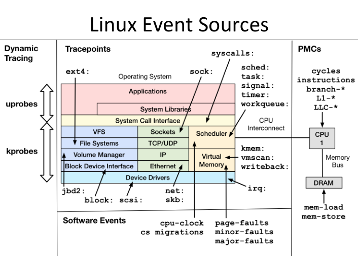  
How to choosing a Tracer  
  