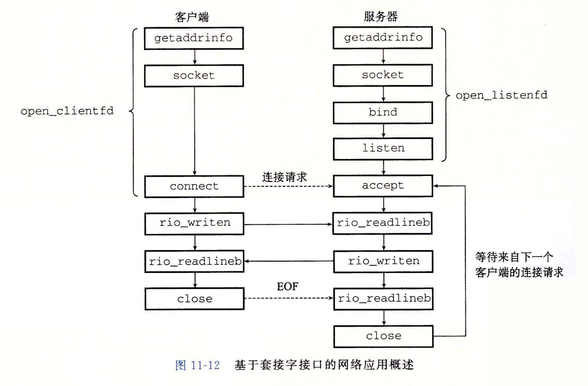

# 客户端和服务端进程建立通信
## 通过socket连接
socket也可以用“一切皆文件”来理解，可将其视为一类特殊的文件，其使用遵循“打开open-读写read/write-关闭close”的模式。
### socket接口
一个socket连接是由它两端的套接字地址唯一确定的。这对套接字地址叫做套接字对(socket pair):(cliaddr:cliport, servaddr:servport)


#### socket接口常用数据结构
```C
// #include <sys/socket.h>
// #include <bits/sockaddr.h>
/* POSIX.1g specifies this type name for the `sa_family' member.  */
typedef unsigned short int sa_family_t;

/* This macro is used to declare the initial common members
   of the data types used for socket addresses, `struct sockaddr',
   `struct sockaddr_in', `struct sockaddr_un', etc.  */

#define	__SOCKADDR_COMMON(sa_prefix) \
  sa_family_t sa_prefix##family

/* Structure describing a generic socket address.  */
/* 指向要绑定给sockfd的协议地址。这个地址结构会根据地址创建socket时的地址协议族的不同而不同 */
struct sockaddr
{
    __SOCKADDR_COMMON (sa_);	/* Common data: address family and length. */
    /* sa_family_t sa_family; */
    char sa_data[14];		/* Address data.  */
};

/* Add more `struct sockaddr_AF' types here as necessary.
   These are all the ones I found on NetBSD and Linux.  */

# define __SOCKADDR_ALLTYPES \
  __SOCKADDR_ONETYPE (sockaddr) \
  __SOCKADDR_ONETYPE (sockaddr_at) \
  __SOCKADDR_ONETYPE (sockaddr_ax25) \
  __SOCKADDR_ONETYPE (sockaddr_dl) \
  __SOCKADDR_ONETYPE (sockaddr_eon) \
  __SOCKADDR_ONETYPE (sockaddr_in) \
  __SOCKADDR_ONETYPE (sockaddr_in6) \
  __SOCKADDR_ONETYPE (sockaddr_inarp) \
  __SOCKADDR_ONETYPE (sockaddr_ipx) \
  __SOCKADDR_ONETYPE (sockaddr_iso) \
  __SOCKADDR_ONETYPE (sockaddr_ns) \
  __SOCKADDR_ONETYPE (sockaddr_un) \
  __SOCKADDR_ONETYPE (sockaddr_x25)

struct sockaddr_in 
{ 
    sa_family_t sin_family; /* address family: AF_INET */ 
    in_port_t sin_port; /* port in network byte order */ 
    struct in_addr sin_addr; /* internet address */ 
}; 
/* Internet address. */ 
struct in_addr 
{ 
    uint32_t s_addr; /* address in network byte order */
};

/* ipv6对应的是：*/
struct sockaddr_in6
{
    sa_family_t sin6_family; /* AF_INET6 */ 
    in_port_t sin6_port; /* port number */ 
    uint32_t sin6_flowinfo; /* IPv6 flow information */ 
    struct in6_addr sin6_addr; /* IPv6 address */ 
    uint32_t sin6_scope_id; /* Scope ID (new in 2.4) */
}; 
struct in6_addr
{ 
    unsigned char s6_addr[16]; /* IPv6 address */ 
};

/* Unix域对应的是：*/
#define UNIX_PATH_MAX 108 
struct sockaddr_un 
{ 
    sa_family_t sun_family; /* AF_UNIX */
    char sun_path[UNIX_PATH_MAX]; /* pathname */ 
};

```
#### socket()
```C
/*
    domain: 协议域，又称为协议族（family）。常用的协议族有，AF_INET、AF_INET6、AF_LOCAL（或称AF_UNIX，Unix域socket）、AF_ROUTE等等。协议族决定了socket的地址类型，在通信中必须采用对应的地址，如AF_INET决定了要用ipv4地址（32位的）与端口号（16位的）的组合、AF_UNIX决定了要用一个绝对路径名作为地址。
    type: 指定socket类型。常用的socket类型有，SOCK_STREAM、SOCK_DGRAM、SOCK_RAW、SOCK_PACKET、SOCK_SEQPACKET等等（socket的类型有哪些？）当protocol为0时，会自动选择type类型对应的默认协议。
    protocol: 指定协议。常用的协议有，IPPROTO_TCP、IPPTOTO_UDP、IPPROTO_SCTP、IPPROTO_TIPC等，它们分别对应TCP传输协议、UDP传输协议、STCP传输协议、TIPC传输协议
    return_value: socket描述符
*/
int socket(int domain, int type, int protocol);
```
socket文件“打开”操作。由此接口创建一个socket时，返回的socket描述字存在于协议族（address family，AF_XXX）空间中，但没有一个具体的地址。如果需要赋值一个具体的socket地址就要用到bind()函数。另外调用connect()和listen()函数时系统内核会自动分配一个临时端口(ephemeral port)组成一个socket地址。
#### bind()
```C
/*
    sockfd: socket描述符，通过socket()函数创建了，唯一标识一个socket。bind()函数就是将给这个描述符绑定一个socket addr。
    addr: const struct sockaddr *指针，指向要绑定给sockfd的协议地址。这个地址结构根据地址创建socket时的地址协议族的不同而不同
    addrlen: 地址长度
    return_value: 
*/
int bind(int sockfd, const struct sockaddr *addr, socklen_t addrlen);
```
服务器在启动的时候都会绑定一个公认的地址（如ip地址+端口号），用于提供服务，客户就可以通过它来接连服务器；而客户端就不用指定，系统内核会在connect()时自动分配一个临时端口号和自身的ip地址组合。这就是为什么通常服务器端在listen之前会调用bind()，而客户端就不会调用。
#### listen()
```C
/*
    sockfd: 服务端监听进程使用的socket描述符
    backlog: 相应socket最大连接个数
    return_value: 
*/
int listen(int sockfd, int backlog);
```
作为一个服务器，在调用socket()、bind()之后就会调用listen()来监听这个socket，如果客户端这时调用connect()发出连接请求，服务器端就会接收到这个请求。
socket()函数创建的socket默认是一个主动类型(todo?)的，listen函数将socket变为被动类型的，等待客户的连接请求。
#### connect()
```C
/*
    sockfd: 客户端进程的socket描述字
    addr: 服务端进程的socket地址
    addrlen: socket地址长度
    return_value: 
*/
int connect(int sockfd, const struct sockaddr *addr, socklen_t addrlen);
```
客户端通过调用connect函数来建立与TCP服务器的连接。
#### accept()
```C
/*
    sockfd: 服务端进程的socket描述字
    addr: 用于返回客户端进程的socket地址指针
    addrlen: 返回的socket地址长度指针
    return_value: 已连接的socket描述符
*/
int accept(int sockfd, struct sockaddr *addr, socklen_t *addrlen);
```
服务器端依次调用socket()、bind()、listen()之后，就会监听指定的socket地址了。TCP客户端依次调用socket()、connect()之后就想TCP服务器发送了一个连接请求。TCP服务器监听到这个请求之后，就会调用accept()函数取接收请求，如果accpet成功，那么其返回值是由内核自动生成的一个全新的描述字，代表与返回客户的TCP连接。这样连接就建立好了。之后就可以开始网络I/O操作了，即类同于普通文件的读写I/O操作。（accept的第一个参数为服务器的socket描述字，是服务器开始调用socket()函数生成的，称为监听socket描述字；而accept函数返回的是已连接的socket描述字。一个服务器通常通常仅仅只创建一个监听socket描述字，它在该服务器的生命周期内一直存在。内核为每个由服务器进程接受的客户连接创建了一个已连接socket描述字，当服务器完成了对某个客户的服务，相应的已连接socket描述字就被关闭。）
## 参考
https://zhuanlan.zhihu.com/p/100151937
