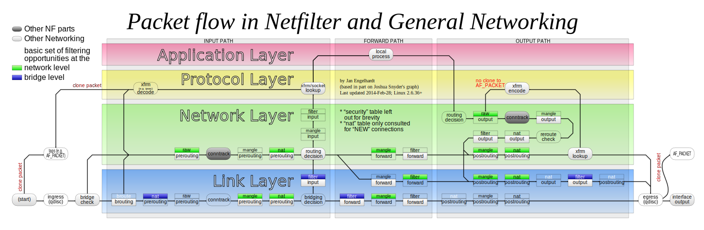
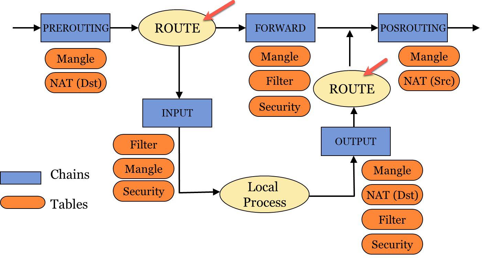

# netfilter & iptables
netfilter是一个内核模块，是linux内核处理网卡收到内核的数据包的一个框架
iptables是对应的用户工具，用户通过iptables命令下发规则，规则在netfilter框架中应用，匹配并按照规则处理IP数据包，iptables主要是应对ipv4协议（以及传输层协议）的规则，相应的还有ip6tables应对ipv6协议（以及传输层协议）的规则、arptables等工具
## netfilter
netfilter定义了一系列HOOK标志点（include\linux\netfilter.h）
```C
enum nf_inet_hooks {
	NF_INET_PRE_ROUTING,
	NF_INET_LOCAL_IN,
	NF_INET_FORWARD,
	NF_INET_LOCAL_OUT,
	NF_INET_POST_ROUTING,
	NF_INET_NUMHOOKS
};
```
以ipv4为例，这几个HOOK标志点具体执行的位置为(linux-2.6.34)
- NF_INET_PRE_ROUTING: `ip_rcv() (linux/net/ipv4/ip_input.c)`中执行注册在此HOOK标志点的hook函数。执行完成后会通过`ip_rcv_finish()`这个`okfn`调用执行`ip_route_input()`函数。在`ip_route_input()`函数中，会根据数据包的目的（指向本机/不指向本机）通过`skb_dst_set()`函数进行sk_buff的路由dst的设置（`ip_local_deliver()`/`ip_forward()`），或者在路由查找失败或ip选项处理失败的特殊情况下会丢弃此sk_buff，不再处理。此HOOK标志点被视为IP数据包的总入口。
- NF_INET_LOCAL_IN: `ip_local_deliver() (linux/net/ipv4/ip_input.c)`中执行注册在此HOOK标志点的hook函数。如果经过路由判断后，sk_buff的路由`struct dst_entry->input`函数为`ip_local_deliver()`或者通过别的input最终调用到`ip_local_deliver`都会触发执行hook函数。之后数据包会继续交给协议栈上层处理。此HOOK标志点被视为IP数据包中指向本机的数据包的总入口。
- NF_INET_FORWARD: `ip_forward() (net\ipv4\ip_forward.c)`中执行注册在此HOOK标志点的hook函数。如果经过路由判断后，sk_buff的`struct dst_entry->input`函数为`ip_forward()`就会触发执行hook函数。此HOOK标志点被视为IP数据包中不指向本机的数据包的总入口。
- NF_INET_LOCAL_OUT: `ip_local_out() (net\ipv4\ip_output.c)`中执行注册在此HOOK标志点的hook函数。协议栈上层需要封装发送数据包时会调用此函数。此HOOK标志点被视为由本机发出的IP数据包的总出口。
- NF_INET_POST_ROUTING: `ip_mc_output() (net\ipv4\ip_output.c)` 中执行注册在此HOOK标志点的hook函数。`ip_mkroute_output()`函数会在路由表某些需要发送出去的项的`struct dst_entry->output`函数设置为`ip_mc_output()`，`dst_output()`函数调用`ip_mc_output()`时就会触发执行hook函数。此HOOK标志点被视为IP数据包的总出口。

> 路由判断 `ip_rcv_finish->ip_route_input->skb_dst_set`


以此可见，netfilter框架实际运行于Network Protocol层中

在内核中通过`nf_register_hook()/nf_register_hooks() (net/netfilter/core.c)`将`nf_hook_ops`注册到`struct list_head nf_hooks[NFPROTO_NUMPROTO][NF_MAX_HOOKS]`这个链表数组中
```C
/**
 * @hooknum: 上面提到的HOOK标志点
 * @skb: 待处理的sk_buff
 * @in: 输入网络设备，由nf_hook_thresh传递进来的
 * @out: 输出网络设备，由nf_hook_thresh传递进来的
 * @okfn: 处理中可能用到的回调函数，由nf_hook_thresh传递进来的
 */ 
typedef unsigned int nf_hookfn(unsigned int hooknum,
			       struct sk_buff *skb,
			       const struct net_device *in,
			       const struct net_device *out,
			       int (*okfn)(struct sk_buff *));

struct nf_hook_ops {
	struct list_head list;

	/* User fills in from here down. */
	nf_hookfn *hook;
	struct module *owner;
	u_int8_t pf;
	unsigned int hooknum;
	/* Hooks are ordered in ascending priority. */
	int priority;
};
```
内核协议栈在处理某个协议的包时，会调用`NF_HOOK()`宏（或是函数），并最终调用`nf_hook_thresh() (include/linux/netfilter.h)`函数，`nf_hook_thresh()`函数定义如下
```C
/**
 * @pf: 协议族（Protocol family），如 PF_INET（IPv4）或 PF_INET6（IPv6）
 * @hook: 上面提到的HOOK标志点
 * @skb: 待处理的sk_buff
 * @indev: 输入网络设备（可为 NULL）
 * @outdev: 输出网络设备（可为 NULL）
 * @okfn: 所有hook函数处理完成后调用的回调函数
 * @thresh: 钩子优先级阈值，仅执行优先级 >= thresh 的钩子
 */ 
static inline int nf_hook_thresh(u_int8_t pf, unsigned int hook,
				 struct sk_buff *skb,
				 struct net_device *indev,
				 struct net_device *outdev,
				 int (*okfn)(struct sk_buff *), int thresh);
```
最终会通过`nf_iterate (net/netfilter/core.c)`函数遍历执行`nf_hooks[pf][hook]`nf_hook_ops的hook函数（会根据proiority过滤），hook函数会返回以下结果之一(include\linux\netfilter.h)，`NF_HOOK()`会根据返回结果对skb进行处理。
```C
/* Responses from hook functions. */
#define NF_DROP 0
#define NF_ACCEPT 1
#define NF_STOLEN 2
#define NF_QUEUE 3
#define NF_REPEAT 4
#define NF_STOP 5
#define NF_MAX_VERDICT NF_STOP
```

## iptables


iptables对规则的管理从两个维度出发
- 表 table：根据规则的功能维度来区分，通过`-t`参数可以指定表
- 链 chain：根据规则作用的时间点（HOOK标志点）也就是数据的传输路径节点来区分。且可以通过命令增加删除
一般默认有四表五链，当设备启用了SELinux时，一般还会增加一个security表，用于控制流的安全上下文
- filter, nat, mangle, raw四个表，每个表有对应
- INPUT, OUTPUT, FORWARD, PREROUTING, POSTROUTING五个链，分别与netfilter的五个HOOK点对应，不赘述了

### 表
不同的表根据应用规则后对数据的操作集合（即规则的功能）来区分
1. filter表：可以配置ACCEPT\REJECT\DROP操作。主要用于实现本机防火墙功能。
2. nat表：可以配置SNAT\DNAT\MASQUERADE\NETMAP\REDIRECT操作。主要用于网络地址转换功能。其中MASQUERADE（地址伪装）与SNAT类似会自动使用当前网卡的实际IP地址替换。
3. mangle表：可以配置MARK\CONNMARK\TCPMSS等操作。主要用于mangling(modifying 修改)数据包的元信息（如IP头）。主要用于修改数据包的TOS（Type Of Service，服务类型）、TTL（Time To Live，生存周期）指以及为数据包设置Mark标记，以实现Qos(Quality Of Service，服务质量)调整以及策略路由等应用，由于需要相应的路由设备支持，因此应用并不广泛。
4. raw表：可以配置NOTRACK操作，让包绕过conntrack。应用也不广泛
除了上述的操作，还有一些普遍的操作如LOG可以在各个表中设置

### 命令使用
``` bash
# 查看规则 -L list -A append -D delete -I insert （-I/D 链后面跟数字可以插入/删除具体位置的规则）
iptables -t nat -L POSTROUTING -nv --line-number
```
#### 场景1：透明代理
``` bash
# 设置DNAT将请求转发到服务进程
iptables -t nat -I PREROUTING 1 -p tcp --dport 80 -j DNAT --to-destination 10.20.152.181:12345
# 到达FORWARD链时已经完成DNAT的修改
iptables -I FORWARD -p tcp -d 10.20.152.181 --dport 12345 -j ACCEPT
# 配置MASQUERADE规则（一种特殊的源地址转换规则）处理服务进程响应包的源目的地址和源目的端口将其转换为请求进程和代理服务器的地址和端口
iptables -t nat -I POSTROUTING -p tcp -d 10.20.152.181 --dport 12345 -j MASQUERADE
# 配置MASQUERADE（或SNAT）规则后，响应包不会再次经过PREROUTING链，直接走FORWARD链（有连接跟踪（conntrack）决定），所以在FORWARD链中配置ACCEPT规则放行
iptables -A FORWARD -j ACCEPT -p tcp -s 10.20.152.181 --sport 12345

# 添加日志，方便调试。日志会记录在/var/log/messages
iptables -t nat -I PREROUTING 5  -j LOG --log-prefix "PREROUTING-DEBUG: " --log-level 4 -p tcp --dport <代理服务端口:80>
iptables -I FORWARD -j LOG --log-prefix "FORWARD-DEBUG: " --log-level 4 -p tcp -d 10.20.152.181 --dport <服务端口:12345>
iptables -t nat -I POSTROUTING -j LOG --log-prefix "POSTROUTING-DEBUG: " --log-level 4 -p tcp -d <服务地址:10.20.152.181> --dport <服务端口:12345>
iptables -I FORWARD -j LOG --log-prefix "RFORWARD-DEBUG: " --log-level 4 -p tcp -s <服务地址:10.20.152.181> --sport <服务端口:12345>
```
## conntrack
conntrack是netfilter中的一个子模块，其具体处理函数是也是通过`nf_register_hook()/nf_register_hooks() (net/netfilter/core.c)`注册，并通过priority保证conntrack的hook执行在相对靠前的位置，因为conntrack的逻辑保证了其不会修改数据包，仅可能丢弃数据包，不会影响后续hook函数的执行。
可以通过如下命令查看系统中连接的连接状态
``` bash
conntrack -L # 列出所有连接信息及其状态
cat /proc/net/nf_conntrack # 与上一条命令相同
cat /proc/net/stat/nf_conntrack # 连接状态统计
conntrack -S # 根据CPU统计

```

## 参考
1. [netfilter源码和tc使用介绍（翻译自Traffic Control HOWTO）](https://wiki.dreamrunner.org/public_html/Linux/Networks/netfilter.html)
2. [如何配置iptables](https://zchan.moe/2024/08/25/%E5%A6%82%E4%BD%95%E9%85%8D%E7%BD%AEiptables/)
3. [[译] 深入理解 iptables 和 netfilter 架构](https://arthurchiao.art/blog/deep-dive-into-iptables-and-netfilter-arch-zh/)
4. [连接跟踪（conntrack）：原理、应用及 Linux 内核实现](https://arthurchiao.art/blog/conntrack-design-and-implementation-zh/)