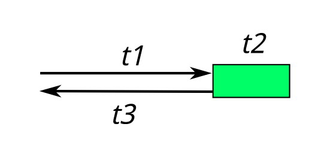
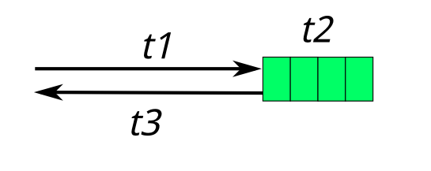
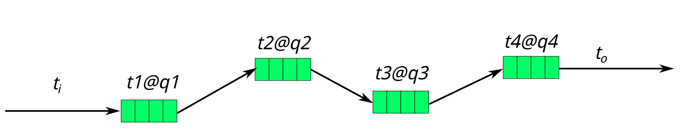

# 基本模型
https://zhuanlan.zhihu.com/p/22124514
## 瓶颈
提升性能 -> 用一套完整的方法发现系统的瓶颈 -> 解决瓶颈 
- 通量（吞吐量 Throughput）
- 时延（Latency）
- 功耗 目前考虑得比较少  

通量和时延相互作用，当通量达到系统上线，时延就会增加  

## 基本模型
  
平均时延：t1+t2+t3  
通量：1/(t1+t2+t3)  
因为t1、t2、t3分别作用于不同的模块，所以可以通过流水线来加速

假设系统接收到的全部包数量为n，系统处理一个请求的平均时间为ti，某一个瞬时在t2所在管道的包数量为len。
平均时延：t1+t2+t3
通量：n/(t1+n*ti+t3)(当n趋向于无穷，且调度可以平衡且t2所在管道流量无限，通量为1/ti)  
t2=len*ti  
可以看出如果请求变多t2变高时延变长，所以此时要进行的是**流控**

现代cpu系统模型会复杂一点，但只考虑主业务流则相似。
### 基本模型下的性能分析方法
1. 系统主性能 决定ti  
2. ti无法改变，调整流控点（队列长度来满足需求）
3. 思考多系统并行处理（多进程，多线程）
## 全系统的线程模型
看系统性能模型时，从线程（广义线程）角度入手  
从线程模型上看性能，处理模型就会比较简单：我们如果希望提高一个队列清库存的效率，只要增加在这个队列上的搬移线程，或者提高部署在上面的线程（实际上是CPU核）的数量，就可以平衡它的流控时间。如果我们能平衡所有队列的效率和长度，我们就比较容易控制整个系统的通量和时延了。
在线程这个问题上，最后要补充几句：线程是为了驱动系统的运行。不少新手很容易把线程和模块的概念搞到一起，甚至给每个模块配备一个线程。这是不少系统调度性能差的原因（why？）。初学者应该要时刻提醒自己，线程和模块是两个独立的，正交的概念，是不应该绑定的。模块是为了实现上的内聚，而线程是为了：

1. 把计算压力分布到多个核上

2. 匹配不同执行流程的速率

3. 当线程的执行流程中有同步IO的时候，增加线程以便减少在同步IO上的等待时间（本质上是增加流水线层次提升执行部件的同步效率）
## 一般操作方式
1.查看cpu占用率:`top`
 - 没有满
   - 某个队列提早进行了流控。
   - 调度没充分展开
   - 配套队列的线程有IO空洞，需要通过异步设计吧空洞填掉
 - 已经占满
   - CPU是否花在业务进程上
     - 如果不是，用perf分析，调度特别频繁的时候可以用ftrace观察切换原因
     - 看是否被充分利用以及算法优化
## 关于流控
流控很复杂之后再说
1. 流控要出现在队列链的最前面，不要在中间环节，因为这样丢包不会多消耗cpu。
2. 注意队列过长的情况，防止包因处理时间过长t2(len*ti)>规定响应时间造成浪费。