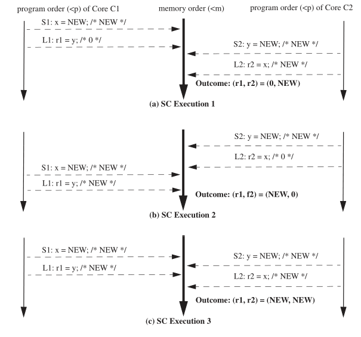

# 并发问题和内存一致性模型（memory consistency model）
在计算机追寻计算性能的发展道路上，冯诺依曼模型单核CPU性能遇到功耗墙，此后芯片厂商开辟出了通过增加核心数目来增强计算性能的新道路。


多核情况下，CPU们共享内存（现代cpu上内存的含义被进一步拓展为多级缓存，这里的指的共享内存不包括cpu本地缓存（L1Cache），包括但不限于多cpu共享缓存(L3Cache)）。在对共享内存的读写操作上，多核心计算机在计算过程中需要保证以下一致性，防止竞争条件（race condition）的发生，以达到和单核相同的计算正确性。而讨论正确性的时候可以将其划分为两个子问题
- memory consistency: 内存一致性问题包含了内存读写操作的规则 
- cache coherence：缓存一致性问题是支持内存一致性的组成部分之一。其目的是让硬件cache在对共享内存的读写操作没有任何影响，就和没有cache是一样的。问题的主要由硬件工程师解决，不在本文中做重点讨论。
1. 读/写都有原子性：读/写在执行完成前都不可能有另一个读/写生效 **（互斥）**
2. 写保证顺序性: 保证读之前的所有并发的写的结果是代码编写人员期望的末序（最后一个）写入的结果 **（同步）**
3. 读保证可见性：保证上述写之后的结果对所有并发的读可见 **（同步）**
为了保证上述特性，我们需要将这一系列读/写操作打包放入 **(原子性)互斥** 的临界区中以保证 **同步**。
## 1. 单核CPU上的优化导致的多核并发问题
假设我们希望通过软件实现的方法实现同步原语，部分针对单核的一些优化手段会给同步原语的实现带来更多的挑战。
### 1.1. 编译优化
在1970年代，Frances E. Allen和 John Cocke一起提出了一种称为"规则依赖分析"（Dependency Analysis）的编译器优化技术。该技术可以自动识别程序中的数据依赖关系，并利用这些信息在不影响程序执行结果的前提下（eventually consistency），来进行指令重排和其他优化。通过减少数据相关性依赖，使得指令执行时减少（指令流水线中的取存阶段的）等待时间以及提升分支预测准确率。编译优化分为两个方面。
- 一方面，识别数据依赖关系时，编译器会默认指令访问的内存为当前指令序列独占。这大多数情况下优化的效果是读写操作的压缩，将多次内存的读/写压缩为单次的读/写和计算时的寄存器操作。当多核情况下，就会导致原本在某一个核心A的读/写之间的另一个核心B的读写在指令执行时放到了A读/写之外（**顺序性**被破坏）。
```C
// 假设一个简单的情况
// 某一个线程A调用lock函数，不停read 共享变量done的值并等待
// 另一个线程B将write 共享变量done的值让线程A结束等待
int lock()
{
  while (done == 0);
}

// 编译优化后，代码逻辑变成了这样。原本线程B在线程A两次read done变量之间的write就不可能发生了导致了lock函数违背了其设计初衷。
int lock()
{
  if (done == 0) while (1);
}
```
- 另一方面，指令重排会使得编译后的机器指令并不完全按照程序编写人员编写的代码逻辑顺序执行，这部分和指令优化相似不过是层级不同（一个是多条指令的顺序，一个是多条指令中的micro指令的顺寻）。
#### 1.1.1. 编译优化导致的并发问题解决方法
主要是打破内存独占的假设，告诉编译器内存可能在指令之间被修改，使得编译器对依赖这部分内存的指令不优化
- 方法1：插入 “不可优化” 代码
``` C
// “Clobbers memory”
asm volatile ("" ::: "memory");
```
- 方法2：标记变量 load/store 为不可优化: 
``` C
// 使用 volatile 变量
extern int volatile done;
while (!done) ;
```
### 1.2. 指令优化
经过编译优化后的指令在处理器上执行。处理器将一部分数据相关性的问题带到硬件设计中解决，通过数据无关的指令并行执行以提高效率。 现代乱序处理器中单个逻辑CPU中指令首先被处理器前端译码，然后被分派到各自的处理管线中执行，cpu中有多条处理管线同时运行，也就是说多条指令在多条流水线上并行执行，执行完成顺序变得不可预测。与编译优化类似，乱序执行受限于上述的数据依赖关系，不会影响单核程序执行的结果。但多核场景下，会导致多条读/写指令的**有序性**被破坏。以peterson算法为例
``` C
int turn;
bool flag[2];

void lock(int thread_index)
{
  flag[thread_index] = true;
  turn = 1 - thread_index;
  while (flag[1-thread_index] && turn == 1-thread_index);
}

void unlock(int thread_index)
{
  flag[thread_index] = false;
}

int thread_func(int thread_index)
{
  init();
  do {
    // entry section
    lock(thread_index);
    // critical section
    // do something
    // exit section
    unlock(thread_index);
    // remainder section
  } while (true);
}
```
在lock函数中，如果按照代码顺序正常执行但存在随机调度的情况下，可以保证两个线程不同时运行临界区的代码（**互斥**）。turn设置为另一个线程的线程id可以保证进步性（process）（防止死锁），且保证了最多等一次的有限等待（bounded waiting）（防止饥饿）。看似完美的方案，
但是！
指令优化会导致问题，由于lock函数中使用的两个共享变量`flag[thread_index]`和`turn`没有实际的数据关联性，导致cpu在进行指令优化时，可能导致真正的读写顺序与代码所写的期望顺序颠倒，导致代码逻辑失效。
``` C
// lock函数中未经指令优化的期望的读写顺序
void lock(int thread_index)
{
  // step 1
  write (flag[thread_index], true);
  // step 2
  write (turn, 1 - thread_index);
  // step 3
  read (flag[1-thread_index]);
  // step 4
  read (turn);
}
// 可能发生如下情况
// turn = 0
// flag[0] = false
// flag[1] = false
// thread 0                 |     thread 1
// step 3                   |     
// read flag[1] = false     |
// ...                      |     step 3
// ...                      |     read flag[0] = false
// step 1                   |      
// write flag[0] = true     |
// ...                      |     ...
// 因为读取到的flag[0/1]都是false
// flag[1-thread_index] && turn == 1-thread_index 条件都不满足
// go into critial section  |     go into critial section
```
#### 1.2.1. 指令优化中的重排序类型
现代的处理器核可以重排许多内存访问，但讨论两个内存操作的重排序已经足够了。大多数情况下，我们只需要讨论一个核重排序两个不同地址的两个内存操作（因为同一个地址的内存操作会因为数据相关的原因不会重排，即保证了单核上的重排优化不影响执行结果）。我们将可能的重排序分解成四种场景。
##### 1.2.1.1. Store-Store 重排序
##### 1.2.1.2. Load-Load 重排序
##### 1.2.1.3. Store-Load 重排序
##### 1.2.1.4. Load-Store 重排序
会导致一些错误，比如在释放锁之后去加载一个被锁保护的值（假设store是解锁操作）

#### 1.2.2. 指令优化导致的并发问题解决方法
使用硬件提供的**内存屏障指令**（栅栏指令）。
屏障指令可以保证在屏障之前的操作执行先完成，屏障之后的操作再执行。
``` C
// 通过以下修改保证读写顺序，即保证flag[thread_index]的写操作完成在先，对flag[1-thread_index]的读在后
int turn;
bool flag[2];

void lock(int thread_index)
{
  flag[thread_index] = true;
  turn = 1 - thread_index;
  // 内存屏障指令 （事实上就是mfence, lfence, sfence）
  __sync_synchronize();

  while (flag[1-thread_index] && turn == 1-thread_index);
}

```
### 1.3. 缓存优化
上面提到的两个优化的导致的问题都是由于冯诺依曼模型中CPU指令执行的顺序乱序导致的，还未涉及内存一致性问题。其解决方案也都是在[内存顺序一致性模型](#参考5)的前提下有效的。

#### 1.3.1. 内存一致性模型
内存一致性模型，或简称内存模型。上述提到了的内存顺序一致性模型就是其中一种。内存模型是一个规范，指明了使用共享内存执行的多线程程序所被允许的行为，目的是为了精确定义
   - 编程者能够期望什么行为 
   - 系统实现者可以使用哪些优化
我们采用Weaver和Germond的形式化语言，使用如下符号：**L(a)** 和 **S(a)** 表示一次load和一次store操作，这两个操作作用到一个地址a。顺序符号 **<p** 和 **<m** 定义了程序和全局内存顺序。程序顺序 **<p** 是一个单核总顺序，此顺序和每个核逻辑（顺序）执行的内存操作顺序是一致的。全局内存顺序 **<m** 是所有核的内存操作的总顺序。
假设有如下例程A
``` C
int x = 0;
int y = 0;

void func_on_core_1()
{
  x = 1;
  print(y);
}

void func_on_core_2()
{
  y = 1;
  print(x);
}
```
下面根据A介绍几个常见的内存模型
##### 1.3.1.1. 内存顺序一致性模型（SC）
内存顺序一致性模型是最理想情况下的内存模型（MIPS R10000使用的此类内存模型），从硬件角度看可以类比于所有的处理器直接连接到一块共享的每次只允许一个处理器读/写的内存上且处理器和共享内存间没有cache。
- 每次任意一个处理器对共享内存上的读，直接从共享内存读。
- 每次任意一个处理器对共享内存上的写，直接写到共享内存。
使用形式化语言描述此结构
1. 所有核遵循自身的程序顺序，插入它们的load和store操作到顺序 **<m** 中，不管这些操作的目的地址是相同的还是不同的（即a = b或 a ≠ b ）。有四种情况：
```
Load->Load:   if L(a) <p L(b) then L(a) <m L(b)
Load->Store:  if L(a) <p S(b) then L(a) <m S(b)
Store->Store: if S(a) <p S(b) then S(a) <m S(b)
Store->Load:  if S(a) <p L(b) then S(a) <m L(b)
```

2. 每个load操作获取的值来自其 **<m** 序列中向前最近一次的store结果
3. 顺序一致性模型在下表中的这些内存操作必须要按照内存顺序执行（其中RMW是原子读-改-写指令，如test-and-set）

##### 1.3.1.2. x86 Total Store Order(x86-TSO)

为了加速性能，硬件上在CPU和内存间多了一个FIFO的local write queue（a write back cache \ write buffer）。使得读\写操作变得如下
- 每次任意一个处理器对共享内存上的读，先从local write queue查看是否存在，存在直接读local write queue，不存在则从共享内存读。
- 每次任意一个处理器对共享内存上的写，先写到local write queue，再一起写到共享内存。
对单核处理器来说，这个local write queue不会影响读\写操作的结果。
对于多核处理器上的例程A来说，假设指令顺序和代码一致，也会存在如下执行顺序
1. core1对x的赋值缓存在了core1的local write queue中
2. core2对y的赋值缓存在了core2的local write queue中
3. 两个core执行load操作都读到了内存上未被local write queue更新的旧值
4. load操作执行完成后local write queue更新到了内存中
上述结果是顺序一致性模型所不允许的。SPARC和x86就在此硬件基础上，实现了一个新的内存模型TSO。
使用形式化语言描述此结构
1. 所有核心遵循的内存顺序和程序顺序一致的有三种操作
```
Load->Load:   if L(a) <p L(b) then L(a) <m L(b)
Load->Store:  if L(a) <p S(b) then L(a) <m S(b)
Store->Store: if S(a) <p S(b) then S(a) <m S(b)
// Store->Load:  if S(a) <p L(b) then S(a) <m L(b) /* SC包含但TSO不包含 */
```

##### 1.3.1.3. Relaxed Memory Consistency
###### 1.3.1.3.1. ARM/POWER Relaxed Momory Moder 

#### 1.3.2. 指令优化导致的并发问题解决方法

## 2. 解决方法 
1. 编译顺序一致性: 编译屏障
指令乱序执行顺序一致性: 内存屏障
缓存一致性: 读写屏障
## 最终解决方法————锁
## 3. 参考
0. chatgpt
1. [编译器架构历史](https://en.wikipedia.org/wiki/History_of_compiler_construction)
2. [E. W. Dijkstra. 1965. Solution of a problem in concurrent programming control. Commun. ACM 8, 9 (Sept. 1965), 569. ](https://doi.org/10.1145/365559.365617)
3. [Intel® 64 and IA-32 Architectures Software Developer's Manual]() - Vol.2B, Chapter4.3 MFENCE
4. S. V. Adve and K. Gharachorloo, "Shared memory consistency models: a tutorial," in Computer, vol. 29, no. 12, pp. 66-76, Dec. 1996, doi: 10.1109/2.546611.
5. <span id="参考5"></span>[Hardware Memory Models](https://research.swtch.com/hwmm)
6. [Intel® 64 and IA-32 Architectures Software Developer's Manual]() - Vol.3, Chapter8.2 MEMORY ORDERING
7. [内存一致性文章翻译版](https://www.zhihu.com/column/c_1468301126504771584)
8. [内存一致性文章原文]()


## 例子
读写指令穿插