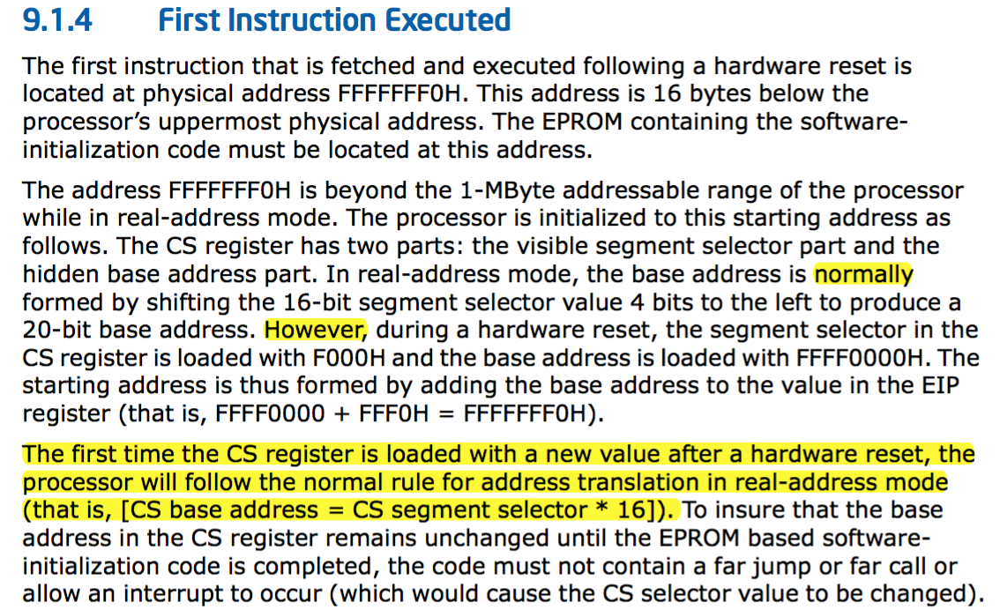
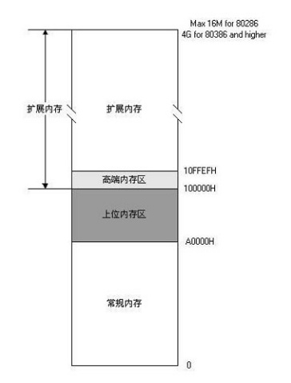

# lab1
## 实验目的
1. 计算机原理
    - CPU的编址与寻址: 基于分段机制的内存管理
    - CPU的中断机制
    - 外设：串口/并口/CGA，时钟，硬盘
2. Bootloader软件
    - 编译运行bootloader的过程
    - 调试bootloader的方法
    - PC启动bootloader的过程
    - ELF执行文件的格式和加载
    - 外设访问：读硬盘，在CGA上显示字符串
3. ucore OS软件
    - 编译运行ucore OS的过程
    - ucore OS的启动过程
    - 调试ucore OS的方法
    - 函数调用关系：在汇编级了解函数调用栈的结构和处理过程
    - 中断管理：与软件相关的中断处理
    - 外设管理：时钟
### x86上电后第一条指令


## 实验内容
### 练习1 
1. make V=:可以看到make的详细执行步骤
```
# 这里用dd命令生成包含10000个扇区(每个扇区512bytes)d的ucore.img文件
dd if=/dev/zero of=bin/ucore.img count=10000
10000+0 records in
10000+0 records out
5120000 bytes (5.1 MB) copied, 0.00896992 s, 571 MB/s
# 用dd命令将bootblock程序(即我们的bootloader)放在ucore.img的第一个扇区
dd if=bin/bootblock of=bin/ucore.img conv=notrunc
1+0 records in
1+0 records out
512 bytes (512 B) copied, 0.000172564 s, 3.0 MB/s
# 用dd命令将我们的kernel程序放在1一个扇区后的位置(即bootblock之后)
dd if=bin/kernel of=bin/ucore.img seek=1 conv=notrunc
138+1 records in
138+1 records out
70724 bytes (71 kB) copied, 0.000287529 s, 246 MB/s
```
2. makefile里通过sign(生成主引导扇区的程序)将bootblock.out生成为标准的主引导扇区，也正因为修改了所以gdb无法读取符号信息。
```
$(bootblock): $(call toobj,$(bootfiles)) | $(call totarget,sign)
	@echo + ld $@
	$(V)$(LD) $(LDFLAGS) -N -e start -Ttext 0x7C00 $^ -o $(call toobj,bootblock)
	@$(OBJDUMP) -S $(call objfile,bootblock) > $(call asmfile,bootblock)
	@$(OBJCOPY) -S -O binary $(call objfile,bootblock) $(call outfile,bootblock)
    # 这里是用sign生成标准主引导扇区
	@$(call totarget,sign) $(call outfile,bootblock) $(bootblock)
```
### 练习2
1. 查看CPU加电后的第一条指令

通过在qemu和gdb remote debug调试，在qemu启动后gdb中输入`info reg`，可以看到eip寄存器值为0xfff0，cs寄存器的值为0xf000。
通过调试可以看到cpu加点后的第一条指令时各个寄存器值如下:
   - cs(the visible segment part)    : 0xf000
   - eip                             : 0xfff0

系统的第一条指令实际上是在内存0xfffffff0位置，但上电后cpu处于实模式，而实模式的寻址空间只有1M，那是怎么到这个远超1M的内存位置的呢？首先CS寄存器是由两部分组成
   1. 可见的段选择子
   2. 不可见的基地址
      - 在实模式下，基地址通常等于(段选择子<<4)的20位地址
      - 然而在上电时，基地址被特殊的设置为了0xffff0000，在重新给CS寄存器赋值后，其基址恢复正常的实模式基址方式(即段选择子<<4)，所以为了确保在EPROM上的指令执行完成前基址0xffff0000不发生变化，EPROM代码中不能允许有中断和far jump和far call指令存在

所以，在cpu上电这一特殊时刻的指令为(cs段基地址+eip = 0xffff0000 + 0xfff0 = 0xfffffff0)
2. BIOS执行完成后，会选择一个启动设备（例如软盘、硬盘、光盘等），并且读取该设备的第一扇区(即主引导扇区或启动扇区)到内存一个特定的地址0x7c00处，然后CPU控制权会转移到那个地址继续执行。此时进入bootloader
### 练习3
1. A20 gate

最开始的8088/8086只有20位地址线，但当时的PC机寻址方式为segment:offset(16位寄存器)，换算方式是`segment << 4 + offset`可得最大值为`0xffff0 + 0xffff = 0x10ffef > 0xfffff `，而多出的部分则会回滚至`0x00000 ~ 0xfffff`(即常规内存和上位内存区)的区域。  
为了兼容上述回滚机制，后续地址线位数更长的CPU采用了A20 gate机制。A20机制的实现是在第21条地址线上做了一个开关，开关开启时第21条地址线可正常使用，开关关闭时此地址线恒为0。这样就可以实现回滚机制。
另外可以简单的把A20gate作为实模式和保护模式的开关，当A20gate没有开启时cpu处于实模式采用1M的寻址空间，而A20gate使能后则可以使用更大的地址空间