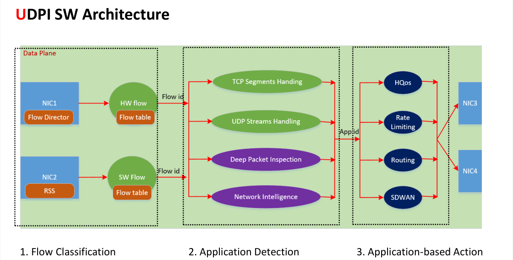

# UDPI(Universal Deep Packet Inspection)通用深度包检测
## 功能
1. Flow Classification 识别流
    - HW flow offloading leveraging rte_flow on DPDK
    - SW flow classification
    - Supports both IPv4 and IPv6 flows
    - Supports Tunnel Traffic Classification
    - BD-aware and VRF(Virtual Route Forwarding)-aware
    - Bi-directional traffic maps to one flow. 双向流量映射到同一个流
2.  Flow Expiration 终止流
    - Timer-based expiration mechanism 超时机制
    - TCP session aware expiration mechanism TCP会话终止机制
3. TCP Segment Reassembly TCP段重组
    - TCP connection tracking 
    - TCP segment re-ordering
    - TCP segment overlap handling
4. Application Database 应用数据库
    - Default static Application Database
    - Add new Application rules dynamically 动态添加应用规则
5. Application Detection 应用检测
    - Leverage Hyperscan Stream Mode 利用Hyperscan流模式
    - Reassembly of TCP segments on the fly 运行时重组TCP段
6. Application-based Actions 基于应用的响应行为
    - QoS
    - Rate Limiting
    - Policy Routing
    - SD-WAN
7. Supported Protocols 支持的协议
    - TLS/HTTPS
    - HTTP
    - DNS
    - QUIC
    - etc
## 设计原理
  
### 流程
part1 流分类和老化机制：
     创建一个软件流表（如果硬件支持这个软件流表则导入到硬件的Flow Director或其他的offload中去，不过流数量超过硬件能力的话还是会用软件流表），与流表匹配后会给包带上流id
part2 应用程序检测：
    预处理：对TCP分段进行重拍和去重。对UDP排序
    核心：用Hyperscan对明文进行快速扫描匹配应用id，再用AI识别。

part3 基于检测的行为
### 特性
1. 提供了一个默认的检测识别用的APPID数据库
2. 支持TCP连接状态跟踪
3. 支持运行时TCP段重组（包括乱序TCP段和重复段）
4. 支持Hyperscan流模式（匹配可以不在同一个包内）
5. 使用5元组和VRF-aware配置静态深度检测流，可以同时支持ipv4和ipv6流。这些流首先会流经基于DPDK的rte_flow机制的硬件卸载方式和vpp/vnet/flow基础设施。如果失败则会创建SW流映射。每一条流配置会创建两条HW或者SW流映射（比如转发和反向流量）同事两条流映射会映射到一条DPI流上。
6. 当HW流卸载匹配后，数据包会被在包描述符上打上dpi流的id标签重定向到DPI插件中。如果没匹配则会被bypass，然后再去检索SW流映射表。
7. 然后会识别7层的应用。
## 主要对象
