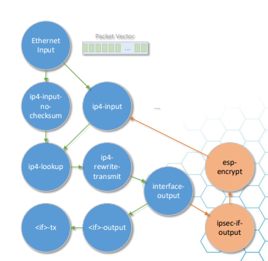

# crypto
## 介绍
  以ipsec为例
  
  这个节点图貌似比较老旧了，但原理相近
## 基础函数和数据结构
  
```C
/* 
  vm: vlib_main_t vlib主数据结构
  name: 引擎名称
  prio: 引擎优先级
  desc: 引擎详细描述 
  注册引擎，将engine加入到crypto_main->engines中，并返回engine在其中的index
*/
u32
vnet_crypto_register_engine (vlib_main_t * vm, char *name, int prio,
			     char *desc)
{
  vnet_crypto_main_t *cm = &crypto_main;
  vnet_crypto_engine_t *p;

  vec_add2 (cm->engines, p, 1);
  p->name = name;
  p->desc = desc;
  p->priority = prio;

  hash_set_mem (cm->engine_index_by_name, p->name, p - cm->engines);

  return p - cm->engines;
}
```

```C
/* 
  vm: vlib_main_t vlib主数据结构
  engine_index: 引擎index 
  opt: 使用的算法（预定义的，包括加解密、哈希），opt是全局预定义的（就那么几个算法）
  fn: handler函数指针
  cfn: handler函数指针
  注册引擎后，引擎注册handler
*/
void
vnet_crypto_register_ops_handler_inline (vlib_main_t * vm, u32 engine_index,
					 vnet_crypto_op_id_t opt,
					 vnet_crypto_ops_handler_t * fn,
					 vnet_crypto_chained_ops_handler_t *
					 cfn)
{
  vnet_crypto_main_t *cm = &crypto_main;
  vnet_crypto_engine_t *ae, *e = vec_elt_at_index (cm->engines, engine_index);
  // 获取op_data，全局cm管理的，一个算法对应一个
  vnet_crypto_op_data_t *otd = cm->opt_data + opt;
  vec_validate_aligned (cm->ops_handlers, VNET_CRYPTO_N_OP_IDS - 1,
			CLIB_CACHE_LINE_BYTES);
  vec_validate_aligned (cm->chained_ops_handlers, VNET_CRYPTO_N_OP_IDS - 1,
			CLIB_CACHE_LINE_BYTES);

  if (fn)
    {
      // 先在e下管理注册的handler
      e->ops_handlers[opt] = fn;
      // 如果全局中当前的这种opt算法没有指定引擎
      if (otd->active_engine_index_simple == ~0)
	{
      // 则这种opt算法的计算默认用这个引擎
	  otd->active_engine_index_simple = engine_index;
	  cm->ops_handlers[opt] = fn;
	}
      // 取出这种opt算法当前的默认引擎
      ae = vec_elt_at_index (cm->engines, otd->active_engine_index_simple);
      // 对比引擎优先级，采用优先级高的引擎作为这种opt算法的计算引擎（修改otd里的active_engine_index）
      if (ae->priority < e->priority)
	crypto_set_active_engine (otd, opt, engine_index, CRYPTO_OP_SIMPLE);
    }
  // 针对一些chained需要计算的数据的handler注册
  if (cfn)
    {
      e->chained_ops_handlers[opt] = cfn;
      if (otd->active_engine_index_chained == ~0)
	{
	  otd->active_engine_index_chained = engine_index;
	  cm->chained_ops_handlers[opt] = cfn;
	}

      ae = vec_elt_at_index (cm->engines, otd->active_engine_index_chained);
      if (ae->priority < e->priority)
	crypto_set_active_engine (otd, opt, engine_index, CRYPTO_OP_CHAINED);
    }

  return;
}
```

```C
/*
  vm: vlib_main_t vlib主数据结构
  engine_index: 引擎index
  opt: 使用的算法（预定义的，包括加解密、哈希）
  enqueue_hdl: 入队（生产者）handler
  dequeue_hdl: 出队（消费者）handler
  注册引擎后，引擎注册异步handler
  */
void
vnet_crypto_register_async_handler (vlib_main_t * vm, u32 engine_index,
				    vnet_crypto_async_op_id_t opt,
				    vnet_crypto_frame_enqueue_t * enqueue_hdl,
				    vnet_crypto_frame_dequeue_t * dequeue_hdl)
```

## 解密引擎分析
  vpp代码目前实现了4个加解密引擎插件
  1. src/plugins/crypto_ipsecmb
  2. src/plugins/crypto_native
  3. src/plugins/crypto_openssl
  4. src/plugins/crypto_sw_scheduler
  前三个都为同步加解密引擎，第四个为异步加解密引擎
### 同步引擎初始化
  以`crypto_openssl`的代码为例看看
```C
clib_error_t *
crypto_openssl_init (vlib_main_t * vm)
{
  vlib_thread_main_t *tm = vlib_get_thread_main ();
  openssl_per_thread_data_t *ptd;
  u8 *seed_data = 0;
  time_t t;
  pid_t pid;
  // 首先注册 crypto_openssl引擎
  u32 eidx = vnet_crypto_register_engine (vm, "openssl", 50, "OpenSSL");
  // 在引擎下依次注册 各种算法的handler
#define _(m, a, b, iv)                                                        \
  vnet_crypto_register_ops_handlers (vm, eidx, VNET_CRYPTO_OP_##a##_ENC,      \
				     openssl_ops_enc_##a,                     \
				     openssl_ops_enc_chained_##a);            \
  vnet_crypto_register_ops_handlers (vm, eidx, VNET_CRYPTO_OP_##a##_DEC,      \
				     openssl_ops_dec_##a,                     \
				     openssl_ops_dec_chained_##a);

  foreach_openssl_evp_op;
#undef _

#define _(a, b) \
  vnet_crypto_register_ops_handlers (vm, eidx, VNET_CRYPTO_OP_##a##_HMAC, \
				    openssl_ops_hmac_##a, \
                                    openssl_ops_hmac_chained_##a); \

  foreach_openssl_hmac_op;
#undef _

#define _(a, b)                                                               \
  vnet_crypto_register_ops_handlers (vm, eidx, VNET_CRYPTO_OP_##a##_HASH,     \
				     openssl_ops_hash_##a,                    \
				     openssl_ops_hash_chained_##a);

  foreach_openssl_hash_op;
#undef _
  // openssl的一些初始化
···
}
```
#### 同步引擎handler
  handler实现基本类似，就是对已经打包的ops进行计算，并返回计算结果
```C
/*
  对已打包的ops进行计算
  */
static_always_inline u32
openssl_ops_enc_cbc (vlib_main_t *vm, vnet_crypto_op_t *ops[],
		     vnet_crypto_op_chunk_t *chunks, u32 n_ops,
		     const EVP_CIPHER *cipher, const int iv_len)
```
### 异步引擎
#### 异步引擎初始化
```C
crypto_sw_scheduler_main_t crypto_sw_scheduler_main;
clib_error_t *
crypto_sw_scheduler_init (vlib_main_t * vm)
{
  ···
  // 注册引擎（在这里是否是异步没什么关系）
  cm->crypto_engine_index =
    vnet_crypto_register_engine (vm, "sw_scheduler", 100,
				 "SW Scheduler Async Engine");

  vnet_crypto_register_key_handler (vm, cm->crypto_engine_index,
				    crypto_sw_scheduler_key_handler);

  crypto_sw_scheduler_api_init (vm);
  // 引擎下注册handler
  /* *INDENT-OFF* */
#define _(n, s, k, t, a)                                                      \
  vnet_crypto_register_async_handler (                                        \
      vm, cm->crypto_engine_index,                                            \
      VNET_CRYPTO_OP_##n##_TAG##t##_AAD##a##_ENC,                             \
      crypto_sw_scheduler_frame_enqueue,                                      \
      crypto_sw_scheduler_frame_dequeue_##n##_TAG_##t##_AAD_##a##_enc);       \
  vnet_crypto_register_async_handler (                                        \
      vm, cm->crypto_engine_index,                                            \
      VNET_CRYPTO_OP_##n##_TAG##t##_AAD##a##_DEC,                             \
      crypto_sw_scheduler_frame_enqueue,                                      \
      crypto_sw_scheduler_frame_dequeue_##n##_TAG_##t##_AAD_##a##_dec);
  foreach_crypto_aead_async_alg
#undef _

#define _(c, h, s, k, d)                                                      \
  vnet_crypto_register_async_handler (                                        \
      vm, cm->crypto_engine_index, VNET_CRYPTO_OP_##c##_##h##_TAG##d##_ENC,   \
      crypto_sw_scheduler_frame_enqueue,                                      \
      crypto_sw_scheduler_frame_dequeue_##c##_##h##_TAG##d##_enc);            \
  vnet_crypto_register_async_handler (                                        \
      vm, cm->crypto_engine_index, VNET_CRYPTO_OP_##c##_##h##_TAG##d##_DEC,   \
      crypto_sw_scheduler_frame_enqueue,                                      \
      crypto_sw_scheduler_frame_dequeue_##c##_##h##_TAG##d##_dec);
      foreach_crypto_link_async_alg
#undef _
      /* *INDENT-ON* */

  if (error)
    vec_free (cm->per_thread_data);

  return error;
}
```
#### 异步队列操作函数
##### 入队（生产者）函数
```C
/*
  将打包好的frame插入到当前线程ptd的对应queue中
  */
static int
crypto_sw_scheduler_frame_enqueue (vlib_main_t * vm,
				   vnet_crypto_async_frame_t * frame)
{
  crypto_sw_scheduler_main_t *cm = &crypto_sw_scheduler_main;
  crypto_sw_scheduler_per_thread_data_t *ptd
    = vec_elt_at_index (cm->per_thread_data, vm->thread_index);
  // q为当前线程ptd上frame->op指定算法对应的队列
  crypto_sw_scheduler_queue_t *q = ptd->queues[frame->op];
  u64 head = q->head;
  
  // 判断队列头是否正常
  if (q->jobs[head & CRYPTO_SW_SCHEDULER_QUEUE_MASK])
    {
      u32 n_elts = frame->n_elts, i;
      for (i = 0; i < n_elts; i++)
	frame->elts[i].status = VNET_CRYPTO_OP_STATUS_FAIL_ENGINE_ERR;
      return -1;
    }
  // 将frame入队
  q->jobs[head & CRYPTO_SW_SCHEDULER_QUEUE_MASK] = frame;
  head += 1;
  CLIB_MEMORY_STORE_BARRIER ();
  q->head = head;
  return 0;
}
```
##### 出队（消费者）函数
```C
/*
  消费所有worker线程ptd上队列中的frame
  */
static_always_inline vnet_crypto_async_frame_t *
crypto_sw_scheduler_dequeue_aead (vlib_main_t * vm,
				  vnet_crypto_async_op_id_t async_op_id,
				  vnet_crypto_op_id_t sync_op_id, u8 tag_len,
				  u8 aad_len, u32 * nb_elts_processed,
				  u32 * enqueue_thread_idx)
{
  crypto_sw_scheduler_main_t *cm = &crypto_sw_scheduler_main;
  crypto_sw_scheduler_per_thread_data_t *ptd = 0;
  crypto_sw_scheduler_queue_t *q = 0;
  vnet_crypto_async_frame_t *f = 0;
  vnet_crypto_async_frame_elt_t *fe;
  u32 *bi;
  u32 n_elts;
  int i = 0;
  u8 state = VNET_CRYPTO_FRAME_STATE_SUCCESS;

  if (cm->per_thread_data[vm->thread_index].self_crypto_enabled)
    {
      /* *INDENT-OFF* */
      // 遍历所有的worker线程，将所有线程ptd上async_op_id对应的队列上的frame取出
      vec_foreach_index (i, cm->per_thread_data)
      {
        ptd = cm->per_thread_data + i;
        q = ptd->queues[async_op_id];
        f = crypto_sw_scheduler_get_pending_frame (q);
        if (f)
          break;
      }
      /* *INDENT-ON* */
    }

  ptd = cm->per_thread_data + vm->thread_index;

  if (f)
    {
      *nb_elts_processed = n_elts = f->n_elts;
      fe = f->elts;
      bi = f->buffer_indices;

      vec_reset_length (ptd->crypto_ops);
      vec_reset_length (ptd->chained_crypto_ops);
      vec_reset_length (ptd->chunks);

      while (n_elts--)
	{
	  if (n_elts > 1)
	    CLIB_PREFETCH (fe + 1, CLIB_CACHE_LINE_BYTES, LOAD);
      
      // 将frame转换为ops数据结构
	  crypto_sw_scheduler_convert_aead (vm, ptd, fe, fe - f->elts, bi[0],
					    sync_op_id, aad_len, tag_len);
	  bi++;
	  fe++;
	}
      // 处理计算转换后的ops
      process_ops (vm, f, ptd->crypto_ops, &state);
      process_chained_ops (vm, f, ptd->chained_crypto_ops, ptd->chunks,
			   &state);
      f->state = state;
      *enqueue_thread_idx = f->enqueue_thread_index;
    }

  return crypto_sw_scheduler_get_completed_frame (ptd->queues[async_op_id]);
}
```

### 数据流向分析
  数据进入ipsec4-output-node节点 -> esp-encrypt节点

```cmd
DBGvpp# show node ipsec4-output-node  
show node: unknown node name: 'ipsec4-output-node'
DBGvpp# show node ipsec4-output-feature
node ipsec4-output-feature, type internal, state active, index 192
  node function variants:
    Name             Priority  Active  Description
    icl                    -1          Intel Ice Lake
    skx                   100    yes   Intel Skylake (server) / Cascade Lake
    hsw                    50          Intel Haswell
    default                 0          default

  next nodes:
    next-index  node-index               Node               Vectors
         0          387               error-drop               0   
         1          194               ah4-encrypt              0   
         2          216              esp4-encrypt              0   

  known previous nodes:
    none
```

  esp-encrypt节点对于数据进行解密

#### 调用
```C
always_inline uword
esp_encrypt_inline (vlib_main_t *vm, vlib_node_runtime_t *node,
		    vlib_frame_t *frame, vnet_link_t lt, int is_tun,
		    u16 async_next_node)
{
    ···
    // 如果是异步的准备好frame，如果是同步的准备好ops
    if (is_async)
	esp_prepare_async_frame (vm, ptd, async_frames[async_op], sa0, b[0],
				 esp, payload, payload_len, iv_sz, icv_sz,
				 from[b - bufs], sync_next[0], hdr_len,
				 async_next_node, lb);
      else
	esp_prepare_sync_op (vm, ptd, crypto_ops, integ_ops, sa0, payload,
			     payload_len, iv_sz, icv_sz, n_sync, b, lb,
			     hdr_len, esp);
    ···
    if (n_sync)
    {
      // 直接同步调用
      esp_process_ops (vm, node, ptd->crypto_ops, sync_bufs, sync_nexts,
		       drop_next);
      esp_process_chained_ops (vm, node, ptd->chained_crypto_ops, sync_bufs,
			       sync_nexts, ptd->chunks, drop_next);

      esp_process_ops (vm, node, ptd->integ_ops, sync_bufs, sync_nexts,
		       drop_next);
      esp_process_chained_ops (vm, node, ptd->chained_integ_ops, sync_bufs,
			       sync_nexts, ptd->chunks, drop_next);

      vlib_buffer_enqueue_to_next (vm, node, sync_bi, sync_nexts, n_sync);
    }
  if (n_async)
    {
      /* submit all of the open frames */
      vnet_crypto_async_frame_t **async_frame;

      vec_foreach (async_frame, ptd->async_frames)
	{
      // 将frame入队
	  if (vnet_crypto_async_submit_open_frame (vm, *async_frame) < 0)
	    {
	      n_noop += esp_async_recycle_failed_submit (
		vm, *async_frame, node, ESP_ENCRYPT_ERROR_CRYPTO_ENGINE_ERROR,
		n_sync, noop_bi, noop_nexts, drop_next);
	      vnet_crypto_async_reset_frame (*async_frame);
	      vnet_crypto_async_free_frame (vm, *async_frame);
	    }
	}
    }
    ···
}

static_always_inline int
vnet_crypto_async_submit_open_frame (vlib_main_t * vm,
				     vnet_crypto_async_frame_t * frame)
{
  vnet_crypto_main_t *cm = &crypto_main;
  vlib_thread_main_t *tm = vlib_get_thread_main ();
  vnet_crypto_async_op_id_t opt = frame->op;
  u32 i = vlib_num_workers () > 0;

  frame->state = VNET_CRYPTO_FRAME_STATE_PENDING;
  frame->enqueue_thread_index = vm->thread_index;
  
  // 调用已经注册的入队hanler，将frame添加到本线程ptd上的队列上
  int ret = (cm->enqueue_handlers[frame->op]) (vm, frame);

  // 将cm->async_active_ids中opt对应的bit设置为1，就是告诉crypto-dispatch节点这个算法对应的队列里有frame需要dequeue
  clib_bitmap_set_no_check (cm->async_active_ids, opt, 1);
  if (PREDICT_TRUE (ret == 0))
    {
      if (cm->dispatch_mode == VNET_CRYPTO_ASYNC_DISPATCH_INTERRUPT)
	{
	  for (; i < tm->n_vlib_mains; i++)
	    vlib_node_set_interrupt_pending (vlib_get_main_by_index (i),
					     cm->crypto_node_index);
	}
    }
  else
    {
      frame->state = VNET_CRYPTO_FRAME_STATE_ELT_ERROR;
    }

  return ret;
}
```

#### 异步引擎驱动
```C
/* 
  从主循环中进入crypto_dispatch_node
  */
VLIB_NODE_FN (crypto_dispatch_node) (vlib_main_t * vm,
				     vlib_node_runtime_t * node,
				     vlib_frame_t * frame)
{
  vnet_crypto_main_t *cm = &crypto_main;
  vnet_crypto_thread_t *ct = cm->threads + vm->thread_index;
  u32 n_dispatched = 0, n_cache = 0;
  u32 index;

  /* *INDENT-OFF* */
  // 先由别的节点调用vnet_crypto_async_submit_open_frame函数，将frame中的数据包中需要解密的数据包添加到别的节点的线程ptd的各个算法对应的队列上，同时设置好cm->async_active_ids
  // 再遍历cm->async_active_ids，调用crypto_dequeue_frame函数
  clib_bitmap_foreach (index, cm->async_active_ids)  {
    // 其中cm->dequeue_handlers 是由上面的引擎注册异步handler注册完成的
    n_cache = crypto_dequeue_frame (vm, node, ct, cm->dequeue_handlers[index],
				    n_cache, &n_dispatched);
  }
  /* *INDENT-ON* */
  if (n_cache)
    vlib_buffer_enqueue_to_next_vec (vm, node, &ct->buffer_indices, &ct->nexts,
				     n_cache);

  return n_dispatched;
}

typedef vnet_crypto_async_frame_t *
  (vnet_crypto_frame_dequeue_t) (vlib_main_t * vm, u32 * nb_elts_processed,
				 u32 * enqueue_thread_idx);

/* 
  vm: vlib_main总数据结构
  node: 节点runtime数据结构
  ct: crypto节点线程数据结构
  hdl: 入队函数
  n_cache:
  n_total:
  */
static_always_inline u32
crypto_dequeue_frame (vlib_main_t * vm, vlib_node_runtime_t * node,
		      vnet_crypto_thread_t * ct,
		      vnet_crypto_frame_dequeue_t * hdl, u32 n_cache,
		      u32 * n_total)
{
  vnet_crypto_main_t *cm = &crypto_main;
  u32 n_elts = 0;
  u32 enqueue_thread_idx = ~0;
  // 调用入队函数hdl返回vnet_crypto_async_frame_t *cf
  vnet_crypto_async_frame_t *cf = (hdl) (vm, &n_elts, &enqueue_thread_idx);
  *n_total += n_elts;

  while (cf || n_elts)
    {
      if (cf)
	{
	  vec_validate (ct->buffer_indices, n_cache + cf->n_elts);
	  vec_validate (ct->nexts, n_cache + cf->n_elts);
	  clib_memcpy_fast (ct->buffer_indices + n_cache, cf->buffer_indices,
			    sizeof (u32) * cf->n_elts);
	  if (cf->state == VNET_CRYPTO_FRAME_STATE_SUCCESS)
	    {
	      clib_memcpy_fast (ct->nexts + n_cache, cf->next_node_index,
				sizeof (u16) * cf->n_elts);
	    }
	  else
	    {
	      u32 i;
	      for (i = 0; i < cf->n_elts; i++)
		{
		  if (cf->elts[i].status != VNET_CRYPTO_OP_STATUS_COMPLETED)
		    {
		      ct->nexts[i + n_cache] = CRYPTO_DISPATCH_NEXT_ERR_DROP;
		      vlib_node_increment_counter (vm, node->node_index,
						   cf->elts[i].status, 1);
		    }
		  else
		    ct->nexts[i + n_cache] = cf->next_node_index[i];
		}
	    }
	  n_cache += cf->n_elts;
	  if (n_cache >= VLIB_FRAME_SIZE)
	    {
	      vlib_buffer_enqueue_to_next_vec (vm, node, &ct->buffer_indices,
					       &ct->nexts, n_cache);
	      n_cache = 0;
	    }

	  if (PREDICT_FALSE (node->flags & VLIB_NODE_FLAG_TRACE))
	    {
	      u32 i;

	      for (i = 0; i < cf->n_elts; i++)
		{
		  vlib_buffer_t *b = vlib_get_buffer (vm,
						      cf->buffer_indices[i]);
		  if (b->flags & VLIB_BUFFER_IS_TRACED)
		    vnet_crypto_async_add_trace (vm, node, b, cf->op,
						 cf->elts[i].status);
		}
	    }
	  vnet_crypto_async_free_frame (vm, cf);
	}
      /* signal enqueue-thread to dequeue the processed frame (n_elts>0) */
      if (cm->dispatch_mode == VNET_CRYPTO_ASYNC_DISPATCH_INTERRUPT
	  && n_elts > 0)
	{
	  vlib_node_set_interrupt_pending (
	    vlib_get_main_by_index (enqueue_thread_idx),
	    cm->crypto_node_index);
	}

      n_elts = 0;
      enqueue_thread_idx = 0;
      cf = (hdl) (vm, &n_elts, &enqueue_thread_idx);
      *n_total += n_elts;
    }

  return n_cache;
}

```

## 参考
https://www.sdnlab.com/community/article/dpdk/899
https://wiki.fd.io/view/VPP/IPSec_and_IKEv2