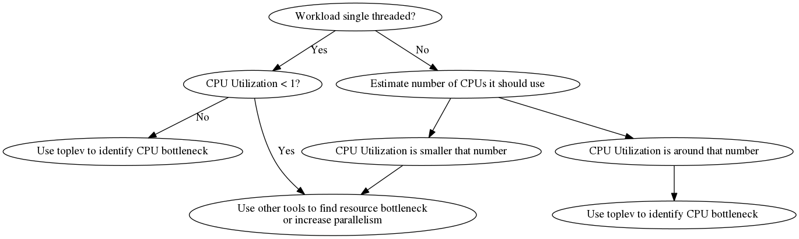

# 00.Intro
TMAM 自顶向下的CPU架构性能分析方法  
TMAM: Top-down Microarchitecture Analysis (TMA) Method  
- 目标: 通过分析检测出瓶颈(进一步定位出问题)&预估其消耗
- 方法: 通过统计PMU采集的Performance Counter值进行计算统计。
## 性能分析

性能分析一般分为3个层级
1. System (Disk, Network, Graphics, ...)
2. Application + Runtime (Algorithm complexity, Parallelization/Multithreading, ...)
3. Architectural + μArch (vectorize key loops, reduce cache misses, ...) (这也是TMA主要针对的)
## 与传统分析方法的区别
### Traditional Methods
传统分析方法采用了`stall_cycles = sum(Penalty[i] * MissEvent[i]) `的计算方法。这样的计算方法存在以下问题
1. Stalls Overlap: 流水线前面μop的卡顿可能会影响后面的μop也卡顿
2. Speculative Execution: 存在分支预测的干扰
3. Workload-dependent penalties: 不同原因造成的时间惩罚不同，难以计算
4. Predefined set of miss-events: 预先定义的missEvent并不完善
5. Superscalar inaccuracy: 超标量(一个cpu周期多个指令)带来的不准确性
### TMAM
争对传统分析方法，TMAM采用了如下措施避免对应问题
1. 将事件细化到cpu流水线的最小单元μOps，统计计算μOps的事件，以便计算penalty(针对传统方法问题1、3)
2. 将分支预测错误放在分析层级的最顶层(针对传统方法问题2)
3. 对最小单元μOp的事件更为通用，不再是争对特定miss-event(针对传统方法问题4)
4. 这其中的event包括occupancy event，occupancy event是可以在一个cpu周期里被pmu计数多次计数的事件(针对传统方法问题5)
## TMAM
## TMAM层级
### 第一层
1. Retiring : 理想状况的流水线执行完成([参考](https://stackoverflow.com/questions/22368835/what-does-intel-mean-by-retired):一定程度上可以理解为正常回写)
2. Bad Speculation : 分支预测出错
3. Frontend Bound : 取指、译码
4. Backend Bound : 执行、访存

## 参考资料
1. [Intel对TMAM的介绍](https://software.intel.com/content/www/us/en/develop/documentation/vtune-cookbook/top/methodologies/top-down-microarchitecture-analysis-method.html)
2. [Intel的TMAM 分析工具 VTune Profiler(不开源)](https://software.intel.com/content/www/us/en/develop/documentation/get-started-with-vtune/top.html)
3. [开源TMAM分析工具 pmu-tools](https://github.com/andikleen/pmu-tools/wiki/toplev-manual)
4. [pmu-tools作者对pmu-tools的介绍(还是直接看github上写得好)](http://halobates.de/blog/p/245)
5. [阿里团队对TMAM的介绍(较为详细)](https://kernel.taobao.org/2019/03/Top-down-Microarchitecture-Analysis-Method/)

