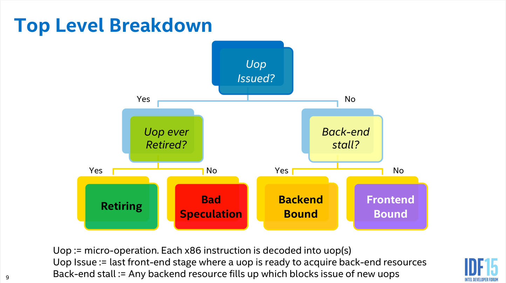

# TMAM 层级结构分析

## TMAM 层级

### 如何分类
  
- Uop Issued? Uop正常在流水线上流通么？
  - 正常->Uop正常完成执行去下一个流水线步骤了么？
    -  正常->Retiring
    -  中途退出了->预测出错
  - 不正常(卡住了)->是Back-end卡住了么？
    - 是->backend限制
    - 否->frontend限制
### 1. Retiring : 理想状况的流水线执行比重(一定程度上可以理解为回写）)
#### 1.1. BASE
##### 1.1.1. FP-arithmetic : 浮点数计算
###### 1.1.1.1. Scalar : 标量的
###### 1.1.1.2. Vector : 矢量的
#### 1.2. Micro Sequencer : 像浮点数计算支持等微指令也会影响性能，被计数在这个部分
### 2. Bad Speculation : 分支预测出错
#### 2.1. Branch Misspredict
#### 2.2. Machine Clears: 数据预取错误，MOB(memory ordering buffer)刷新带来的问题
### 3. Frontend Bound : 取指、译码
#### 3.1. Fetch Latency : 主要指取指的延迟，造成的原因如下
##### 3.1.1. i-cache miss
##### 3.1.2. i-TLB miss
##### 3.1.3. Branch Resteers: 由于流水线刷新造成的，这一项于分支预测错误有很大关系
#### 3.2. Fetch Bandwidth : 主要指译码的低效，通常与特定cpu型号下特定的指令有关
### 4. Backend Bound : 执行、访存
#### 4.1. Memory Bound : 因加载内存而损失的性能
##### 4.1.1. L1 Cache Bound
##### 4.1.2. L2 Cache Bound
##### 4.1.3. L3 Cache Bound
##### 4.1.4. Stores Bound : 写内存而损失的性能
##### 4.1.5. Ext.Memory Bound : 上面都是cache层面的性能损失，这里是cache都miss的内存读取的性能损失
###### 4.1.5.1 Mem Bandwidth : 大多数内存读取时可以同步进行的，其余的会归为此类
###### 4.1.5.1 Mem Latency : 剩下的就是这个了
#### 4.2. Core Bound : 计算核心的性能限制(好比说除法会有更低的计算性能)，得靠编译器优化
## CPU PMU事件分析
