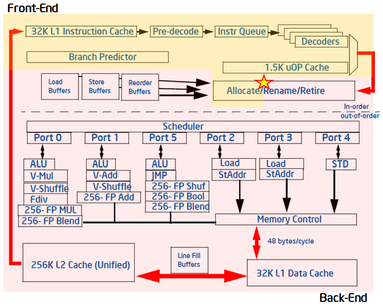
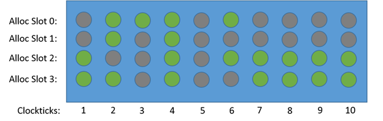

# TMAM 层级结构分析
## 背景知识
### 现代乱序执行CPU

现代CPU通常采用流水线乱序执行的方式ILP(Instruction-level parallelism)加速。  
如上图所示，可以将乱序执行流水线分为两个部分，Frontend 和 Backend。  
- Frontend主要负责取指、译码
- Backend主要负责获取指令执行需要的数据、计算、访存、写回等剩余工作  

目前市面上的intel cpu在单个物理核一个时钟周期可以在Frontend同时取4条指令(可以视为一个物理核有4条pipeline)(不知道这是不是也是有4个PMC的原因)。  

而PMC通过监控途中打星的Allocate的位置pipeline slot的指令是否为空来判断指令执行情况。
## CPU PMU
PMU中主要由PMC(performance monitor counter)组成，cpu中有若干PMC(可以通过cpuid命令查看)(在intel硬件层面称为(MSR: Model Specific Register))可被用户(通过注册，注意有些MSR被注册后没被释放会造成冲突问题)指定监控指定event。PMC通过分时复用来采集大于其数量的event。通过对不同event数据采集统计分析可以得到更为直观的性能评价(metric)。可通过直接读取0x38F这个MSR来查看event counter是否被占用，只有当返回值不为0的时候才意味着没有其他的进程占用了event counter。    
根据event的不同PMC可分为
- core event : 直接工作在CPU物理核心上的计数器
- offcore event : 是相关HT技术导致的同一物理核心上两个不同的HT上不得不共享的一些事件的计数器
- uncore event : 在同一个CPU插槽所有core共享的计数器，使用前需要预先找到对应的虚拟pcie设备，并通过虚拟设备读取而非直接通过CPU指令读取。uncore有以下分类
  - uncore/cha， uncore/imc，uncore/cbo，etc 这类内存和三级缓存访问有关的event
  - uncore/upi UPI相关
  - uncore/iio iio和pcie相关
## TMAM 层级

### 如何分类
  
- Uop Issued? 在Allocate监控到的pipeline slot 是否为空(Uop正常地通过Allocate位置走向Scheduler了么)？
  - 非空(正常)->Uop Retires了么(正常完成执行)？
    -  正常->Retiring
    -  中途退出了->预测出错
  - 空(不正常(说明卡住了))->是Back-end卡住了么(有时候两者都卡住，尽量先解决Backend的问题)？
    - 是->backend限制
    - 否->frontend限制
### 1. Frontend Bound : 取指、译码
比较少见，通常来说像JIT的代码和解释型语言的程序运行时会遇到此类问题，要解决此类问题与程序code layout和编译技术相关。可以采用code size优化和PGO优化。
#### 1.1. Fetch Latency : 主要指取指的延迟，造成的原因如下
##### 1.1.1. i-cache miss
##### 1.1.2. i-TLB miss
##### 1.1.3. Branch Resteers: 由于流水线刷新造成的，这一项于分支预测错误有很大关系
#### 1.2. Fetch Bandwidth : 主要指译码的低效，通常与特定cpu型号下特定的指令有关

### 2. Backend Bound : 执行、访存
大多数没有调优过的程序，通常都会遇到Back-end问题，Back-end问题通常又是关于解决latency的问题。
#### 2.1. Memory Bound : 因指令执行需读写内存数据而损失的性能
##### 2.1.1. L1 Cache Bound : 除了包括L1 cache miss 还有有store uop阻塞了load uop的情况
##### 2.1.2. L2 Cache Bound
##### 2.1.3. L3 Cache Bound
##### 2.1.4. Stores Bound : store uop而损失的性能，通常为执行端口利用率（execution port utilization）较低，以及存在大量需要消耗资源用来缓冲 store 操作的周期。
##### 2.1.5. Ext.Memory Bound : 上面都是cache层面的性能损失，这里是cache都miss的内存读取的性能损失
###### 2.1.5.1 Mem Bandwidth : 大多数内存读取时可以同步进行的，其余的会归为此类。根据是当前有多少请求依赖从内存中获取的数据。每当这类请求的占用率超过一个高阈值时（例如最大请求数的70％），TMAM 将其标记为可能受内存带宽的限制(启发式算法)
###### 2.1.5.2 Mem Latency : 低于70%的就是这个
#### 2.2. Core Bound : 调度器不平衡，相同类型的指令多，导致后端为执行完成，未释放微指令调度时的port或者除法指令过多
### 3. Retiring : 理想状况的流水线执行比重
但仍然可以优化!有计算核心的性能限制(好比说除法会有更低的计算性能，缺少指令级别的并行(考虑使用SIMD))，得靠编译器参数(如DAZ或FTZ)优化。如还需优化则考虑通过增加并行化解决
#### 3.1. BASE
##### 3.1.1. FP-arithmetic : 浮点数计算
###### 3.1.1.1. Scalar : 标量的
###### 3.1.1.2. Vector : 矢量的(SIMD)
#### 3.2. Micro Sequencer : 像浮点数计算支持等微指令也会影响性能，被计数在这个部分

### 4. Bad Speculation : 分支预测出错
可以通过PGO技术优化
#### 4.1. Branch Misspredict
#### 4.2. Machine Clears: 数据预取错误，MOB(memory ordering buffer)刷新带来的问题和自修改代码(self modifying code)

