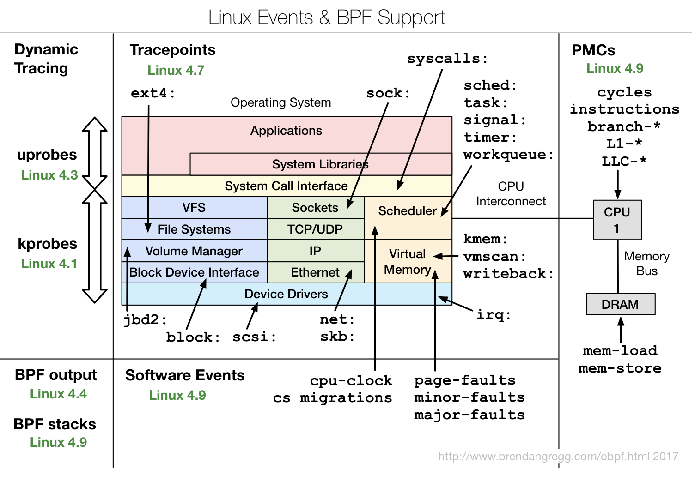

# BPF tools
eBPF 是在内核内的虚拟机(in-kernel JIT for opcodes)，可用于往内核安插探针。在user mode写好后会被编译为eBPF专用的字节码并被eBPF执行
## 限制
eBPF的执行存在一定的限制
- eBPF自身限制
  - MAX 4096 instructions
  - 512B stack
- 系统限制
  - CONFIG_BPF_SYSCALL 编译参数
  - linux版本(随着版本升级，可供插桩)
    
## 执行流程

- 用户层
  1. 用户层生成BPF bytecode
  2. 加载到内核
- 内核
  1. verifier判断是否合法
  2. 插入到指定位置挂钩
  3. 挂钩函数执行结果传递给BPF maps
- 用户层
  3. 用户层通过 perf_output到per-event detail/通过异步读取BPF maps
