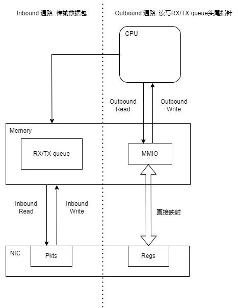

# Intel Vtune I/O
## 基本概念

以dpdk网络设备为例，I/O的性能涉及两个通路
- Inbound PCIe bandwidth :主要指的是设备向内存传输数据供CPU处理（高带宽操作（涉及DMA））
- Outbound PCIe bandwidth :主要指的是CPU通过MMIO向设备回传一些控制信息（低带宽操作）
```
CPU控制IO设备交互的方式有两种，一种是MMIO，另一种是早期的PIO。
MMIO(Memory mapping I/O):内存映射I/O，将设备内存和寄存器映射到内存空间。内存和IO设备使用相同的地址总线，设备监听这个地址总线，CPU通过mov指令读写这些特定的内存地址访问设备，这些特定地址不可给物理内存使用
PIO(Port I/O): 端口映射IO，内存和IO设备拥有各自的地址空间，设备使用一条专门的I/O总线，CPU通过in/out指令访问设备
```
## IO流程
以DPDK收包为例，
1. core在内存空间初始化Rx队列并开始轮询Rx queue tail
2. NIC读取Rx queue head的Rx描述符(Inbound Read)
3. NIC将数据包写到Rx描述符上指定的内存地址(Inbound Write(DMA))
4. NIC更新Rx描述符（占有）状态并通知core
5. core处理数据包
6. core更新Rx描述符（释放）状态并移动Rx queue tail(Outbound Write)

### dpdk在流程中的优化
- 消除Outbound reads操作: 通过NIC写回描述符通知软件queue head 的移动，而不是通过Outbound Read(MMIO Reads)
- 减少与Tx描述符相关的Inbound Write带宽: 
- 分批次的Outbound Writes

## DPDK IO API
通过特别的编译配置可以更好地检测dpdk的cpu使用率

todo: 结合DPDK代码从流程讲述整个过程