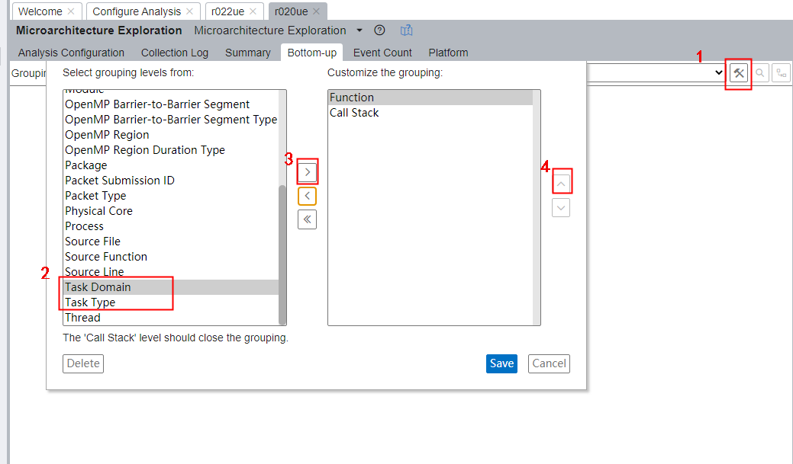

# intel vtune ITT API
## usage
### Step 1 在代码中插入ITT API
可以参考这个https://stackoverflow.com/questions/36731457/how-to-restrict-vtune-analysis-to-a-specific-function
```
<c language headers>
#include "ittnotify.h"

main() {

  __itt_domain* domain = __itt_domain_create("MyDomain");
  __itt_string_handle* task = __itt_string_handle_create("MyTask");

  some malloc() allocations and file reads into these buffers

  __itt_task_begin(domain, __itt_null, __itt_null, task);

  call to an assembly language routine that needs to be optimized to the maximum

  __itt_task_end(domain);

  write back the output of to files and do free()
  exit()
}
```
### STEP 2 添加动态库系统变量
虽然在编译中链接的是静态库，也要添加动态库的系统变量否则数据采集不到。因为
After you instrument your application by adding ITT API calls to your code and link the libittnotify.a (Linux*, Android*) or libittnotify.lib (Windows*) static library, your application will check the INTEL_LIBITTNOTIFY32 or the INTEL_LIBITTNOTIFY64 environment variable depending on your application's architecture. If that variable is set, it will load the libraries defined in the variable.
Make sure to set these environment variables for the ittnotify_collector to enable data collection:
On Windows*:
INTEL_LIBITTNOTIFY32=<install-dir>\bin32\runtime\ittnotify_collector.dll
INTEL_LIBITTNOTIFY64=<install-dir>\bin64\runtime\ittnotify_collector.dll
On Linux*:
INTEL_LIBITTNOTIFY32=<install-dir>/lib32/runtime/libittnotify_collector.so
INTEL_LIBITTNOTIFY64=<install-dir>/lib64/runtime/libittnotify_collector.so
### STEP 3 运行程序并用VTUNE监控
在Vtune Bottom-up 选项卡中的Grouping中调出Task Domain/Task Type就可以查看task区段的性能采样数据了

## 参考
https://github.com/intel/ittapi  
https://software.intel.com/content/www/us/en/develop/documentation/vtune-help/top/api-support/instrumentation-and-tracing-technology-apis.html  