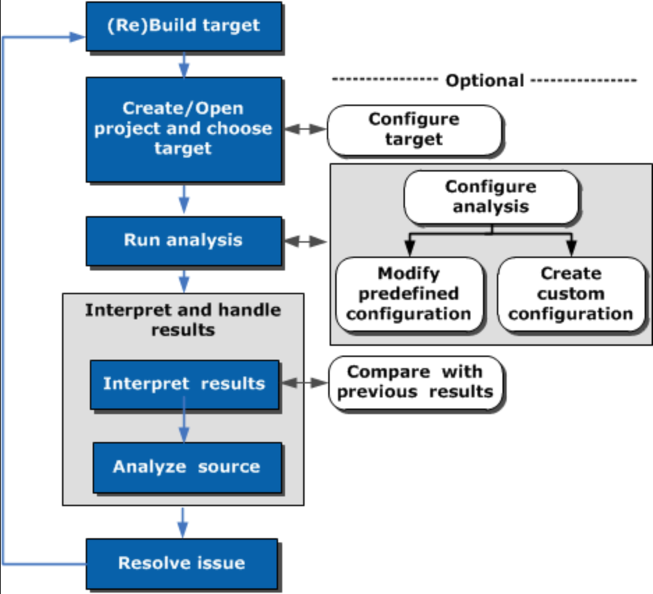

# 一个例子

## step0: Build target
编译时开启优化保留debug symbols（如果拿到手的是没有调试符号的二进制程序，则看看作者有没有提供额外的调试符号文件，涉及内核的话，可以自行下载加载内核调试符号文件），先运行一次，确定现有的性能参数指标，可以多运行几遍，确保性能参数指标具有典型性、可复现性（因为之后需要针对这个性能指标进行优化）。
```powershell
gcc gcc -g -O3 .\PasswordCracker.c
```

## 参考
https://hadibrais.wordpress.com/2017/03/15/the-art-of-profiling-using-intel-vtune-amplifier-part-1/
https://hadibrais.wordpress.com/2017/03/19/the-art-of-profiling-using-intel-vtune-amplifier-part-2/