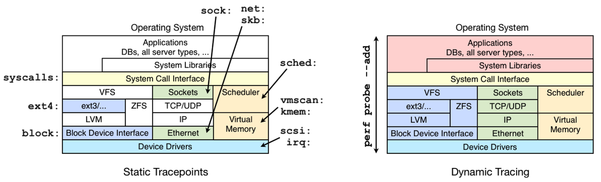

# perf
Linux内核自带的，通过CPU PMU(硬件)事件和软件事件抽样计数找到程序热点，进而找到性能瓶颈的事件驱动监测工具。
## predefined event

可以用perf list 命令查看详细事件

也可以自己添加定义事件
## usage
### perf top (系统级)
实时查看系统热点、函数热点、汇编热点
1. -p 指定进程
2. --call-graph graph 可以查看调用链
3. -s 指定字段
### perf stat (应用程序级)
`perf stat <program>`  
统计单个应用程序整个生命周期的事件
1. -e 指定需要统计的事件(包括系统定义事件及PMC定义事件)
2. -a 范围为所有cpu(即全系统级)
3. -p 指定进程
4. 与 `perf record` 类似
### perf record & perf report (函数级)
```
perf record <program>
perf report
```
统计程序内各模块、函数整个生命周期的事件。(被测程序需要带-g(且不带-fomit-frame-pointer优化)编译)。`perf record`生成的perf.data被`perf report`解析需要访问本地符号表，若需要再另一台机器上分析可以使用`perf-archive`命令打包。
1. -e 指定需要统计的事件(包括系统定义事件及PMC定义事件)
2. -a 范围为所有cpu(即全系统级，包括应用层&内核层，查看更为全面)
3. -g 启用记录调用链
4. -F 指定采样频率
5. -c 指定采样事件的间隔(多少个事件里选用1个事件)
6. -C 指定CPU
7. -G 指定cgroup
### perf script
显示perf.data的详细采样点数据(显示的每一列不固定，可以用perf script -F 来指定字段)，包含的字段有comm, tid, pid, time, cpu, event,
trace, ip, sym, dso, addr, symoff, srcline, period, iregs, uregs, brstack, brstacksym, flags, brstackinsn, brstackoff, insn, insnlen, synth, phys_addr, metric, misc.
1. -F 指定显示字段
## Basic Workflow
1. list -> find events
2. stat -> count them
3. record -> write event data to file
4. report -> browse summary
5. script -> event dump for post processing
## issues
1. perf是基于采样的，所以采样数量少的话结果可信度差
2. perf的很多事件是依赖中断的，linux内核一旦关闭中断就会造成采样错误，要等到中断开启时才会击中，且关闭中断时，中断控制器会丢弃相同中断，也会造成错误。目前的Intel平台已经把PMU中断切换为了NMI中断(不可屏蔽)，但ARM/ARM64平台还没有解决，所以要小心(特别时看到_raw_spin_unlock()这一类函数击中数高时)
3. perf 可能会采集非常多的事件，难于分析，此时可以借助于[火焰图](http://www.brendangregg.com/flamegraphs.html)
4. 编译选项中要保留frame pointer(gcc, java里都有相关选项)，不然没办法查到堆栈信息
5. 上述一些问题包括，利用的符号表信息可以参考[讲义](./BrendanGregg_kernelrecipesperfevents.pdf)