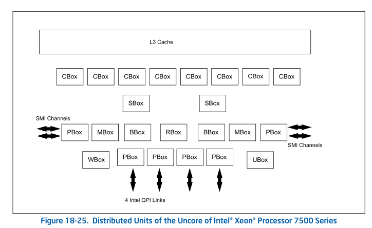

# 从intel_x86看计算机体系架构

## x86发展模式

- Grantley是intel平台代号，代表搭配某一代CPU的主板chipset结构，不同的chipset结构就对应了不同的主板PCH接口
- Haswell是CPU代号
> **注：下面所说的CPU都是一个物理上的CPU，就是拿在手上那种一块cpu**
> 计算机架构从南北桥架构变成了主桥架构。这其中主要是原来北桥上的内存控制器、PCIE root port(IIO root port)等高速设备集成到了cpu内部，这些原来北桥上集成过来的功能在intel被称为cpu uncore modules。
> 
> 另一方面，慢速设备如sata磁盘接口，usb接口，主板集成网卡等io设备直接连接主板的PCH(Platform Controller Hub)芯片组再连接CPU

## CPU内部架构

  Haswell这代CPU将core和LLC、memory controller、IO controller和inter-socket Intel QPI用ring bus架构集成。这样的架构会随着core数量增长而使各模块通信延时增长以及带宽降低。于是从 Haswell 开始，高核心数的服务器 CPU 开始使用双环+双内存控制器的架构，在 LCC(Low core count核数少的情况) 中是单环， MCC 中是一个完整环和一个半环，HCC 中则是两个完整的环，半环和完整的环都带有一个独立的内存控制器。跨ring访问回有多一个CPU cycle的延迟，且随着core数增多还是会存在原来的问题

  Skylake上则引入了mesh架构解决上述core数量增长带来的问题。mesh 架构最多六行六列，其中一行被 UPI 和 PCI 控制器占据，另有两个位置是内存控制器，故最多塞进（6*6-6-2=28）个核心。同时还在mesh中集成了cache agent、home agent和IO 子系统以提高性能。同时每个Core上都有一个CHA以提供跨socket的intel UPI的cache一致性能力。
  另外，在ring bus架构双环中的一环可以被被单独拿出来叫做Cluster-on-die(COD)。在mesh架构上这种CPU上两个独立的功能单元被称为Sub-NUMA Cluster(SNC)。无论是COD还是SNC跨cluster的访问时比cluster内部访问要慢，但是比跨CPU访问快。
> 上图中除了core以外所有模组都属于uncore  
- CHA(combined Caching and Home Agent): 提供跨core/socket的cache coherence的服务以及core之间寻路的路由功能。上一代CPU每个Core上有一个CA，每个内存控制器上有一个HA。Skylake CPU则在每个Core和LLC bank上都放了一个CHA，用于监控来自core的缓存一致性请求情况以及响应本地和其他核上的嗅探请求。Skylake CPU上的CHA实现可以看作是把原有的管理整个内存区域的CHA分开来改成了放在每个core上负责管理这个core上cache使用的内存的CHA。
  - Cbo(cache agent/core broadcast)
  - HA (home agent): 对给定内存的顺序读写。对内存读写的请求进行解析，并在解决一致性冲突后根据请求顺序调度内存的传输
- LLC(Last Level Cache): L3 cache，一个socket上共享
  - Inclusive Shared L3 Cache: 包含式的缓存（即L2 cache的缓存行必定存在于L3中）。haswell中的L3 cache实现
  - Non-Inclusive shared L3 Cache: 非包含式的缓存（即L2 cache中的缓存行不一定存在于L3中，可以将L3 cache 看成是L2 cache的[Victim cache](https://en.wikipedia.org/wiki/Victim_cache)）。skylake中的L3实现，因为L3缓存的这种实现，将原有的L3 cache的一部分转移到了core中的L2 cache。
- SF(Snoop Filter): 
- Intel UPI(Ultra Path Interconnect): 保证跨socket的数据一致性的构件(替换了上一代CPU中的Intel QPI)。Intel UPI移除了home agent需要的预申请的资源，这样使得home agent可以被分布式的放在core上。分布式HA逻辑上可以看作是一个管理地址有些重复的Intel UPI的agent。
## 参考
https://www.intel.com/content/www/us/en/developer/articles/technical/xeon-processor-scalable-family-technical-overview.html
https://en.wikipedia.org/wiki/Tick%E2%80%93tock_model
https://community.intel.com/t5/Software-Tuning-Performance/About-Caching-Home-agent/m-p/1156700
https://www.starduster.me/2018/05/18/talk-about-evolution-from-broadwell-to-skylake/
