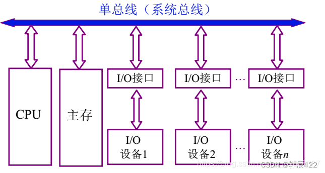
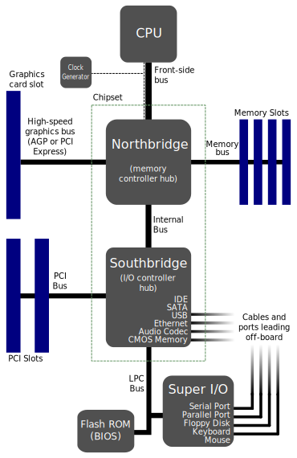

# 从intel_x86看计算机体系架构

## intel x86 服务器芯片发展

- Grantley是intel平台代号，代表搭配某一代CPU的主板chipset结构，不同的chipset结构就对应了不同的主板PCH(Platform Controller Hub)接口
- Haswell是CPU代号

> 注：下面所说的CPU都是一个物理上的CPU，就是拿在手上那种一块cpu

## CPU内部架构

  Haswell这代CPU将core和LLC、memory controller、IO controller（interrupt controler & PCIe Root Complex）和inter-socket Intel QPI用ring bus架构集成。这样的架构会随着core数量增长而使各模块通信延时增长以及带宽降低。于是从 Haswell 开始，高核心数的服务器 CPU 开始使用双环+双内存控制器的架构，在 LCC(Low core count核数少的情况) 中是单环， MCC 中是一个完整环和一个半环，HCC 中则是两个完整的环，半环和完整的环都带有一个独立的内存控制器。跨ring访问会有多一个CPU cycle的延迟，且随着core数增多还是会存在原来的问题

  Skylake上则引入了mesh架构解决上述core数量增长带来的问题。mesh 架构最多六行六列，其中一行被 UPI 和 PCI 控制器占据，另有两个位置是内存控制器，故最多塞进（6*6-6-2=28）个核心。同时还在mesh中集成了cache agent、home agent和IO 子系统以提高性能。同时每个Core上都有一个CHA以提供跨socket的intel UPI的cache一致性能力。
  另外，在ring bus架构双环中的一环可以被被单独拿出来叫做Cluster-on-die(COD)。在mesh架构上这种CPU上两个独立的功能单元被称为Sub-NUMA Cluster(SNC)。无论是COD还是SNC跨cluster的访问时比cluster内部访问要慢，但是比跨CPU访问快。

### core

- FLC(First Level Cache)： L1 cache，分为instruction cache和data cache
- MLC(Middle level Cache)： L2 cache（Skylake放到了core外，由CHA管理）

### uncore module
> 不是core上的都是uncore module

- LLC(Last Level Cache)： L3 cache，一个socket上共享
  - Inclusive Shared L3 Cache： 包含式的缓存（即L2 cache的缓存行必定存在于L3中）。haswell中的L3 cache实现
  - Non-Inclusive shared L3 Cache： 非包含式的缓存（即L2 cache中的缓存行不一定存在于L3中，可以将L3 cache 看成是L2 cache的[Victim cache](https://en.wikipedia.org/wiki/Victim_cache)）。skylake中的L3实现，因为L3缓存的这种实现，将原有的L3 cache的一部分转移到了core中的L2 cache。
- CHA(combined Caching and Home Agent)（ring架构是CBo（CBox），mesh架构下是CHA）： 。提供跨core/socket的cache coherence的服务以及core之间寻路的路由功能。上一代CPU每个Core上有一个CA，每个内存控制器上有一个HA。Skylake CPU则在每个Core和LLC bank上都放了一个CHA，用于监控来自core的缓存一致性请求情况以及响应本地和其他核上的嗅探请求。Skylake CPU上的CHA实现可以看作是把原有的管理整个内存区域的CHA分开来改成了放在每个core上负责管理这个core上cache使用的内存的CHA。
  - Cbo(cache agent/core broadcast)
  - CA（cache agent）：负责cache内容的管理，用来保存一些cache的meta信息，管理LLC和MLC
  - HA (home agent)： core和内存控制器imc之间的接口，负责对给定内存的顺序读写。对内存读写的请求进行解析，并在解决一致性冲突后根据请求顺序调度内存的传输
- SF(Snoop Filter)： skylake新加入的，用于优化core与core之间的缓存一致性实现的。
- UBox(configuration agent)：负责处理分发中断事件。
- Intel UPI(Ultra Path Interconnect)：保证跨socket的数据一致性的构件(替换了上一代CPU中的Intel QPI（由PBox负责管理）)。Intel UPI移除了home agent需要的预申请的资源，这样使得home agent可以被分布式的放在core上。分布式HA逻辑上可以看作是一个管理地址有些重复的Intel UPI的agent。
- PCIe：实际上是PCIe总线（连接到PCI Host bridge或PCIe Root Complex）
- DMI：Direct Media Interface（直接媒体接口）是Intel开发用于连接主板PCH的，其实现基于PCIe
- PCU(Power Control Unit)：负责CPU的供电和温度控制，包括管理Cstate、Pstate的ACPI需求
- iMC(Integrated Memory Controller)：内存通道控制模组，和CHA通信，原本在北桥芯片上的内存控制器，被集成进了CPU片内，skylake架构下有两个iMC，主要为了防止mesh中的core离iMC太远。通常一个iMC会有多个内存通道（channel），有时一个channel又被分为多个slot（对应物理上的内存插条），这使得内存条的插法比较讲究，可以看内存专题。
- BSB(Back Side Bus)： 在早期intel的芯片实现中，core通过BSB连接到L1 L2 cache，Pentium III后BSB直接被集成到CPU片内

## 总线架构的发展
总线是一组信号线的集合
在x86 PC诞生的初阶段，并没有专门的芯片组概念，CPU与内存、I/O系统的通讯是由一个所谓门列控制芯片，它也就是主板的核心部件，也被称为“Core Logic（核心逻辑）”，第一代ISA总线是8位的，每次只能读/写一个字节。第二代ISA总线扩充成了16位，为单总线架构。后来扩充为32位的EISA总线（还来不及推广就被PCI取代）

随着技术发展和应用普及，市场需要支持热插拔、高带宽、总线共享、设置简单的新总线架构。此时，PCI标准（1992年）脱颖而出成为通用的总线标准。
进入386时代后，双芯片结构的芯片组正式确立，按照它们在主板的不同位置，通常把两个芯片分别称作“北桥（North Bridge/Host Bridge）”和“南桥（South Bridge）”，桥负责匹配不同的速度，形成了双总线架构。

CPU与北桥芯片由FSB（Front-side bus）相连，FSB相对较短（物理意义上），跨CPU的传输与北桥的传输公用一条FSB（可以将FSB升级变为多条，但一样有相同抢占总线的问题）
北桥芯片与内存控制器、显卡和pci总线由系统总线相连。
北桥芯片与南桥芯片相连，南桥芯片组负责相对慢速的设备连接，这些设备与CPU通过 I/O Bus (IOB)相连
在这样的架构设计存在总线间竞争以及匹配不同设备间（CPU-内存、内存-设备等）的通信速度差异，为了解决上述问题，需要进一步优化总线架构，形成了多总线架构。CPU与pci总线通过HOST-PCI桥（host bridge）相连
  

随着CPU主频提高，后续为进一步匹配CPU处理性能，原来北桥芯片上连接的内存控制器、PCIE root port(IIO root port)等高速设备集成到了cpu内部（2009年），原本位于北桥上的集成进CPU的功能模块在intel被称为cpu uncore modules。

另一方面，慢速设备如sata磁盘接口，usb接口，主板集成网卡等io设备直接连接主板的PCH(Platform Controller Hub)芯片组再连接CPU。从cpu直接连出来的被通俗地称为直通式PCIE，由PCH连接的被称为非直通式PCIE

### pci介绍
在PCI总线之前，系统仅有一个CPU作为总线中的主设备，可以启动跨总线操作。从设备则需要向CPU申请才可以。PCI总线是一种点对点的总线模型。为了设备间传输数据的同时可以释放CPU，需要允许总线中可以有多个主设备，PCI总线配置了一个仲裁器，仲裁器会从候选主设备（实现pci协议的设备）中选择其一作为主设备，以避免冲突。
内存控制器通常又与HOST-PCI桥集成在一个芯片上（后续也集成进了CPU中），可以将内存也看作PCI总线上的一个设备，不过其永远是从设备。从一个PCI endpoint到另一个PCI endpoint的数据搬运过程，可以是PIO或者是DMA，看此时PCI主设备的具体实现（我的理解）。
PCI架构后续进一步发展为PCIe总线标准（2004年）

PCIe的架构主要由五个部分组成：Root Complex，PCIe Bus，(Endpoint，Port and Bridge，Switch)
Root Complex是整个PCIe设备树的根节点，通过PCIe Bus将CPU处理单元、内存控制器和PCIe设备连接起来。PCIe架构不再是**共享总线**，各endpoint可以进行点对点通信。RC的实现在不同的平台有不同的实现。
#### PCI配置
PCIe支持两种配置空间访问机制
- CAM(Configuration Access Mechanism)：是与PCI兼容的一种配置访问机制，包括总线枚举和软件配置过程。x86芯片提供两个I/O端口寄存器（intel文档里没看到），Address Port（地址寄存器0xCF8）和Data Port（数据寄存器0xCFC），由于PCI是地址数据共用32bit总线，所以需要先写入目标地址，其次将数据写入数据寄存器。这里的地址实际就是BDF（Bus总线号 + Device设备号 + Function功能号）组成的
- ECAM(Enhanced Configuration Access Mechanism)：增强型配置访问机制，因每个设备256Byte的配置空间不够用，扩展到了4KB，但BDF等位宽不变，所以整个配置空间是256MB。ECAM直接将配置空间映射到物理内存。通过BIOS（有BIOS的系统）或者设备树(无BIOS系统)中获取到ECAM基址，通过ECAM基址+设备BDF偏移获得设备最终的配置空间地址，并通过MMIO访问配置。具体来说CPU发起MMIO（正常的内存读写指令）时，地址转换部件会判断地址
### 外部总线
usb

## 参考
https://www.intel.com/content/www/us/en/developer/articles/technical/xeon-processor-scalable-family-technical-overview.html
https://en.wikipedia.org/wiki/Tick%E2%80%93tock_model
https://community.intel.com/t5/Software-Tuning-Performance/About-Caching-Home-agent/m-p/1156700
https://www.starduster.me/2018/05/18/talk-about-evolution-from-broadwell-to-skylake/
https://answers.microsoft.com/en-us/windows/forum/all/device-io/8ee64904-e136-4484-920c-fc4a14b43c45
linux内核源代码情景分析，设备驱动
https://blog.csdn.net/weixin_44395686/article/details/105240630
http://cniti.com/index.php/article/index/id/3008/viewall/1
[PCIe配置空间](https://blog.csdn.net/zz2633105/article/details/138060829)
[剖析PCIe协议](https://fpgaup.com/fpgauptext.php?cidi=190)
https://r12f.com/posts/pcie-1-basics/
https://zhuanlan.zhihu.com/p/54876718
https://www.zhihu.com/column/c_1089831721599438848
Yuan, J.; Zhang, J.; Qiu, P.; Wei, X.; Liu, D. A Survey of of Side-Channel Attacks and Mitigation for Processor Interconnects. Appl. Sci. 2024, 14, 6699. https://doi.org/10.3390/app14156699
https://handwiki.org/wiki/Engineering:List_of_Intel_CPU_microarchitectures