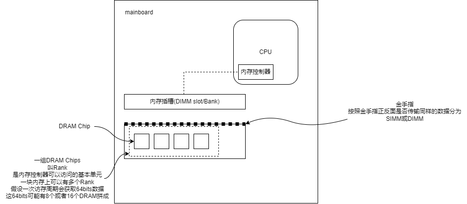
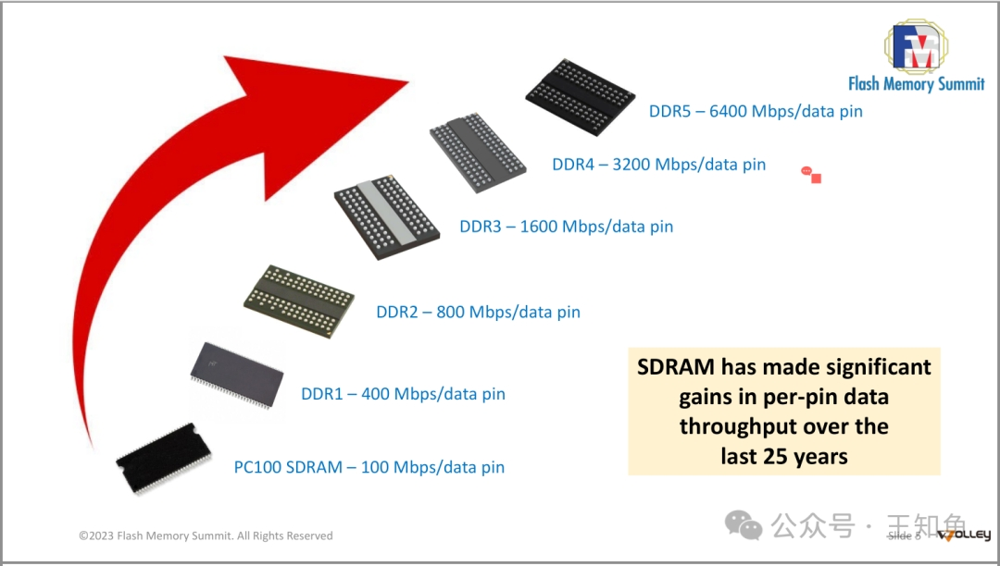

# Memory

之前提到经典的南北桥架构，其存在一定的问题。
1. RAM和IO设备间的数据传输。早期PC时代，所有与IO设备的传输都要经过一遍CPU，严重影响性能。现在可以通过DMA。DMA允许IO设备在南桥芯片的帮助下，直接与RAM传输不用CPU的参与。
2. 北桥到RAM的数据传输。以前的系统只有一条总线连接到所有的RAM芯片组上，这种方式无并行性可言。现代系统上支持多条总线(通道，如DDR4的升级)来提高并行性。提升了并行性后，下一步要提升内存访问速率，发展出了CPU cache(另一方面，内存访问模式也会影响到性能，详见后面todo)。另外也有一些架构对RAM与CPU的数据传输进行了不同方向上的探索  

   - 外部内存控制器架构。北桥不集成单一的内存控制器，而是可以连接管理更多的外部内存控制器。是现在比较流行的服务器架构。这种架构可以通过增加总线数量在增加带宽，同时可以支持更多的RAM(这种RAM组织方式，可以做成memory RAID，来支持内存热插拔)。这下性能压力来到了北桥内部的带宽上。

   - CPU集成内存内存控制器。CPU直接与RAM传输。这类架构在AMD的一些SMP系统上比较流行，Intel用类似架构实现了Common System Interface(CSI)。这类架构的好处就是传输不用经过北桥，会特别快。坏处就是内存不是一致的，也就是NUMA(Non-Uniform Memory Architecture)的由来。另外，当访问直接与CPU相连的RAM速度正常，但当一块CPU访问与另一块CPU相连的内存时，就会需要interconnects(如图所示cpu1-cpu2要1条，cpu1到cpu4要2条)。每一条interconnects都会对总体性能带来损耗，这种损耗被称为"NUMA factors"。进一步地，有架构将多个core整合进一个CPU里，一个CPU共享一个（或两个）内存控制器以减少节点内core访问RAM所需的interconnect，这种架构需要跟复杂的设计来控制"NUMA factors"。intel从haswell的ring总线架构改进为skylake的mesh总线架构就是为了进一步减少"NUMA factors"。

## RAM Types
#### Static RAM
贵。cache就是这种
#### Dynamic RAM 

##### Synchronous DRAM

一般情况下，计算机使用的DRAM基本为SDRAM（同步动态随机存取内存）。SDRAM是一种同步动态随机存取存储器，它是DRAM的一种类型，与传统的异步DRAM相比，它能够与系统时钟同步运行，从而提供更高的数据传输率和更佳的性能。SDRAM的设计目的是为了适应计算机系统中日益增长的性能需求，尤其是在处理器速度快速提升的背景下，传统的异步DRAM无法提供足够的带宽和响应速度。
###### 发展

1. SIMM(Single Inline Memory Module): 金手指两侧提供相同的信号
2. DIMM(Dual Inline Memory Module, 双列直插内存模块): 内存金手指两端不互通，可各自传输信号。相比SIMM调高了内存速率，降低了功耗
3. UDIMM(Unregistered/Unbuffered DIMM,无缓冲双列直插内存模块): 最开始的DIMM，无缓冲双列直插内存模块，指地址和控制信号不经缓冲器，无需做任何时序调整，直接到达DIMM上的DRAM芯片。UDIMM由于在CPU和内存之间没有任何缓存，因此同频率下延迟较小。
4. RDIMM(Registered DIMM,带寄存器的双列直插内存模块): 带寄存器的双列直插内存模块。RDIMM在内存条上加了一个寄存器进行传输，其位于CPU和内存颗粒之间，既减少了并行传输的距离，又保证并行传输的有效性。由于寄存器效率很高，因此相比UDIMM，RDIMM的容量和频率更容易提高。
5. LRDIMM(Load Reduced DIMM,低负载双列直插内存模块): DDR3出现的技术，使用比RDIMM简单的缓冲（非寄存器）可缓存同时控制总线和数据总线访问，减少了主板上的电压负载，可以进一步提升内存频率，以及内存容量。但如果开启了rank复用模式下，因为内存板上寄存器的原因，内存控制器无法知道访问的rank是否位于同一个DIMM上，所以需要花费时间切换DRAMS，这可能会带来25%的性能损耗
6. 搭配可感知Rank的内存控制器的LRDIMM: 2012后第二代DDR3平台的内存控制器可以感知到LRDIMM片上缓存后面的物理rank，使得其可以对访问有更细微的控制（时间上等），减少了LRDIMM与RDIMM间延迟差距和带宽差距。DDR4有了更进一步的提高
7. DDR4
8. DDR5
## 内存子系统贷款
### 
## refer
1. [What every programmer should know about memory - Ulrich Drepper](https://lwn.net/Articles/250967/)
2. [MEMORY DEEP DIVE SERIES - Frank Denneman](https://frankdenneman.nl/2015/02/18/memory-configuration-scalability-blog-series/)
3. https://en.wikipedia.org/wiki/Memory_bandwidth
4. https://www.intel.com/content/www/us/en/support/articles/000055509/server-products/server-boards.html
5. https://www.intel.com/content/www/us/en/support/articles/000005657/boards-and-kits.html
6. https://lwn.net/Articles/253361/ Section 4 virtual memory implemention
7. https://lwn.net/Articles/254445/ Section 5 NUMA system
8. https://lwn.net/Articles/255364/ Section 6 (important) program advice
9. https://lwn.net/Articles/257209/ Section 6.5 
10. https://lwn.net/Articles/256433/ Section 7 tool
11. https://lwn.net/Articles/258154/ Section 8 furture work
12. https://lwn.net/Articles/258188/ mem9