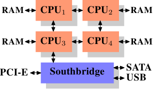

# Memory
## 现代计算机架构
因为高速便宜的网络设备的普及，现代计算机多使用平行架构而非垂直架构。多数计算机采用了如下的南北桥架构：  
  
- CPUs
- CPU通过一条前端总线(the Front Side Bus, FSB)连到北桥上。
- 北桥：包含内存控制器(其实现决定了内存芯片类型)，现已集成了南桥功能，形成了主桥架构  
- 南桥：包含I/O控制器(集成了PCI，PCIe, SATA, USB等设备)，现其功能也已慢慢被集成进北桥
这样的架构决定了数据传输中
- 跨CPU的传输与北桥的传输公用一条FSB
- 与RAM的传输必须经过北桥
- RAM只有一个端口（此处不讨论多端口RAM）
- CPU与南桥上IO设备间的传输经过北桥  
在这样的架构设计中就暴露了很多性能瓶颈，同时也有相应的解决方案
1. RAM和IO设备间的数据传输。早期PC时代，所有与IO设备的传输都要经过一遍CPU，严重影响性能。现在可以通过DMA。DMA允许IO设备在南桥芯片的帮助下，直接与RAM传输不用CPU的参与。
2. 北桥到RAM的数据传输。以前的系统只有一条总线连接到所有的RAM芯片组上，这种方式无并行性可言。现代系统上支持多条总线(通道，如DDR4的升级)来提高并行性。提升了并行性后，下一步要提升内存访问速率，发展出了CPU cache(另一方面，内存访问模式也会影响到性能，详见后面todo）。另外也有一些架构对RAM与CPU的数据传输进行了不同方向上的探索  

   - 外部内存控制器架构。北桥不集成单一的内存控制器，而是可以连接管理更多的外部内存控制器。是现在比较流行的服务器架构。这种架构可以通过增加总线数量在增加带宽，同时可以支持更多的RAM(这种RAM组织方式，可以做成memory RAID，来支持内存热插拔)。这下性能压力来到了北桥内部的带宽上。 

   - CPU集成内存内存控制器。CPU直接与RAM传输。这类架构在AMD的一些SMP系统上比较流行，Intel用类似架构实现了Common System Interface(CSI)。这类架构的好处就是传输不用经过北桥，会特别快。坏处就是内存不是一致的，也就是NUMA(Integrated Memory Controller)的由来。另外，当访问直接与cpu相连的RAM速度正常，但当一块cpu访问与另一块cpu相连的内存时，就会需要interconnects(如图所示cpu1-cpu2要1条，cpu1到cpu4要2条)。每一条interconnects都会对总体性能带来损耗，这种损耗被称为"NUMA factors"。进一步地，有架构将多个CPU整合进一个节点里，一个节点共享一个内存控制器以减少节点内cpu访问RAM所需的interconnect，这种架构下的"NUMA factors"更为大。
## RAM Types
#### Static RAM
贵。
cache就是这种
#### Dynamic RAM
## refer
1. [What every programmer should know about memory - Ulrich Drepper](https://lwn.net/Articles/250967/)
2. [MEMORY DEEP DIVE SERIES - Frank Denneman](https://frankdenneman.nl/2015/02/18/memory-configuration-scalability-blog-series/)
3. 
4. https://lwn.net/Articles/253361/ Section 4 virtual memory implemention
5. https://lwn.net/Articles/254445/ Section 5 NUMA system
6. https://lwn.net/Articles/255364/ Section 6 (important) program advice
7. https://lwn.net/Articles/257209/ Section 6.5 
8. https://lwn.net/Articles/256433/ Section 7 tool
9.  https://lwn.net/Articles/258154/ Section 8 furture work
10. https://lwn.net/Articles/258188/ mem9