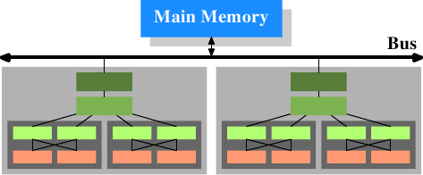
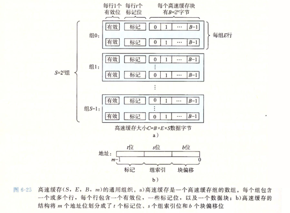
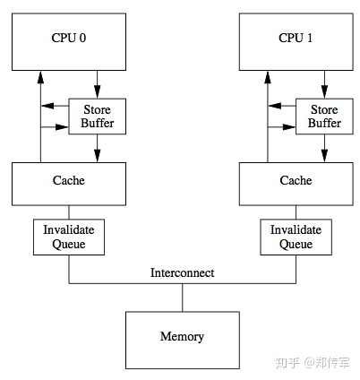

# cache

## intro
在CPU和DRAM之间存在极大的性能鸿沟。如果全用SRAM则性价比过低。如果使用一小部分SRAM来替代某些特定内存地址，这种方案可以将SRAM看作是一些额外的寄存器。但这种方案存在一定的问题，首先这部分SRAM和虚拟内存映射需要处理器通过软件去管理使用这部分内存区域，其次不同处理器的不同大小的SRAM使得这个管理更麻烦，最终导致提升的性能全被这管理这部分的代码消耗掉。另外一种方案是让处理器硬件管理SRAM，SRAM对操作系统以及用户不可见。在这种场景下SRAM上只保存一份DRAM上正准备使用的内存拷贝。正是因为程序的空间和时间局部性使得这样的方案能提升性能。

## CPU - cache 模型
  
在上图暂且先将北桥抽象，简化为CPU直接于cache相连，cache与memory通过FSB(前端总线)相连  
  
将CPU cache分为不同速率的三个层次，同时在最接近CPU的层级区分是数据cache和指令cache。  
  
core和thread的区别是一个core独享所有的硬件资源，而一个thread与另一个thread共享同一个core上的硬件资源。上图展示的是多处理器，多core，多thread的示意图。两个处理器，一个处理器上有两个core，一个core里有两个thread。thread共享使用core上的L1 caches，而一个core则独占自己的L1 cache，共享L2/L3 cache，一个处理器独享自己的L2/L3 cache。  
### cache模型


### 现代cpu上的cache使用框架
  
- write combining store buffer: 64Byte的缓冲区同时有一个64bit的bitmap，每更新其中的Byte会设置相应的bit。（写数据时发生cache miss，会先将数据暂存于write combining store buffer, 以便后续指令继续执行。若在write combining store buffer的数据在未解决cache miss期间，数据会直接在store buffer读写。）
### 
## 基本优化方针

## 内存数据使用模式
为了更有针对性地利用cache，我们将内存数据的使用分为以下三种模式:
- Temporal: 数据会立马被使用
- Non-temporal: 数据会被使用一次但短时间内不会再次被使用
- Spatial: 相邻位置的数据会被使用（比方说在同一个cache line上）
## 数据预取(cache prefetch)
首先无论对内存数据的读/写都要其先出现在cache上，这时就可以利用数据预取的手段，在数据被读写前将其先一步加载到cache上。
### 硬件预取
由硬件逻辑实现的cache prefetch，对编程人员不可见
### 软件预取
软件预取是由编程人员或编译器主观的加入PREFETCH指令到执行代码中实现的。不同的data caching策略由不同的PREFETCH指令，合适的策略可以可以提高cache利用率和减少cache污染。
#### 指令
1. PREFETCHNTA: (Non-temporal区域)预取到最接近处理器的Non-temporal区域，最小化cache污染
2. PREFETCHT0 : (Temporal区域)预取到所有层级的cache上
3. PREFETCHT1 : (Temporal区域)预取到 第二层 和 第三层的cache上
4. PREFETCHT2 : (Temporal区域)目前来说和PREFETCH1一样
5. PREFETCHW  : 预取到预期写的cache上(, and invalidates any other cached copy in anticipation of a write)
#### 优化场景
1. 可预测的内存访问模型
2. 最耗时的最内层循环
3. 你知道有memory bound造成的微指令流水线卡顿的地方
##### in gcc
__builtin_prefetch() 是 gcc 的一个内置函数。它通过对数据手工预取的方法，减少了读取延迟，从而提高了性能，但该函数也需要 CPU 的支持。
该函数的原型为：
``` C
void __builtin_prefetch (const void *addr, ...)
```
其中参数 addr 是个内存指针，它指向要预取的数据，我们人工需要判定这些数据是很快能访问到的，或者说是它们就在最近的内存中 --- 一般来说，对于链表而言，各个节点在内存中基本上是紧挨着的，所以我们容易预取链表节点里的指针项。

该函数还有两个可选参数，rw 和 locality 。

rw 是个编译时的常数，或 1 或 0 。1 时表示写(w)，0 时表示读(r) 。

locality 必须是编译时的常数，也称为“时间局部性”(temporal locality) 。时间局部性是指，如果程序中某一条指令一旦执行，则不久之后该指令可能再被执行；如果某数据被访问，则不久之后该数据会被再次访问。该值的范围在 0 - 3 之间。为 0 时表示，它没有时间局部性，也就是说，要访问的数据或地址被访问之后的不长的时间里不会再被访问；为 3 时表示，被访问的数据或地址具有高 时间局部性，也就是说，在被访问不久之后非常有可能再次访问；对于值 1 和 2，则分别表示具有低 时间局部性 和中等 时间局部性。该值默认为 3 。另外，参数 addr 是需要用户保证地址的正确，函数不会对不正确的地址做出错误的提示。

用法：
``` C
for (i = 0; i < n; i++)
            {
              a[i] = a[i] + b[i];
              __builtin_prefetch (&a[i+j], 1, 1);
              __builtin_prefetch (&b[i+j], 0, 1);
              /* ... */
            }
```

在 linux 内核中，经常会使用到这种预抓取技术。通常是通过宏和包装器函数使用预抓取。下面是一个辅助函数示例，它使用内置函数的包装器（见 ./linux/include/linux/prefetch.h）。这个函数为流操作实现预抓取机制。使用这个函数通常可以减少缓存缺失和停顿，从而 提高性能。
``` C
#ifndef ARCH_HAS_PREFETCH
#define prefetch(x) __builtin_prefetch(x)
#endif
 
static inline void prefetch_range(void *addr, size_t len)
{
#ifdef ARCH_HAS_PREFETCH
    char *cp;
    char *end = addr + len;
 
    for (cp = addr; cp < end; cp += PREFETCH_STRIDE)
        prefetch(cp);
#endif
}
```
#### prefetch vs load指令
基于如下原因，prefetch指令有更好的性能
1. prefetch 没有目的寄存器，只更新到cache line上
2. 不会使得正常的指令卡顿
3. 不会影响程序正常运行
4. 没有跨cache line 的访问
5. 不会造成因为LOCK prefix 造成的exceptions except
6. 即使有问题，也只是这条prefetch指令不执行而已
#### prefetch 不生效的情况
1. 老的微架构
2. prefetch一个造成fault/exception的地址
3. L1cache到L2cache的访问请求数超过硬件限制值
## store 数据存储 
写数据行为后将cache更新到内存上。为了实现此时有cache存在与没cache时一样，cache有两种更新数据的策略
1. write-through
2. write-back
除此之外，还有另外两种特殊的cache更新策略
3. write-combining
4. uncacheable
> 同时因为现在的多核处理器架构，还需要处理缓存一致性的问题。
#### Streaming Non-temporal Stores
在流式SIMD指令中MOVNTPS, MOVNTPD, MOVNTQ, MOVNTDQ, MOVNTI, MASKMOVQ, MASKMOVDQU是non-temporal store，也就是数据存储后并不会在短时间内再次使用，同时流式存储指令可以使用于跨不同内存类型的内存区域(For instance, a regionmay be mapped as write-back (WB) using page attribute tables (PAT) or memory type range registers(MTRRs) and yet is written using a streaming store.)。

流式存储指令从如下方面提升性能:
- 增大存储带宽。如果要写的数据可以正好在一个store buffer的范围内，首先他们在写入时先会写到store buffer中而不需要再获取read-for-ownership总线请求，其次数据在写入到内存上时会合并为一个64Bytes的总线写操作
- 减少对常用数据缓存区域的干扰（减少cache污染）
#### leverage store buffer
如果我们能在缓冲区被传输到外部缓存之前将其填满，那么将大大提高各级传输总线的效率。

这些缓冲区的数量是有限的，且随CPU模型而异。例如在Intel CPU中，同一时刻只能拿到4个。这意味着，在一个循环中，你不应该同时写超过4个不同的内存位置，否则你将不能享受到合并写（write combining）的好处。（如果还开启了hyper-threading， 可能会有两个线程竞争一个核的缓冲区）

代码示例:
``` C++
public final class WriteCombining {
private static final int    ITERATIONS = Integer.MAX_VALUE;
private static final int    ITEMS      = 1 << 24;
private static final int    MASK       = ITEMS - 1;
private static final byte[] arrayA     = new byte[ITEMS];
private static final byte[] arrayB     = new byte[ITEMS];
private static final byte[] arrayC     = new byte[ITEMS];
private static final byte[] arrayD     = new byte[ITEMS];
private static final byte[] arrayE     = new byte[ITEMS];
private static final byte[] arrayF     = new byte[ITEMS];
public static void main(final String[] args) {
    for (int i = 1; i <= 3; i++) {
        out.println(i + " SingleLoop duration (ns) = " + runCaseOne());
        out.println(i + " SplitLoop duration (ns) = " + runCaseTwo());
    }
    int result = arrayA[1] + arrayB[2] + arrayC[3] + arrayD[4] + arrayE[5] + arrayF[6];
    out.println("result = " + result);
}
public static long runCaseOne() { // slow case 
    long start = System.nanoTime();
    int i = ITERATIONS;
    while (--i != 0) {
        int slot = i & MASK;
        byte b = (byte) i;
        arrayA[slot] = b;
        arrayB[slot] = b;
        arrayC[slot] = b;
        arrayD[slot] = b;
        arrayE[slot] = b;
        arrayF[slot] = b;
    }
    return System.nanoTime() - start;
}
public static long runCaseTwo() { // faster case
    long start = System.nanoTime();
    int i = ITERATIONS;
    while (--i != 0) {
        int slot = i & MASK;
        byte b = (byte) i;
        arrayA[slot] = b;
        arrayB[slot] = b;
        arrayC[slot] = b;
    }
    i = ITERATIONS;
    while (--i != 0) {
        int slot = i & MASK;
        byte b = (byte) i;
        arrayD[slot] = b;
        arrayE[slot] = b;
        arrayF[slot] = b;
    }
    return System.nanoTime() - start;
}

```
## load 数据加载
## Fencing Instructions
fencing 指令是针对于解决weakly ordered问题用的。其强制将store buffer/Invalidate queue上的数据刷新至cache上。
## 屏障指令
屏障指令的意义是为了保证计算单元和缓存上的数据的顺序一致性
## 缓存一致性协议
缓存一致性协议是为了保证不同核缓存的数据一致性。实现缓存一致性协议的关键就是跟踪共享内存的状态。
### Directory based
共享内存的状态被存放在一个位置，叫做`directory`。常用在SMP中，可以启用一个目录，与内存或者某个单一有顺序的内存映射（如最后一级缓存）映射，目录中记录跟踪共享内存的状态
### Snooping 嗅探
在SMP上所有的cache可以通过总线相连，所有的缓存控制监控器可以监听或者发送广播以同步共享内存的状态。由于 snooping 使用了广播会占用总线带宽，一般认为 snooping 扩展性不如 directory-based，但是在带宽足够的前提下，snooping 会更快。也有在directory-based之上的snooping协议。
## MISC
1. 可以通过查看`/sys/devices/system/cpu/cpu0/cache/index`文件查看cpu cache信息
## 参考
1. [csapp 程序优化](https://www.bilibili.com/video/BV1iW411d7hd?p=12)
2. [数据预取](https://www.cnblogs.com/dongzhiquan/p/3694858.html)
3. [write combining](http://ifeve.com/writecombining/) 
4. [Memory part 2:CPU cache - Ulrich Drepper](https://lwn.net/Articles/252125/)
5. https://www.starduster.me/2018/05/18/talk-about-evolution-from-broadwell-to-skylake/