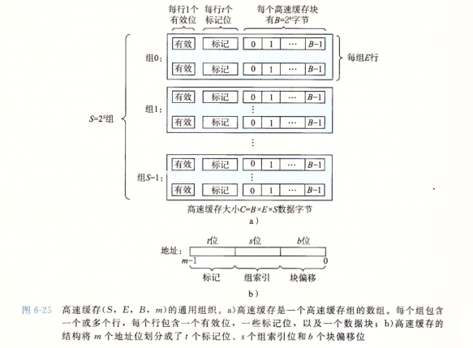
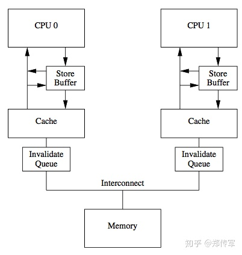

# cache
## intro
在CPU和DRAM之间存在极大的性能鸿沟。如果全用SRAM则性价比过低。如果使用部分SRAM来替代
## cache 模型

### 现代cpu上的cache使用框架
  
- write combining store buffer: 64Byte的缓冲区同时有一个64bit的bitmap，每更新其中的Byte会设置相应的bit。（写数据时发生cache miss，会先将数据暂存于write combining store buffer, 以便后续指令继续执行。若在write combining store buffer的数据在未解决cache miss期间，数据会直接在store buffer读写。）
### 
## 基本优化方针

## 内存数据使用模式
为了更有针对性地利用cache，我们将内存数据的使用分为以下三种模式:
- Temporal: 数据会立马被使用
- Non-temporal: 数据会被使用一次但短时间内不会再次被使用
- Spatial: 相邻位置的数据会被使用（比方说在同一个cache line上）
## 数据预取(cache prefetch)
首先无论对内存数据的读/写都要其先出现在cache上，这时就可以利用数据预取的手段，在数据被读写前将其先一步加载到cache上。
### 硬件预取
由硬件逻辑实现的cache prefetch，对编程人员不可见
### 软件预取
软件预取是由编程人员或编译器主观的加入PREFETCH指令到执行代码中实现的。不同的data caching策略由不同的PREFETCH指令，合适的策略可以可以提高cache利用率和减少cache污染。
#### 指令
1. PREFETCHNTA: (Non-temporal区域)预取到最接近处理器的Non-temporal区域，最小化cache污染
2. PREFETCHT0 : (Temporal区域)预取到所有层级的cache上
3. PREFETCHT1 : (Temporal区域)预取到 第二层 和 第三层的cache上
4. PREFETCHT2 : (Temporal区域)目前来说和PREFETCH1一样
5. PREFETCHW  : 预取到预期写的cache上(, and invalidates any other cached copy in anticipation of a write)
#### 优化场景
1. 可预测的内存访问模型
2. 最耗时的最内层循环
3. 你知道有memory bound造成的微指令流水线卡顿的地方
##### in gcc
__builtin_prefetch() 是 gcc 的一个内置函数。它通过对数据手工预取的方法，减少了读取延迟，从而提高了性能，但该函数也需要 CPU 的支持。
该函数的原型为：
``` C
void __builtin_prefetch (const void *addr, ...)
```
其中参数 addr 是个内存指针，它指向要预取的数据，我们人工需要判定这些数据是很快能访问到的，或者说是它们就在最近的内存中 --- 一般来说，对于链表而言，各个节点在内存中基本上是紧挨着的，所以我们容易预取链表节点里的指针项。

该函数还有两个可选参数，rw 和 locality 。

rw 是个编译时的常数，或 1 或 0 。1 时表示写(w)，0 时表示读(r) 。

locality 必须是编译时的常数，也称为“时间局部性”(temporal locality) 。时间局部性是指，如果程序中某一条指令一旦执行，则不久之后该指令可能再被执行；如果某数据被访问，则不久之后该数据会被再次访问。该值的范围在 0 - 3 之间。为 0 时表示，它没有时间局部性，也就是说，要访问的数据或地址被访问之后的不长的时间里不会再被访问；为 3 时表示，被访问的数据或地址具有高 时间局部性，也就是说，在被访问不久之后非常有可能再次访问；对于值 1 和 2，则分别表示具有低 时间局部性 和中等 时间局部性。该值默认为 3 。另外，参数 addr 是需要用户保证地址的正确，函数不会对不正确的地址做出错误的提示。

用法：
``` C
for (i = 0; i < n; i++)
            {
              a[i] = a[i] + b[i];
              __builtin_prefetch (&a[i+j], 1, 1);
              __builtin_prefetch (&b[i+j], 0, 1);
              /* ... */
            }
```

在 linux 内核中，经常会使用到这种预抓取技术。通常是通过宏和包装器函数使用预抓取。下面是一个辅助函数示例，它使用内置函数的包装器（见 ./linux/include/linux/prefetch.h）。这个函数为流操作实现预抓取机制。使用这个函数通常可以减少缓存缺失和停顿，从而 提高性能。
``` C
#ifndef ARCH_HAS_PREFETCH
#define prefetch(x) __builtin_prefetch(x)
#endif
 
static inline void prefetch_range(void *addr, size_t len)
{
#ifdef ARCH_HAS_PREFETCH
    char *cp;
    char *end = addr + len;
 
    for (cp = addr; cp < end; cp += PREFETCH_STRIDE)
        prefetch(cp);
#endif
}
```
#### prefetch vs load指令
基于如下原因，prefetch指令有更好的性能
1. prefetch 没有目的寄存器，只更新到cache line上
2. 不会使得正常的指令卡顿
3. 不会影响程序正常运行
4. 没有跨cache line 的访问
5. 不会造成因为LOCK prefix 造成的exceptions except
6. 即使有问题，也只是这条prefetch指令不执行而已
#### prefetch 不生效的情况
1. 老的微架构
2. prefetch一个造成fault/exception的地址
3. L1cache到L2cache的访问请求数超过硬件限制值
## store 数据存储 
写数据行为后将cache更新到内存上。为了实现此时有cache存在与没cache时一样，cache有两种更新数据的策略
1. write-through
2. write-back
除此之外，还有另外两种特殊的cache更新策略
3. write-combining
4. uncacheable
#### Streaming Non-temporal Stores
在流式SIMD指令中MOVNTPS, MOVNTPD, MOVNTQ, MOVNTDQ, MOVNTI, MASKMOVQ, MASKMOVDQU是non-temporal store，也就是数据存储后并不会在短时间内再次使用，同时流式存储指令可以使用于跨不同内存类型的内存区域(For instance, a regionmay be mapped as write-back (WB) using page attribute tables (PAT) or memory type range registers(MTRRs) and yet is written using a streaming store.)。

流式存储指令从如下方面提升性能:
- 增大存储带宽。如果要写的数据可以正好在一个store buffer的范围内，首先他们在写入时先会写到store buffer中而不需要再获取read-for-ownership总线请求，其次数据在写入到内存上时会合并为一个64Bytes的总线写操作
- 减少对常用数据缓存区域的干扰（减少cache污染）
#### leverage store buffer
如果我们能在缓冲区被传输到外部缓存之前将其填满，那么将大大提高各级传输总线的效率。

这些缓冲区的数量是有限的，且随CPU模型而异。例如在Intel CPU中，同一时刻只能拿到4个。这意味着，在一个循环中，你不应该同时写超过4个不同的内存位置，否则你将不能享受到合并写（write combining）的好处。（如果还开启了hyper-threading， 可能会有两个线程竞争一个核的缓冲区）

代码示例:
``` C++
public final class WriteCombining {
private static final int    ITERATIONS = Integer.MAX_VALUE;
private static final int    ITEMS      = 1 << 24;
private static final int    MASK       = ITEMS - 1;
private static final byte[] arrayA     = new byte[ITEMS];
private static final byte[] arrayB     = new byte[ITEMS];
private static final byte[] arrayC     = new byte[ITEMS];
private static final byte[] arrayD     = new byte[ITEMS];
private static final byte[] arrayE     = new byte[ITEMS];
private static final byte[] arrayF     = new byte[ITEMS];
public static void main(final String[] args) {
    for (int i = 1; i <= 3; i++) {
        out.println(i + " SingleLoop duration (ns) = " + runCaseOne());
        out.println(i + " SplitLoop duration (ns) = " + runCaseTwo());
    }
    int result = arrayA[1] + arrayB[2] + arrayC[3] + arrayD[4] + arrayE[5] + arrayF[6];
    out.println("result = " + result);
}
public static long runCaseOne() { // slow case 
    long start = System.nanoTime();
    int i = ITERATIONS;
    while (--i != 0) {
        int slot = i & MASK;
        byte b = (byte) i;
        arrayA[slot] = b;
        arrayB[slot] = b;
        arrayC[slot] = b;
        arrayD[slot] = b;
        arrayE[slot] = b;
        arrayF[slot] = b;
    }
    return System.nanoTime() - start;
}
public static long runCaseTwo() { // faster case
    long start = System.nanoTime();
    int i = ITERATIONS;
    while (--i != 0) {
        int slot = i & MASK;
        byte b = (byte) i;
        arrayA[slot] = b;
        arrayB[slot] = b;
        arrayC[slot] = b;
    }
    i = ITERATIONS;
    while (--i != 0) {
        int slot = i & MASK;
        byte b = (byte) i;
        arrayD[slot] = b;
        arrayE[slot] = b;
        arrayF[slot] = b;
    }
    return System.nanoTime() - start;
}

```
## load 数据加载
## Fencing Instructions
fencing 指令是针对于解决weakly ordered问题用的。其强制将store buffer/Invalidate queue上的数据刷新至cache上。
## MISC
1. 可以通过查看`/sys/devices/system/cpu/cpu0/cache/index`文件查看cpu cache信息
## 参考
1. [数据预取](https://www.cnblogs.com/dongzhiquan/p/3694858.html)
2. [write combining](http://ifeve.com/writecombining/) 
3. [Memory part 2:CPU cache - Ulrich Drepper](https://lwn.net/Articles/252125/)