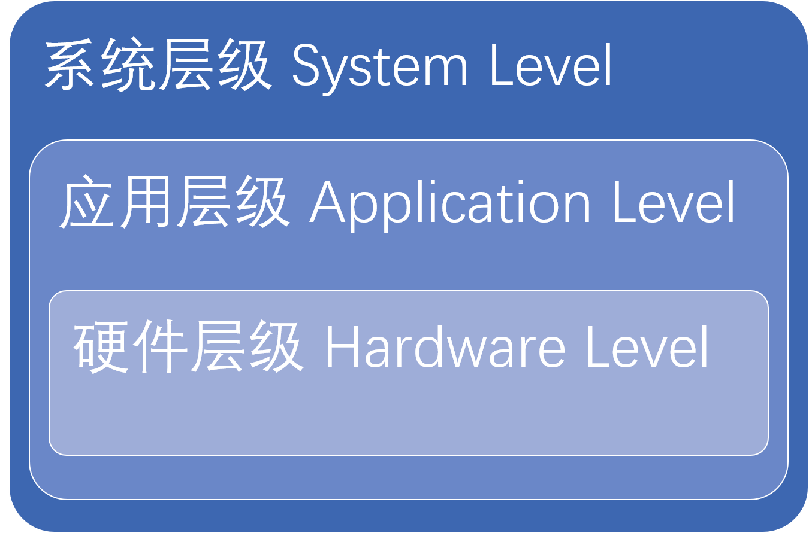

# 性能分析与优化

>`“总之，前途是光明的，道路是曲折的。我们面前困难还多，不可忽视。我们和全体人民团结起来，共同努力，一定能够排除万难，达到胜利的目的。” —— 毛主席`

## 1. 方法论 

### 1.1. 思路
性能提升的思路，可以简单的分为两种，这两种又是可以相互转化的

#### 1.1.1 乐观思路
乐观思路，将性能提升看作目标

> 后续的讲解将以乐观思路为例讲述。

##### 1.1.1.1 步骤
1. 先设立一个性能目标
2. 找到目前可以提升性能最大（其实是性价比最高）的方向并完成它
3. 查看是否完成目标，如未完成目标回到步骤2

#### 1.1.2. 悲观思路
悲观思路，将性能提升看作问题。

##### 1.1.2.1. 步骤
1. 定义目前遇到的性能问题
2. 找到目前影响性能的最大问题并解决它
3. 验证是否已经解决问题，如为解决回到步骤2

### 1.2. 步骤详解

#### 1.2.1. 先验知识
##### 1.2.1.2. 性能观测方法
在系统运行过程中获取性能数据，需要用额外的工具或者代码实现。这些工具和代码又会不同程度的影响系统性能。观测方法根据所获得的性能数据的丰富程度分为以下3类
###### 1.2.1.2.1. 跟踪(tracing)
   - 记录原始事件和事件元数据
   - 比较详细但通常观测开销较大
   - 工具: eBPF\tcpdump\strace\插桩
###### 1.2.1.2.2. 采样(sampling)
   - 实现原理：观测时周期性（定时\定次或某种情况下）触发采样（记录系统状态，比如IP（记录当前程序执行的位置）等寄存器）（使用软件来驱动采样的方式在某些平台上可能会导致采样时机的延迟，会造成数据不准确的情况）
   - 可能会遗漏事件导致不准确
   - 工具: vtune的hotspot
###### 1.2.1.2.3. 使用计数器统计(counting)
   - 实现原理：观测周期开始时触发计数器统计，观测周期结束时结束统计，最后获得观测期间事件发生的频次
   - 消耗较小但只计数，需要更多的知识
   - 工具: top/`perf stat`/pmu-tools
##### 1.2.1.1. 性能分析中的抽象层级

将常见性能分析的领域按照抽象程度由高到低区分，分为3个大层级:
- 系统层级 system level
  - 分布式系统 distributed system
  - 操作系统 OS (Disk, Network, Graphics, ...)
- 应用层级 application level
  - 多核/多线程 Parallelization/Multithreading
  - 算法复杂度 Algorithm complexity
- 硬件层级 hardware level
  - 硬件架构 hardware architecture
  - 硬件本身 hardware 

低层级的问题最终往往会暴露在高层级，而且这种问题也是最难排查的

#### 1.2.2. 设立性能目标
一个良好的性能目标必须是清晰客观可量化的性能指标组成。
常见的性能指标：
- 吞吐量(Throughout)
- 利用率(Utilization)
- 延迟(Latency)(重要)
- 饱和度(Saturation)
- 功耗

> 低层级的性能还有更具体的性能指标描述。
> 另外，在性能指标的采集会一定程度上影响系统真实的性能。这种影响称为观察者效应(observer effect)

通常来说，性能目标来自于抽象程度最高的层级。
#### 1.2.3. 找到 提升性能最大(性价比最高)的方向并完成它
寻找性能提升点是整个过程中最花费时间的。有很多方法论可以帮你逐步缩小问题范围
> 当然也包含一些反向方法(即对性能提升帮助不大或毫无帮助的方法)，这里不做赘述
##### 1.2.3.1. Ad Hoc核对清单法
  场景： 最先使用的方法，对系统有很强的针对性
  一份性能核对清单。通常是产品开发使用过程中慢慢积累下来的。这样的清单可以有效减少常见问题的响应时间。清单中每项需包含以下内容
  - 如何对性能指标进行检查(比如用什么工具)
  - 性能指标的合理范围
  - 如果性能指标有问题的说明(甚至包括如何解决)

> 举个列子:
> 运行`iostat -x 1`检查await列。如该列在负载下持续超过10(ms)，那么说明磁盘太慢或是过载
> 有一个比较笼统的[checklist](https://netflixtechblog.com/linux-performance-analysis-in-60-000-milliseconds-accc10403c55)，可以参考
##### 1.2.3.2. 问题陈述法
  场景： 最先使用的方法，与提出性能需求提出者沟通。可以为后续的定位问题提供一定的方向
  包括以下问题：
  1. 是什么让你认为存在性能问题
  2. 系统之前的性能情况如何？
  3. 最近有什么改动？软件？硬件？业务负载？
  4. 性能问题能用一个性能指标来表述么？
  5. 性能问题的影响范围？
  6. 目前所使用的环境是怎样的？硬件环境、软件版本、配置版本...

##### 1.2.3.3. 工作（业务）负载分析 workload characterization method
  场景： 了解了一定情况（问题陈述法）后，了解工作（业务）负载进一步了解系统情况，可以帮助排除部分性能干扰因素，甚至可以直接解决问题。同时还可以帮助仿真性能测试的设计
  查看工作负载是否均衡（任务是否排队，或系统资源消耗在了任务调度上）以及是否有不必要的工作负载（比如系统资源用于解决一些不正常的情况，错误等）,完成工作（业务）负载分析后可以有效地框定性能分析的范畴
  分析对比系统运行正常时的业务负载（可以通过一些市面上已有的性能观测项目分析），并对其建模，类似与TDD中的测试用例，用于后续性能分析的基准。有了性能测试的基础模型，以便每次修改可以检查优化效果。对建立好的业务负载模型，可以重点关注以下性能数据指标
- Throughout(吞吐量)
- Utilization(利用率)
- Latency(延迟)
- Error
- (扩展性:热扩展?)
##### 1.2.3.4. 资源分析
  查看是否是特定资源的问题
##### 1.2.3.4.1. USE方法 The USE method 
  场景： 可以在确定是某一资源的问题后，进行更具体的分析
  详情和使用实践参考[另一篇博客](todo)
##### 1.2.3.. 科学实验法
  场景： 在简单定位了问题范围后，用于验证是否找对了性能提升点。
  和科学实验一样。
  1. 提出假设，根据假设提出预测
  2. 设计实验，收集数据
  3. 分析实验数据，查看是否与预测一致

##### 1.2.3.. 向下挖掘分析法
  场景： 在简单定位了问题范围后，用于进一步缩小范围
  就是在框定了的问题范围内，细分，再继续使用之前描述的方法缩小范围。

#### 1.2.4. 查看是否完成了目标

性能是螺旋缓慢提升的，优化操作系统与应用程序相互切换
系统相关:
numa
hugepage
## 性能提升的细节
### 2.3.3. 权衡三角
### 2.3.4. 调整的影响
### 2.3.5. 合适的层级
### 2.3.6. 性能建议的时间点
### 性能提升的代价与权衡
  需要了解性能的极限
## 参考
1. https://easyperf.net/blog/2018/06/01/PMU-counters-and-profiling-basics