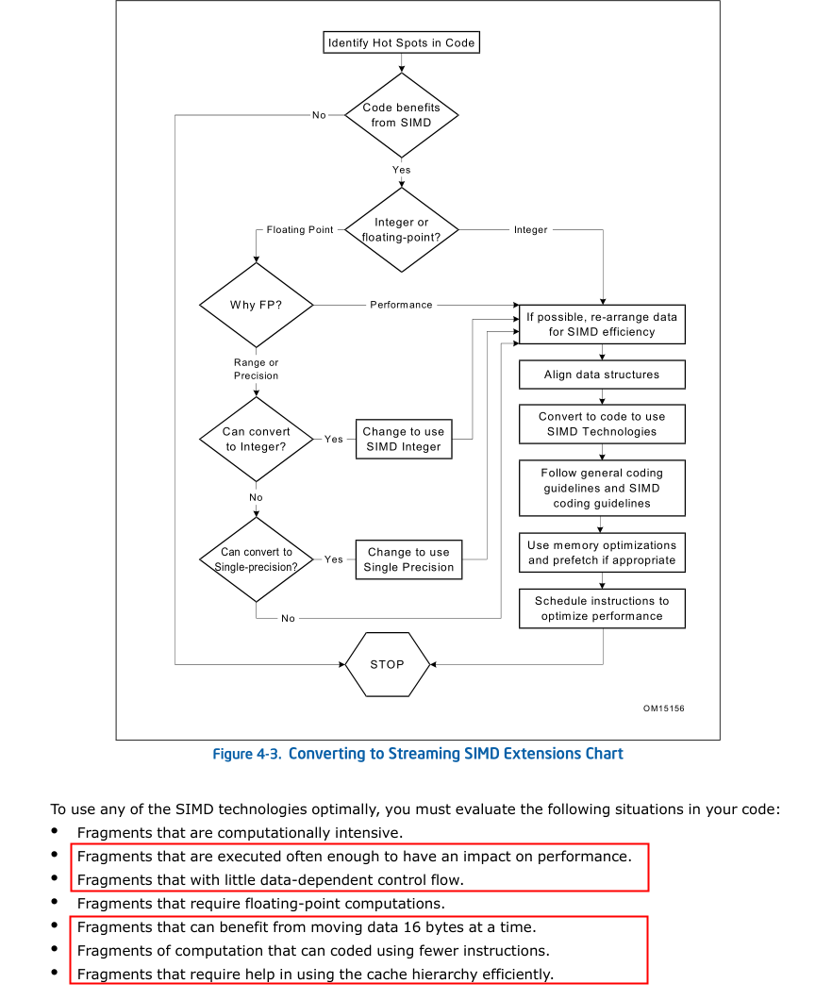
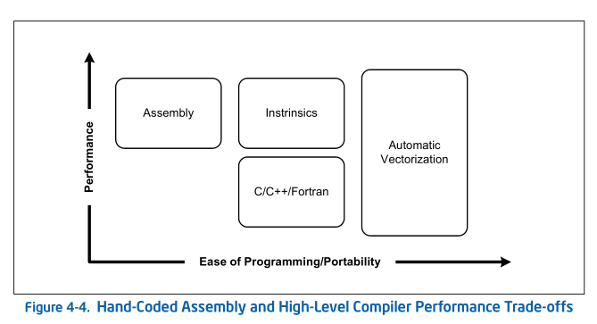

# SIMD
SIMD指令广泛应用于多媒体处理、信号处理、字符串处理（解析器）等应用中
以intel SIMD指令集为例
其中利用SIMD加速有以下要点
1. 利用后文提到的优化以及调度策略
2. 使用栈对齐以及数据对齐技术以保证内存的高效正确使用
3. 尽可能使用SSE和SSE2提供的可缓存的指令
## 分类
### MMX
1997年Intel公司推出了多媒体扩展指令集MMX，它包括57条多媒体指令。MMX指令主要用于增强CPU对多媒体信息的处理能力，提高CPU处理3D图形、视频和音频信息的能力。
### SSE
SSE 是一种支持单指令多数据的过程或技术。旧款处理器每个指令只处理一个数据元素。SSE 使指令能够处理多个数据元素。它用于 3D 显卡等密集型应用程序，以实现更快的处理速度。SSE 旨在取代 MMX™ 技术。它扩展到各代英特尔® 处理器，包括 SSE2、SSE3/SSE3S 和 SSE4。每次迭代都带来了新的指令并提高了性能。
由于MMX指令并没有带来3D游戏性能的显著提升，所以，1999年Inter公司在Pentium III CPU产品中推出了数据流单指令序列扩展指令（SSE），兼容MMX指令。SSE为Streaming SIMD Extensions的缩写，如同其名称所表示的，是一种SSE指令包括了四个主要的部份：
1. 单精确度浮点数运算指令
2. 整数运算指令（此为MMX之延伸，并和MMX使用同样的寄存器）
3. Cache控制指令
4. 状态控制指令。
### SSE2
SSE2 通过添加 144 条指令扩展了 MMX 技术和 SSE 技术，可在各种应用中提高性能。以 MMX 技术引入的 SIMD 整数指令从 64 位扩展到 128 位。这使 SIMD 整数运算的有效执行率翻倍。

双精度浮点 SIMD 指令允许以 SIMD 格式同时执行两个浮点运算。这种对双精度运营的支持有助于加快内容创建、金融、工程和科学应用的速度。

增强了原始 SSE 指令，以支持灵活、更高动态的计算功率范围。这是通过支持多种数据类型的算法操作来完成的。示例包括双词和四词。SSE2 指令帮助软件开发人员充分灵活。它们在运行 MPEG-2、MP3 和 3D 显卡等软件时可以实施算法并提供性能增强。

SSE2指令一共144条，包括浮点SIMD指令、整形SIMD指令、SIMD浮点和整形数据之间转换、数据在MMX寄存器中转换等几大部分。其中重要的改进包括引入新的数据格式，如：128位SIMD整数运算和64位双精度浮点运算等。
### SSE3
相对于SSE2，SSE3又新增加了13条新指令，此前它们被统称为pni(prescott new instructions)。13条指令中，一条用于视频解码，两条用于线程同步，其余用于复杂的数学运算、浮点到整数转换和SIMD浮点运算。
### SSE4
SSE4增加了50条新的增加性能的指令，这些指令有助于编译、媒体、字符/文本处理和程序指向加速。
### AVX & AVX2
英特尔® AVX是一种面向英特尔® SSE 的 256 位指令集扩展，专为浮点 （FP） 密集型应用而设计。英特尔 AVX由于矢量更宽、新的可扩展语法和丰富的功能而提高性能。英特尔 AVX2于 2013 年发布，扩展了跨浮点和整数数据域的矢量处理能力。这样就可以在各种应用程序上实现更高的性能和更高效的数据管理。例如图像和音频/视频处理、科学模拟、金融分析以及 3D 建模和分析。 

在2010年AVX将之前浮点运算数据的宽度从128bit的扩展到256bit。同时新的CPU架构下数据传输速度也获得了提升。AVX指令集在SIMD计算性能增强的同时也沿用了的MMX/SSE指令集。不过和MMX/SSE的不同点在于，增强的AVX指令在指令的格式上也发生了很大的变化。x86(IA-32/Intel 64)架构的基础上增加了prefix(Prefix)，所以实现了新的命令，也使更加复杂的指令得以实现，从而提升了x86 CPU的性能。AVX并不是x86 CPU的扩展指令集，可以实现更高的效率，同时和CPU硬件兼容性也更好，在SSE指令的基础上AVX也使SSE指令接口更加易用。

在2011年发布的AVX2则在此基础上加入了以下新内容：整数SIMD指令扩展至256位，2个新FMA单元及浮点FMA指令，离散数据加载指令“gather”，新的位移和广播指令。

### AVX512
英特尔® AVX-512 可使用一条指令处理两倍英特尔 AVX/AVX2 可处理的数据元件数量，是英特尔 SSE 功能的四倍。英特尔 AVX-512指令非常重要，因为它们为最严苛的计算任务提供了更高的性能功能。英特尔 AVX-512指令在设计指令功能时可为编译器提供最高程度的支持。

AVX-512 是 Intel 公司在 2013 年发布的一套扩展指令集，其指令宽度扩展为 512 bit，每个时钟周期内可执行 32 次双精度或 64 次单精度浮点（FP）运算，专门针对图像/音视频处理、数据分析、科学计算、数据加密和压缩和深度学习等大规模运算需求的应用场景。
## 使用步骤
### 0. 考虑SIMD的必要性

### 1. 检查环境支持
### 2. 修改代码
1. 检查内存存取的依赖，是否会影响数据并行操作
2. 通过SIMD减少最内层循环的次数
#### 改写SIMD的方法

##### 看一个例子
语言原生代码
```C++
void add(float *a, float *b, float *c)
{
    int i;
    for (i = 0; i < 4; i++) {
        c[i] = a[i] + b[i];
    }
}
```
Assembly
```C++
void asm_add(float *a, float *b, float *c)
{
    __asm {
    mov eax, a
    mov edx, b
    mov ecx, c
    movaps xmm0, XMMWORD PTR [eax]
    addps xmm0, XMMWORD PTR [edx]
    movaps XMMWORD PTR [ecx], xmm0
    }
}
```
Intrinsics
```C++
#include <xmmintrin.h>
void add(float *a, float *b, float *c)
{
    __m128 t0, t1;
    t0 = _mm_load_ps(a);
    t1 = _mm_load_ps(b);
    t0 = _mm_add_ps(t0, t1);
    _mm_store_ps(c, t0);
}
```
Classes
```C++
#include <fvec.h>
void classes_add(float *a, float *b, float *c)
{
    F32vec4 *av=(F32vec4 *) a;
    F32vec4 *bv=(F32vec4 *) b;
    F32vec4 *cv=(F32vec4 *) c;
    *cv=*av + *bv;
}
```
Automatic Vectorization (only supported by The Intel C++ Compiler)
Compile this code using the -QAX and -QRESTRICT switches of the Intel C++ Compiler, version 4.0 or later.
```C++
void auto_add (float *restrict a, float *restrict b, float *restrict c)
{
    int i;
    for (i = 0; i < 4; i++) {
        c[i] =   a[i] + b[i];
    }
}
```
## 修改代码
### 栈对齐 & 数据对齐
1. 使用填充对齐数据
2. 使用数组类型的数据结构使得数据连续
3. 视操作将数据结构拆为多个数据结构元素的数组使得数据连续
4. 使用__M128* 数据结构会一定程度上自动将数据栈对齐到16byte的边界(可能会产生数据栈空洞)